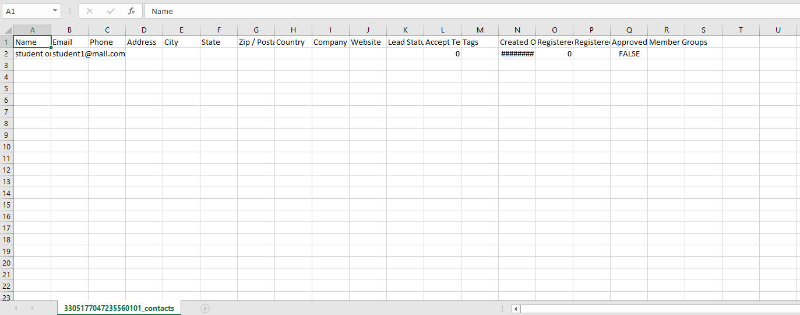

# 連絡先のエクスポート

連絡先をエクスポートすると、現在の連絡先情報をすべて取得し、Excelスプレッドシートに自動的に入力することができます。

連絡先をエクスポートするには、以下のドロップダウンメニューから、\[詳細] > \[エクスポート] を選択します。

<figure><figcaption></figcaption></figure>

エクスポート セクション内に新しいウィンドウが開きます。連絡先をエクスポートするには、\[エクスポート] を選択します。これで、連絡先が Excel スプレッドシートに追加されます。タグからメンバーシップ データまで、すべての連絡先の詳細が含まれます。

<figure><figcaption></figcaption></figure>

