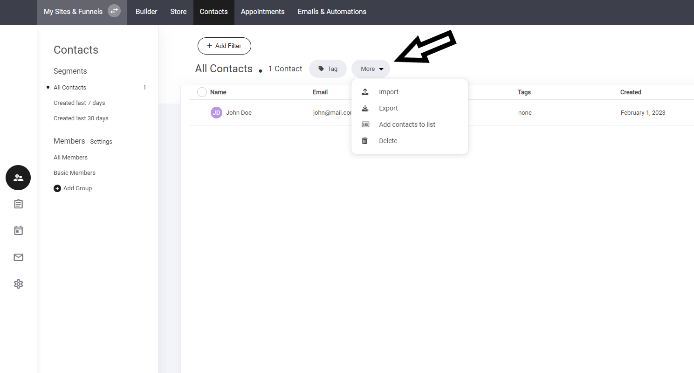

# 連絡先のインポート

連絡先をインポートすると、現在または過去の連絡先の詳細をすべて取得でき、アカウント内の連絡先エリアに追加することができます。

連絡先をインポートするには、「その他」タブで以下のように表示されるドロップダウンメニューから「インポート」を選択します。

<figure><figcaption></figcaption></figure>

インポートセクション内に新しいウィンドウが開きます。連絡先をインポートするには、「今すぐインポート」を選択し、顧客情報を含むCSVファイルを追加するだけで完了です。すべての連絡先が、あなたの連絡先エリアに自動的に追加されます。

<figure><figcaption></figcaption></figure>
