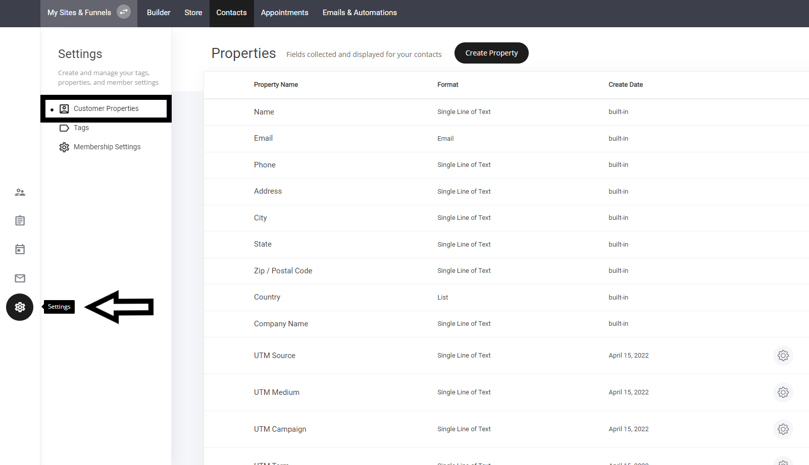
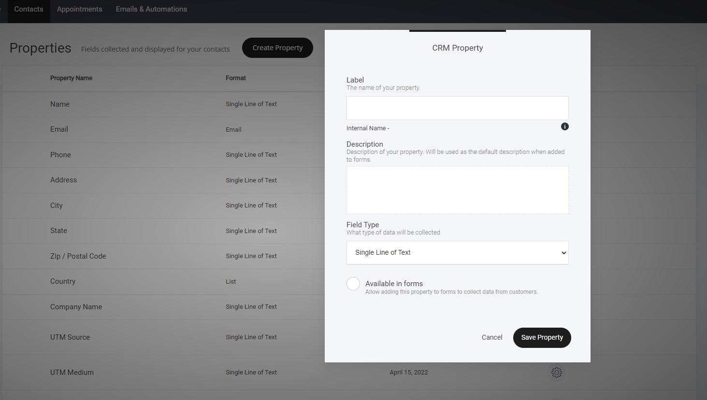

# プロパティ

### プロパティとカスタムプロパティ

プロパティとカスタムプロパティの表示を確認するには、**\[設定]**&#x30BF;ブに移動します。

### カスタムプロパティ 

カスタムプロパティは非常に強力で、マーケティング活動を大幅に支援することができます。

カスタムプロパティを作成するには、リストからフィールドタイプを選択するだけです。

**フィールドの種類**

* 1行のテキスト
* 電子メール
* 数字
* 真偽
* 日付
* リスト

### **フォームでも利用できます** 

フォームでフィールドを使用できるようにしたい場合は、単にオンにするだけです。※フォーム設定の「隠しフィールドタイプ」で、フィールドを非表示にすることもできます。
