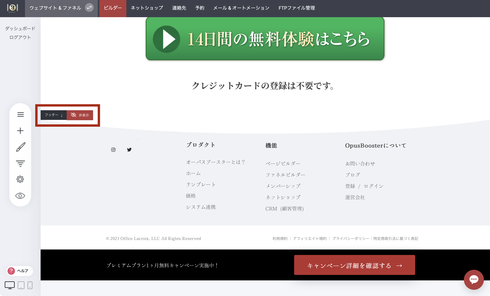

# フッター - 使い方と編集方法

ページの一番下までスクロールすると、画面左側に「フッター」と表示され、フッターエリアを示す矢印が表示されます。

**フッター**エリアに追加したものはすべて、フッターを有効にしたすべてのページに共通して表示されます。フッターを隠すには、「非表示」ボタンをクリックしてください。

<figure><figcaption></figcaption></figure>
