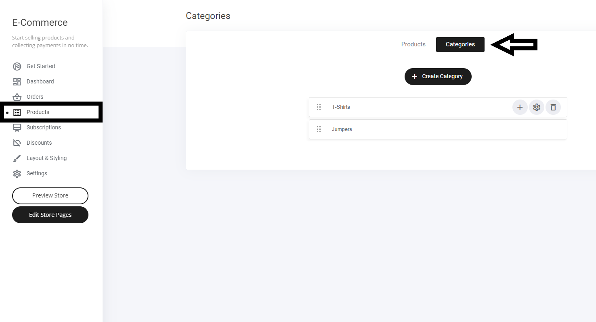

# 商品カテゴリー

ネットショップのカテゴリーを作成する方法を解説します。

ネットショップタブを選択 > 商品を選択 > カテゴリを選択

### 新規カテゴリーの作成

上図のように「＋カテゴリー作成」ボタンを選択します。カテゴリーに名前を付け、送信をクリックしてください。

新しいカテゴリは、既存のカテゴリリストに追加されます。タブを上下に動かして、表示させたい場所に合わせることができます。

### サブカテゴリーの作成

メインカテゴリーにサブカテゴリーを追加するには、以下のように+アイコンを選択するだけです。

新しいサブカテゴリーに名前を付けましょう。

再度、新しいカテゴリーがカテゴリーリストに追加されます。

