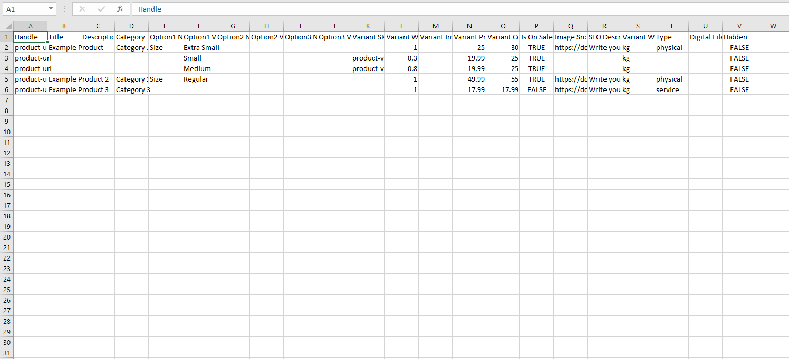

# 商品の一括入力

### 在庫の管理 

このセクションでは以下の内容を扱います。

* 店舗在庫の表示
* 他のソフトウェアからの商品のインポート
* CSVファイルからの商品のインポート

まず、ストアタブ > 商品タブに移動し、下部にハイライト表示されている「その他」ボタンを選択します。

#### 商品のインポート

上記画像のようなポップアップから、参考のために在庫 CSV の例を**表示およびダウンロード**できます。以下の画像のようになります。既存のパラメータをマージして、ストアにアイテムを自動的に追加するためのポップダウン メニューが表示されます。

参考用CSVの例

