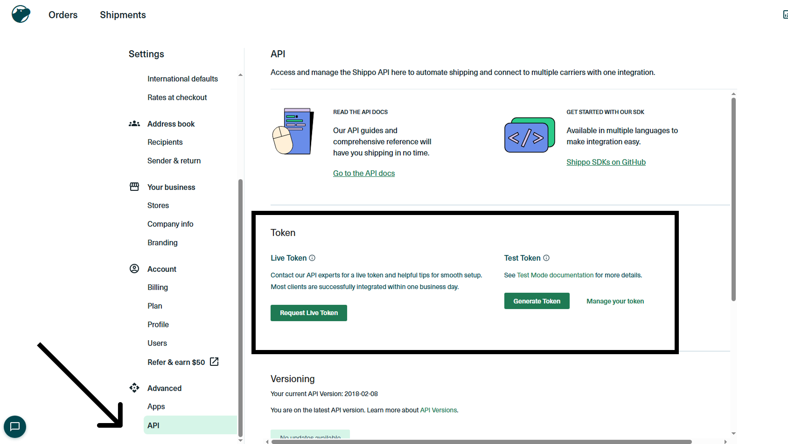
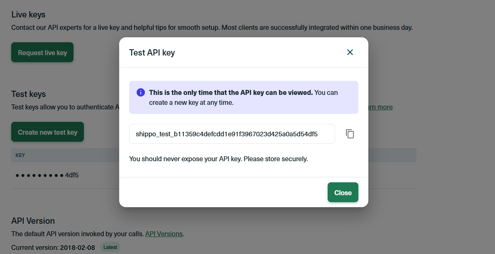
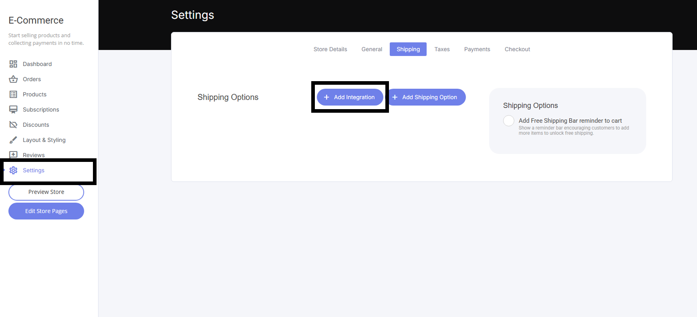
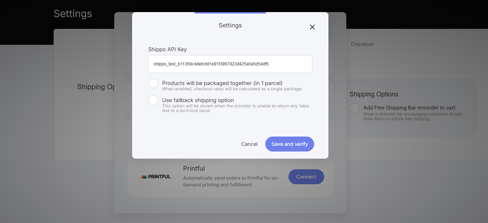
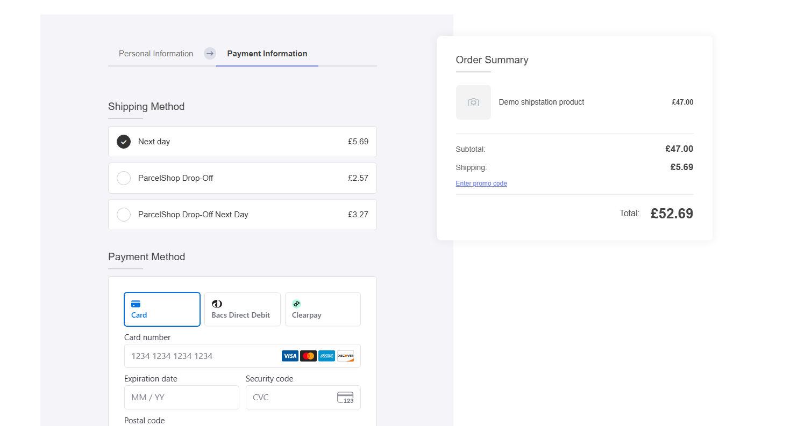

# Shippo連携

Shippo連携を使うと、ネットショップをShippoの料金比較・ラベル印刷ツールに接続できます。一度のセットアップで、複数の配送キャリアと割引配送料金をすぐに利用できるようになります。

Shippoでは料金を比較して最適な配送オプションを選べるため、フルフィルメントの流れを止めることなく注文を発送できます。複雑な仕組みを増やさずに配送を管理したい事業者向けの、柔軟で軽量なソリューションです。

## 接続手順

1. Shippoのダッシュボードを開き、「**API**」タブを選択します
2. 「**トークンを作成**」を選択します

<figure><figcaption></figcaption></figure>

3. 作成したトークンを選択すると、APIキーが表示されます

<figure><figcaption></figcaption></figure>

4. ネットショップのタブに移動し、「**設定**」→「**連携を追加**」を選択すると、Shippo連携が表示されます

<figure><figcaption></figcaption></figure>

5. ShippoのAPIキーを貼り付けます

<figure><figcaption></figcaption></figure>

## 接続後の動作

接続が完了すると、チェックアウト画面にShippoの配送オプションが自動的に表示され、配送料は注文の概要にあらかじめ反映されます。

<figure><figcaption></figcaption></figure>
