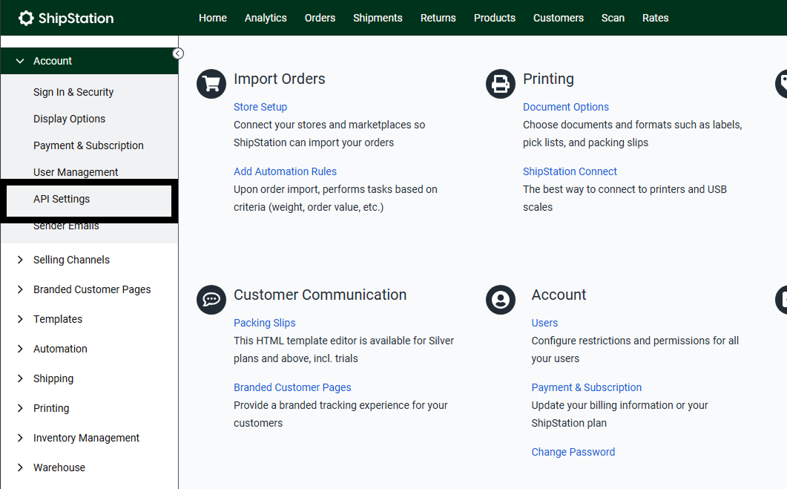
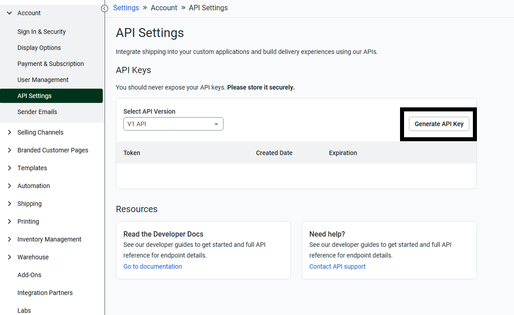
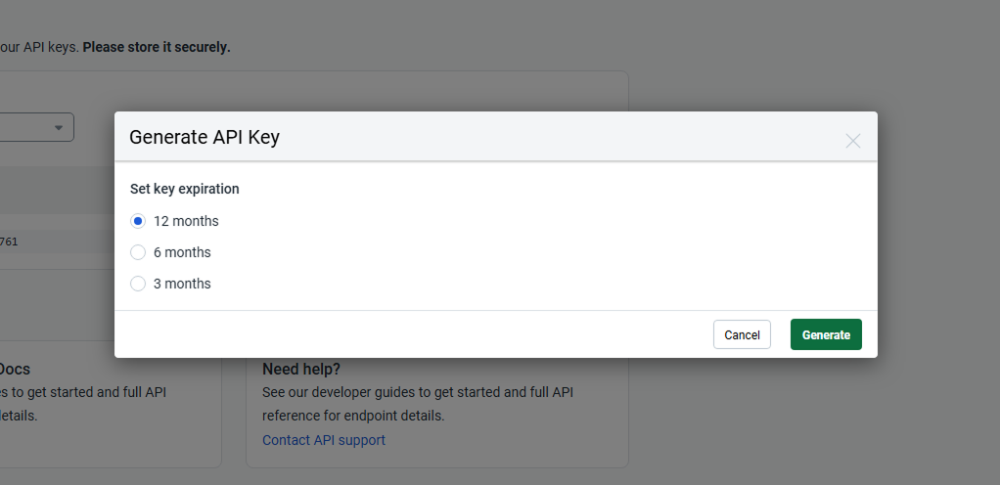
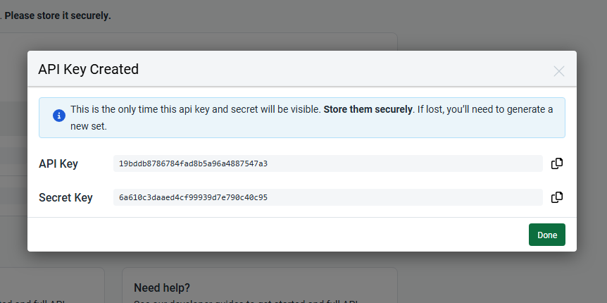
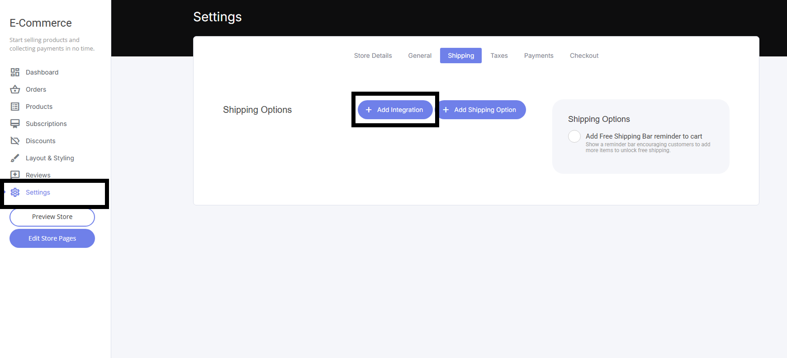
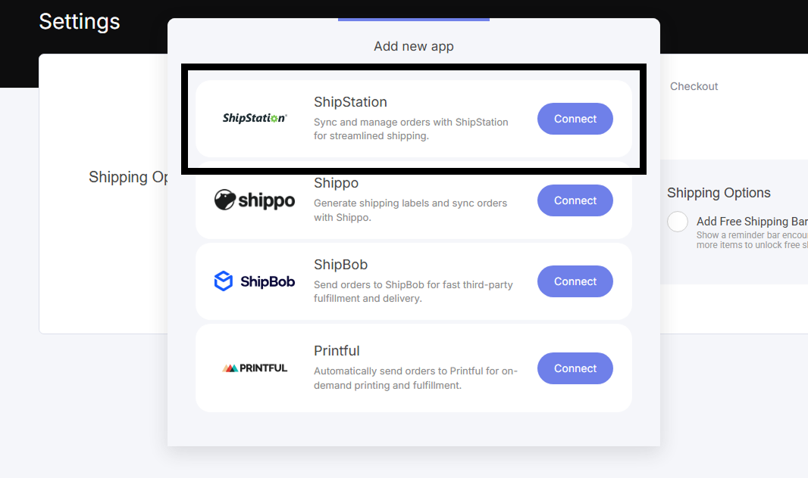
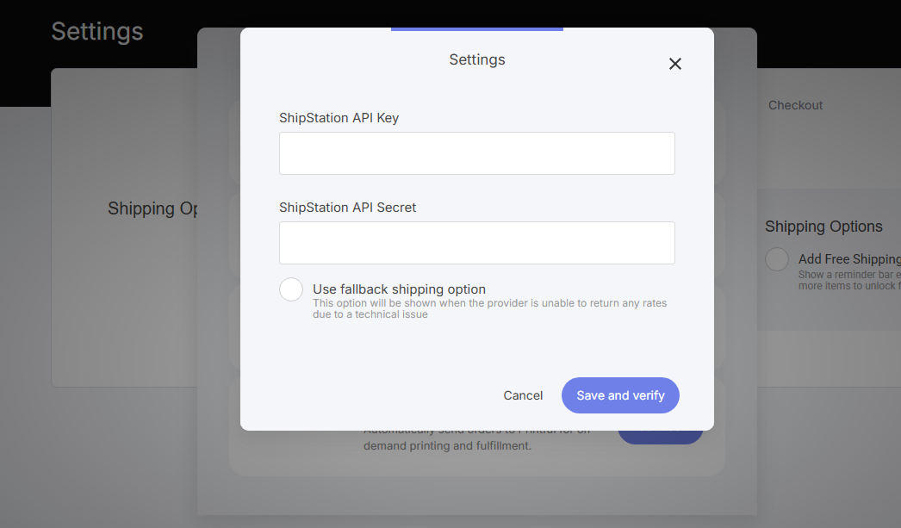
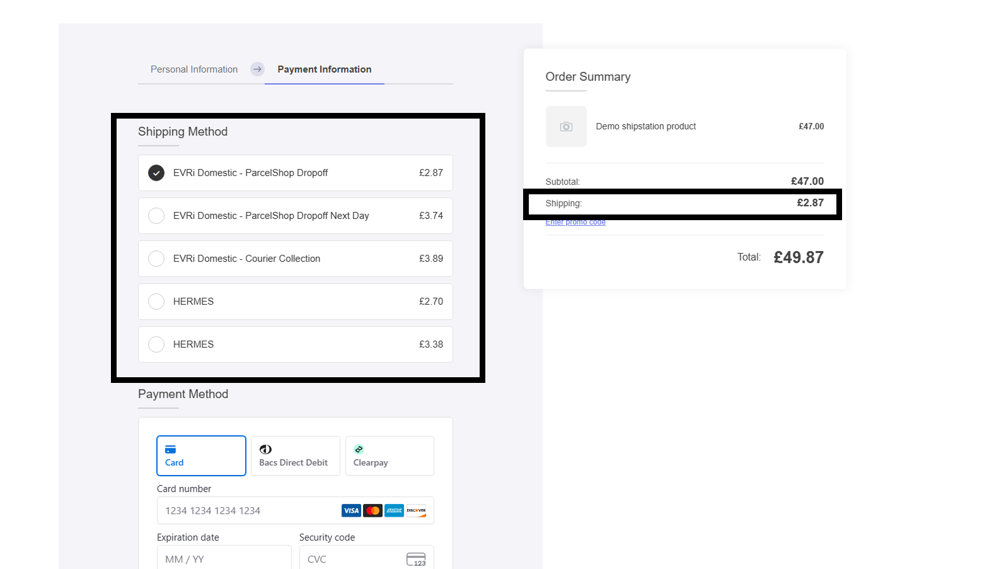
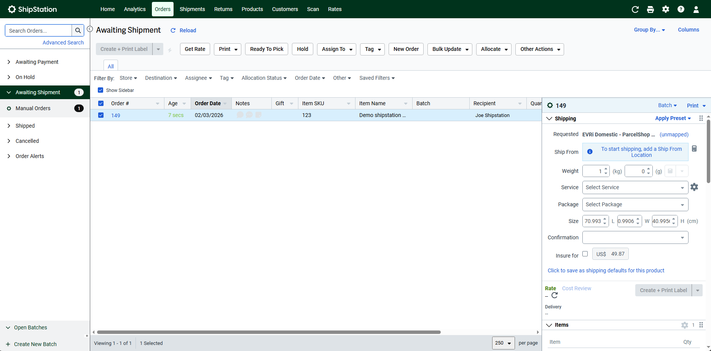
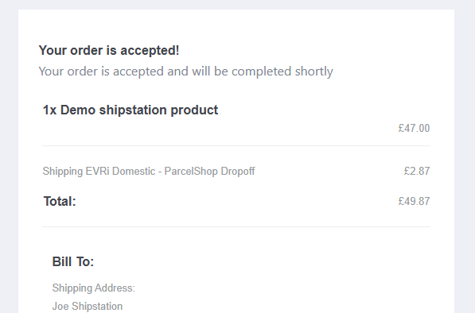

# ShipStation連携

ShipStation連携を使うと、ネットショップの注文が自動的にShipStationへ送信され、配送ラベルの作成、キャリアの管理、注文のフルフィルメントを一箇所で行えるようになります。

手動でのエクスポートやコピー＆ペーストは不要です。チェックアウトからお届けまでがスムーズにつながります。

<figure><figcaption></figcaption></figure>

## ShipStation側でAPIキーを取得する

1. ShipStationのダッシュボードを開きます
2. 「**アカウント**」→「**API設定**」を選択します

<figure><figcaption></figcaption></figure>

3. 「**APIキーを生成**」を選択します

<figure><figcaption></figcaption></figure>

4. APIキーの有効期限を選択し、生成ボタンをクリックします

<figure><figcaption></figcaption></figure>

5. 生成されたAPIキーの情報を確認します

<figure><figcaption></figcaption></figure>

## OpusBooster側で連携を設定する

1. OpusBoosterのダッシュボードに戻ります
2. 上部のナビゲーションバーで「ネットショップ」タブを選択します
3. 「設定」をクリックします

<figure><figcaption></figcaption></figure>

4. 「**連携を追加**」ボタンを選択します
5. ShipStation連携を選択します

<figure><figcaption></figcaption></figure>

6. 表示されたポップアップに、ShipStationのAPIキーとシークレットキーを貼り付けます

<figure><figcaption></figcaption></figure>

APIキーとシークレットキーを入力すると、ShipStationがネットショップに接続されます。

## 連携後の動作

* チェックアウト画面に、ShipStationで設定した優先キャリアが自動的に表示されます
* 配送料金が自動で計算されます

<figure><figcaption></figcaption></figure>

* 処理された注文は、ShipStationの注文ダッシュボードで確認できます

<figure><figcaption></figcaption></figure>

* 顧客にはシステムメールが自動送信されます
