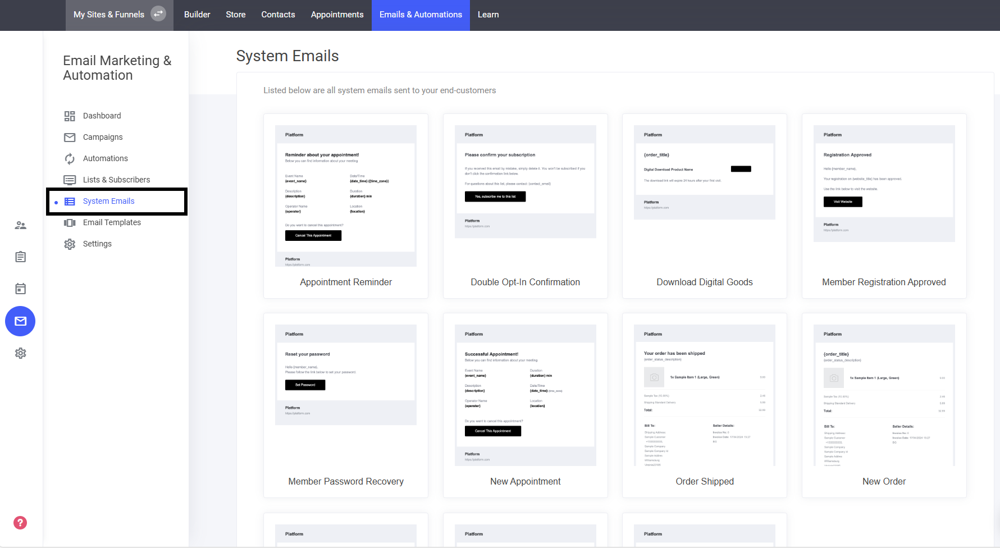

# システムメールテンプレート

システムから自動送信されるメールは、あなたのブランドのコミュニケーションスタイルに合わせてカスタマイズできます。

### システムメールをカスタマイズする手順

* **「メールと自動化」に移動** — メール設定を管理するセクションを開きます。
* **「システムメール」をクリック** — 自動送信メールのテンプレート一覧が表示されます。
* **編集したいメールテンプレートを選択** — カスタマイズしたいメールを選びます。
* **デフォルトメールを無効化** — デフォルトの代わりに、カスタマイズした自分のバージョンを送信するように切り替えます。

これにより、メールコミュニケーションをより柔軟に、よりパーソナライズされたものにできます。

<figure><figcaption></figcaption></figure>
