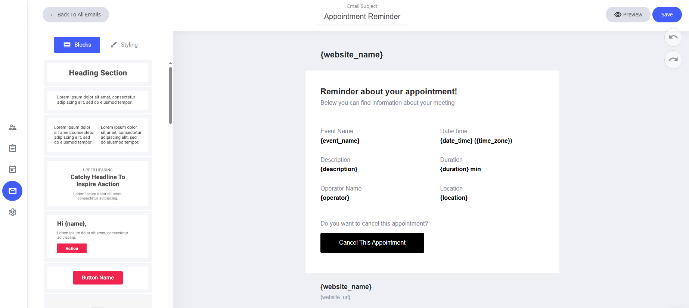
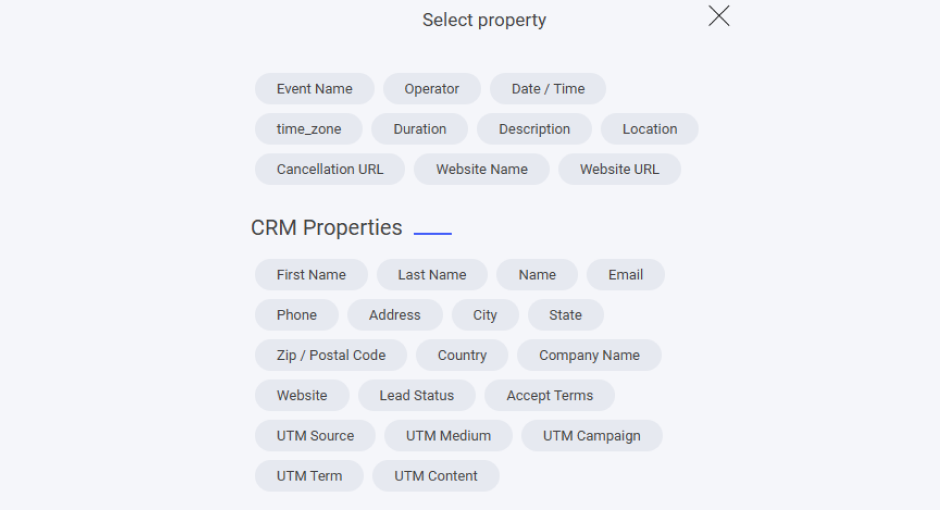

# 予約リマインダー

他のメールと同様に、予約リマインダーのテンプレートもドラッグ＆ドロップのメールエディターで自由に編集できます。

### デフォルトテンプレートに含まれるもの

* **システムフィールド** — ウェブサイト名と、このメールに割り当てられた関連フィールド。
* **既定のコンテンツ** — 予約の詳細とリマインダー文面があらかじめ設定されています。

### カスタマイズ方法

* **フィールドの変更・削除** — システムフィールドは必要に応じて調整できます。
* **ドラッグ＆ドロップエディターを使う** — レイアウトやコンテンツをかんたんにパーソナライズできます。
* **文面の微調整** — わかりやすい文章に磨き上げることで、より良い反応率につながります。

<figure><figcaption></figcaption></figure>

### フィールドを追加するには

システムメールのテンプレートにフィールドを追加したい場合は、テキスト入力中にテキストエディターを選択し、**タグ**アイコンをクリックします。タグアイコンをクリックすると、そのシステムテンプレートに追加できる専用フィールドが一覧表示されます。

<figure><figcaption></figcaption></figure>

ここには、予約リマインダーのシステムメールに割り当てられたすべての専用フィールドが表示されます。

また、すべてのCRMプロパティもメールに追加できます。自分で作成したカスタムプロパティがある場合は、それらもここに一覧表示されます。

<figure><figcaption></figcaption></figure>
