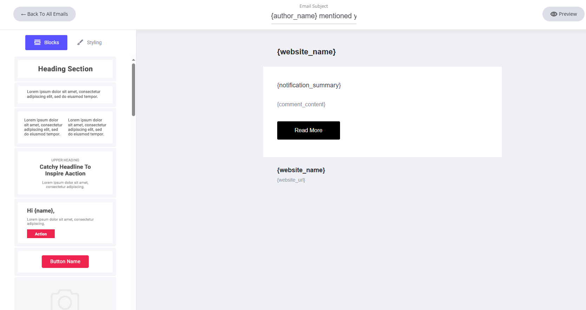
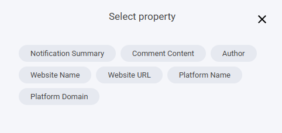

# コミュニティでのメンション

他のメールと同様に、このテンプレートもドラッグ＆ドロップのメールエディターで編集できます。これは、コミュニティであなたがメンションされたことをお知らせするシステムメールです。ウェブサイト名など、このメールに割り当てられたシステムフィールドはあらかじめ設定されており、すべて編集・削除が可能です。

<figure><figcaption></figcaption></figure>

### フィールドを追加するには

システムメールのテンプレートにフィールドを追加したい場合は、テキスト入力中にテキストエディターを選択し、**タグ**アイコンをクリックします。タグアイコンをクリックすると、そのシステムテンプレートに追加できる専用フィールドが一覧表示されます。

<figure><figcaption></figcaption></figure>

ここには、コミュニティでのメンションのシステムメールに割り当てられたすべての専用フィールドが表示されます。

<figure><figcaption></figcaption></figure>
