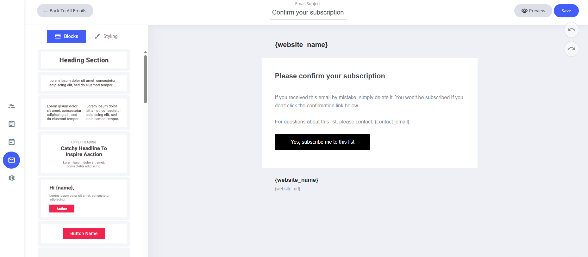
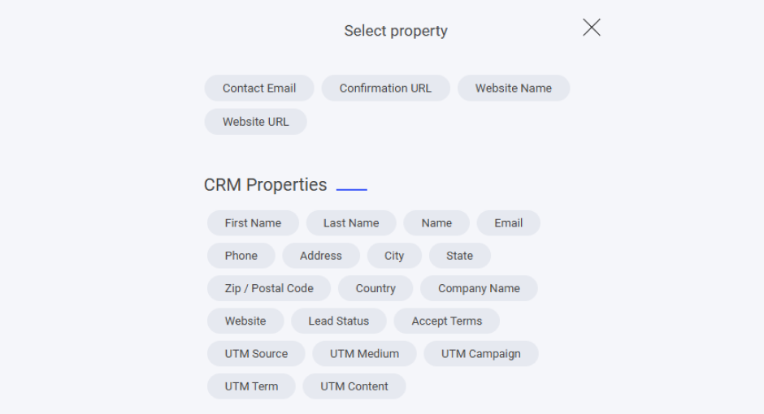

# ダブルオプトイン確認

他のメールテンプレートと同様に、ダブルオプトイン確認メールもドラッグ＆ドロップのメールエディターで細かく調整できます。

### テンプレートにあらかじめ設定されているもの

* **システムフィールド** — ウェブサイト名など、必要なフィールドが割り当て済みです。
* **既定のコンテンツ** — 登録者がスムーズにオプトインを完了できるよう設計された確認メッセージ。

### カスタマイズ方法

* **フィールドの編集・削除** — あらかじめ設定されたシステム情報は必要に応じて変更できます。
* **ドラッグ＆ドロップエディターを使う** — レイアウトやブランド要素をかんたんに調整できます。
* **文面の見直し** — 読者に合わせて、より魅力的な文章に仕上げましょう。

ユーザー体験とブランドの一貫性を高める、手軽な方法です。

<figure><figcaption></figcaption></figure>

### フィールドを追加するには

システムメールのテンプレートにフィールドを追加したい場合は、テキスト入力中にテキストエディターを選択し、**タグ**アイコンをクリックします。タグアイコンをクリックすると、そのシステムテンプレートに追加できる専用フィールドが一覧表示されます。

<figure><figcaption></figcaption></figure>

ここには、ダブルオプトイン確認のシステムメールに割り当てられたすべての専用フィールドが表示されます。

また、すべてのCRMプロパティもメールに追加できます。自分で作成したカスタムプロパティがある場合は、それらもここに一覧表示されます。

<figure><figcaption></figcaption></figure>
