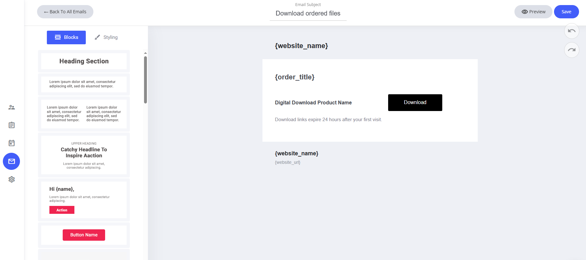
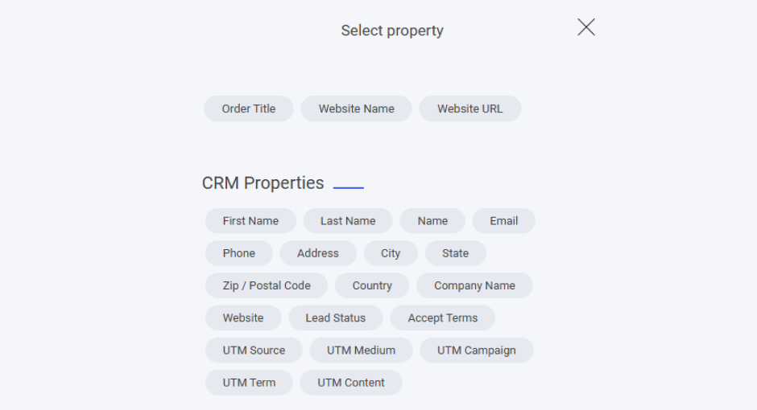

# デジタル商品のダウンロード

このテンプレートもドラッグ＆ドロップのメールエディターで完全にパーソナライズでき、ブランドに沿ったデザインに統一できます。

### テンプレートにあらかじめ設定されているもの

* **システムフィールド** — ウェブサイト名と、このメールに割り当てられた専用フィールド。
* **既定のコンテンツ** — デジタル商品をスムーズにお届けするための内容があらかじめ設定されています。

### カスタマイズ方法

* **フィールドの変更・削除** — システムプロパティは必要に応じて調整できます。
* **ドラッグ＆ドロップエディターを使う** — レイアウトやデザインをかんたんに仕上げられます。
* **文面の強化** — わかりやすく魅力的な内容にして、洗練された購入体験を提供しましょう。

デジタル商品を確実にお届けするための、シンプルで実用的な方法です。

<figure><figcaption></figcaption></figure>

### フィールドを追加するには

システムメールのテンプレートにフィールドを追加したい場合は、テキスト入力中にテキストエディターを選択し、**タグ**アイコンをクリックします。タグアイコンをクリックすると、そのシステムテンプレートに追加できる専用フィールドが一覧表示されます。

<figure><figcaption></figcaption></figure>

ここには、デジタル商品のダウンロードのシステムメールに割り当てられたすべての専用フィールドが表示されます。

また、すべてのCRMプロパティもメールに追加できます。自分で作成したカスタムプロパティがある場合は、それらもここに一覧表示されます。

<figure><figcaption></figcaption></figure>
