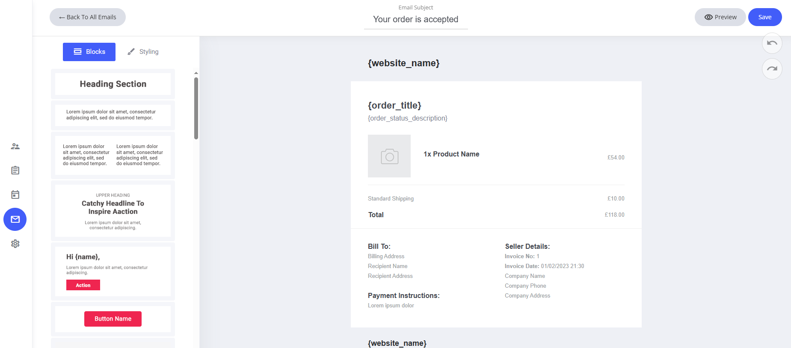
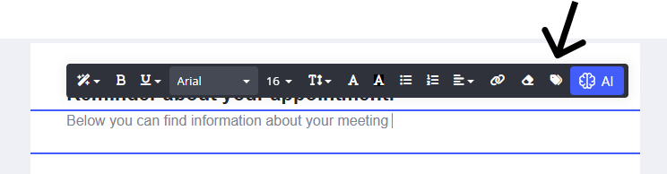
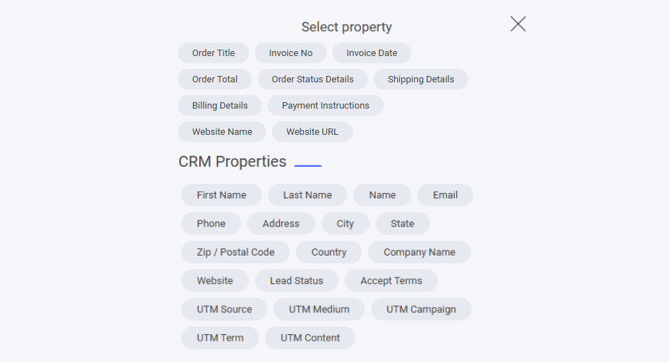

# 新規注文

新規注文の確認メールも、ドラッグ＆ドロップエディターで、ブランドやコミュニケーションスタイルに合わせて細かく調整できます。

### デフォルトテンプレートに含まれるもの

* **システムフィールド** — ウェブサイト名、注文の詳細、取引に関するフィールドが割り当て済みです。
* **既定のコンテンツ** — 注文確認、購入内容のサマリー、次のステップの案内があらかじめ設定されています。

### カスタマイズ方法

* **フィールドの変更・削除** — システムのプレースホルダーは必要に応じて調整できます。
* **ドラッグ＆ドロップエディターを使う** — レイアウト、カラー、書式をかんたんにパーソナライズできます。
* **文面の見直し** — わかりやすく魅力的な内容にして、プロフェッショナルな購入体験を提供しましょう。

<figure><figcaption></figcaption></figure>

### フィールドを追加するには

システムメールのテンプレートにフィールドを追加したい場合は、テキスト入力中にテキストエディターを選択し、**タグ**アイコンをクリックします。タグアイコンをクリックすると、そのシステムテンプレートに追加できる専用フィールドが一覧表示されます。

<figure><figcaption></figcaption></figure>

ここには、新規注文のシステムメールに割り当てられたすべての専用フィールドが表示されます。

また、すべてのCRMプロパティもメールに追加できます。自分で作成したカスタムプロパティがある場合は、それらもここに一覧表示されます。

<figure><figcaption></figcaption></figure>
