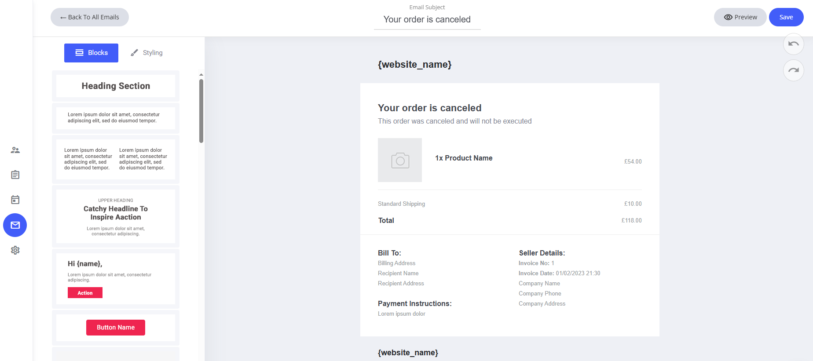
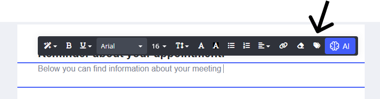
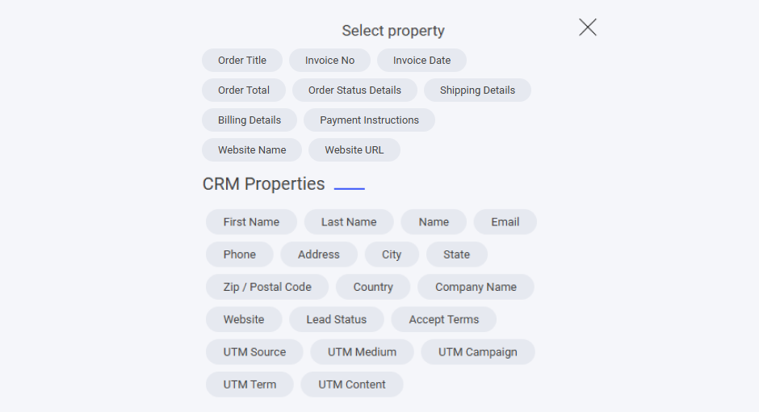

# 注文キャンセル

注文キャンセルの通知メールも、ドラッグ＆ドロップのメールエディターで調整して、一貫性のあるプロフェッショナルなブランドイメージを保てます。

### テンプレートにあらかじめ設定されているもの

* **システムフィールド** — ウェブサイト名、注文の詳細、キャンセルに関するフィールドが割り当て済みです。
* **既定のコンテンツ** — キャンセル確認と、ユーザーへの次のステップの案内があらかじめ設定されています。

### カスタマイズ方法

* **フィールドの変更・削除** — システムのプレースホルダーはビジネスに合わせて調整できます。
* **ドラッグ＆ドロップエディターを使う** — レイアウト、カラー、書式をかんたんにパーソナライズできます。
* **文面の見直し** — わかりやすい内容にして、キャンセル時もスムーズな顧客体験を提供しましょう。

<figure><figcaption></figcaption></figure>

### フィールドを追加するには

システムメールのテンプレートにフィールドを追加したい場合は、テキスト入力中にテキストエディターを選択し、**タグ**アイコンをクリックします。タグアイコンをクリックすると、そのシステムテンプレートに追加できる専用フィールドが一覧表示されます。

<figure><figcaption></figcaption></figure>

ここには、注文キャンセルのシステムメールに割り当てられたすべての専用フィールドが表示されます。

また、すべてのCRMプロパティもメールに追加できます。自分で作成したカスタムプロパティがある場合は、それらもここに一覧表示されます。

<figure><figcaption></figcaption></figure>

***


**自分の場合はどう使えばいいか**

[OpusBoosterの機能全体](https://opusbooster.com/features)を見る。設計から相談したい方は[15分の無料相談](https://opusbooster.com/consultation)、まず触ってみたい方は[14日間の無料トライアル](https://opusbooster.com/register)（クレジットカード不要）から。

