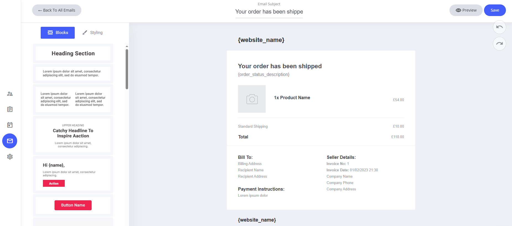
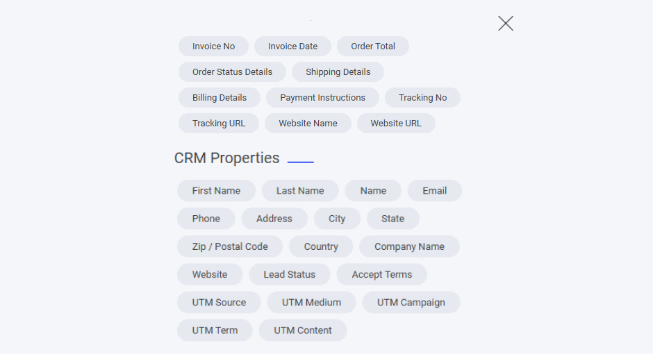

# 発送通知

発送通知メールも、ドラッグ＆ドロップのメールエディターで、ブランドやコミュニケーションスタイルに合わせて細かく調整できます。

### デフォルトテンプレートに含まれるもの

* **システムフィールド** — ウェブサイト名、配送情報、追跡用のフィールドが割り当て済みです。
* **既定のコンテンツ** — 発送確認、追跡リンク、お届け予定日があらかじめ設定されています。

### カスタマイズ方法

* **フィールドの変更・削除** — システムのプレースホルダーは必要に応じて調整できます。
* **ドラッグ＆ドロップエディターを使う** — レイアウト、カラー、デザインをかんたんにパーソナライズできます。
* **文面の見直し** — わかりやすい発送のお知らせに仕上げて、丁寧な印象を届けましょう。

お客様に配送状況をきちんと伝え、購入体験を高めるための、シンプルで効果的な方法です。

<figure><figcaption></figcaption></figure>

### フィールドを追加するには

システムメールのテンプレートにフィールドを追加したい場合は、テキスト入力中にテキストエディターを選択し、**タグ**アイコンをクリックします。タグアイコンをクリックすると、そのシステムテンプレートに追加できる専用フィールドが一覧表示されます。

<figure><figcaption></figcaption></figure>

ここには、発送通知のシステムメールに割り当てられたすべての専用フィールドが表示されます。

また、すべてのCRMプロパティもメールに追加できます。自分で作成したカスタムプロパティがある場合は、それらもここに一覧表示されます。

<figure><figcaption></figcaption></figure>
