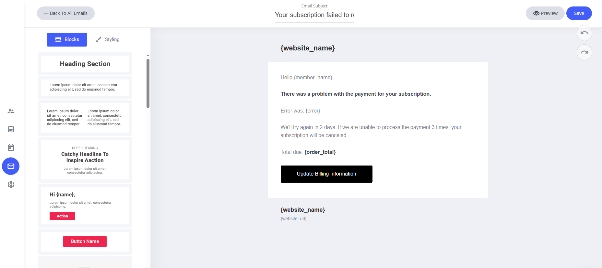
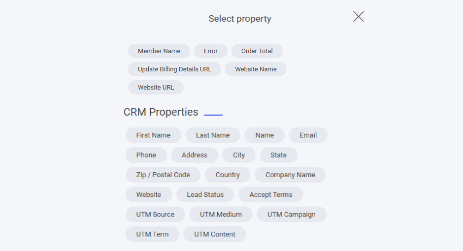

# サブスクリプション更新失敗

サブスクリプションの更新に失敗したことをお知らせするメールも、ドラッグ＆ドロップのメールエディターで自由にカスタマイズでき、丁寧なトーンを保ったままお知らせできます。

### デフォルトテンプレートに含まれるもの

* **システムフィールド** — ウェブサイト名と、サブスクリプションに関する情報フィールドが割り当て済みです。
* **既定のコンテンツ** — 更新失敗のお知らせと、解決のための次のステップがあらかじめ設定されています。

### カスタマイズ方法

* **フィールドの変更・削除** — プレースホルダーは伝えたい内容に合わせて調整できます。
* **ドラッグ＆ドロップエディターを使う** — レイアウト、カラー、書式をかんたんにパーソナライズできます。
* **文面の見直し** — 状況をわかりやすく伝えつつ、具体的な解決方法を案内しましょう。

ユーザーとのコミュニケーションを高めながら、スムーズな更新手続きへつなげるための、シンプルで効果的な方法です。

<figure><figcaption></figcaption></figure>

### フィールドを追加するには

システムメールのテンプレートにフィールドを追加したい場合は、テキスト入力中にテキストエディターを選択し、**タグ**アイコンをクリックします。タグアイコンをクリックすると、そのシステムテンプレートに追加できる専用フィールドが一覧表示されます。

<figure><figcaption></figcaption></figure>

ここには、サブスクリプション更新失敗のシステムメールに割り当てられたすべての専用フィールドが表示されます。

また、すべてのCRMプロパティもメールに追加できます。自分で作成したカスタムプロパティがある場合は、それらもここに一覧表示されます。

<figure><figcaption></figcaption></figure>
