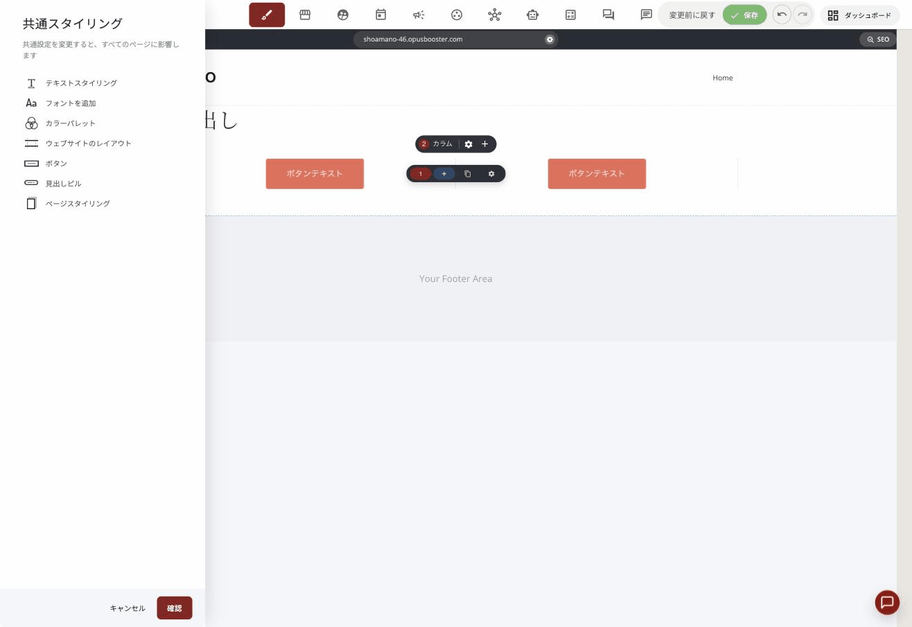
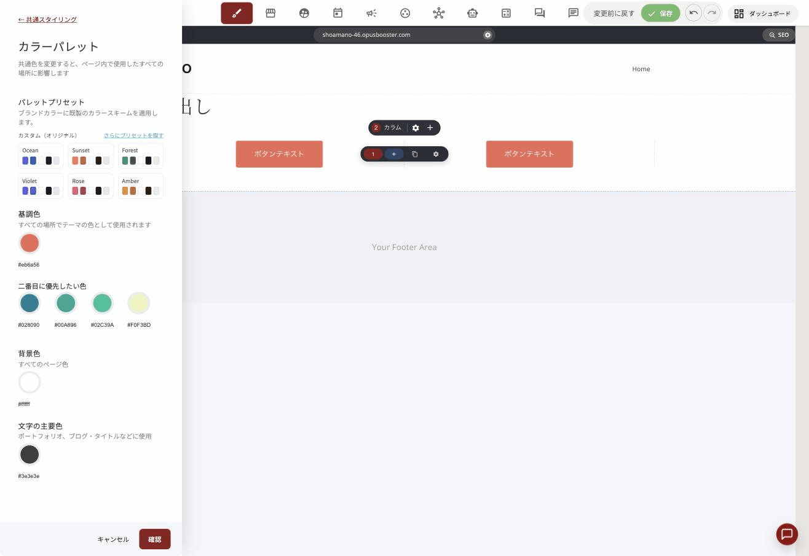
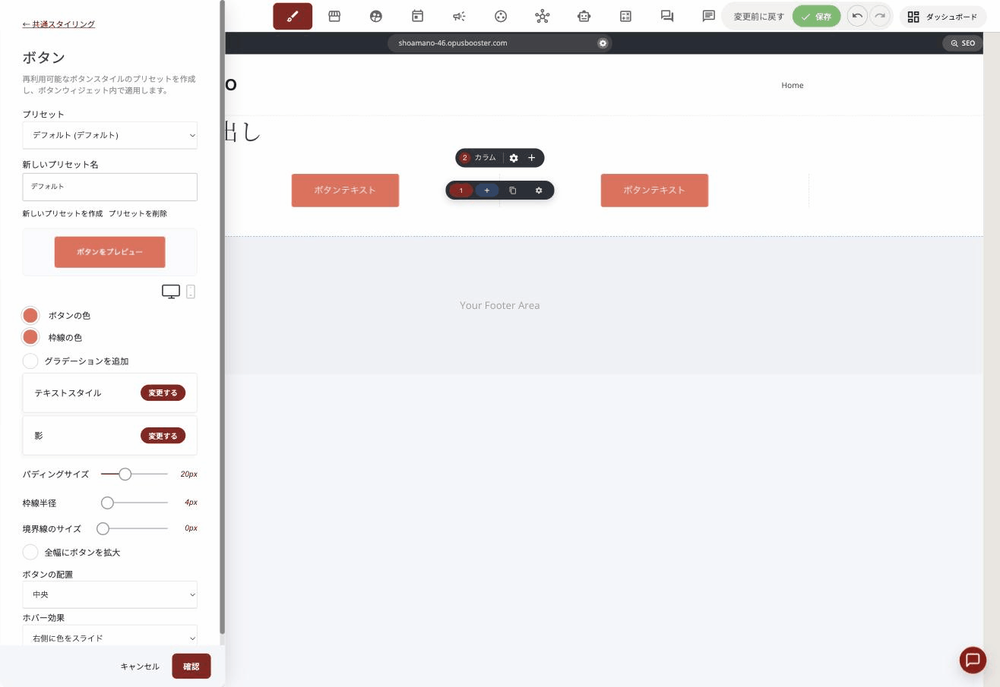
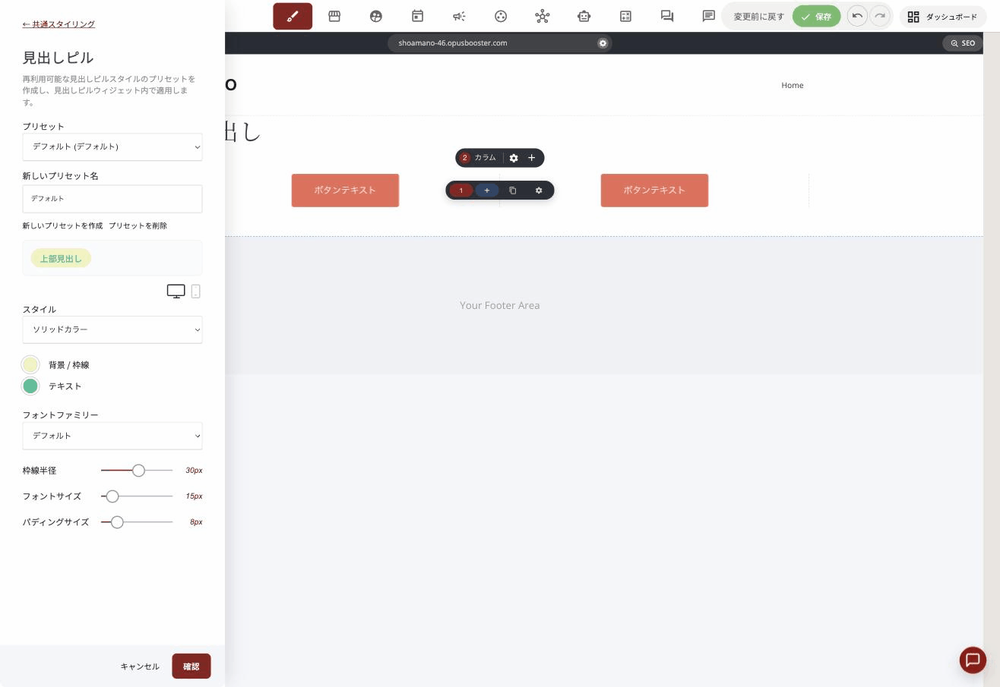
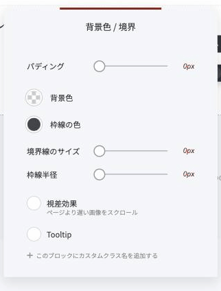

# 色と装飾を、1か所で決める

ページを作っていると、こうなりがちです。

ボタンの色を変えたくなって、1つ直す。次のページにも同じボタンがあったので、また直す。3ページ目で少し違う色にしてしまい、気づかないままサイト全体がちぐはぐになる。

**直す場所を1か所にまとめれば、これは起きません。**

この記事では、**色**と**ボタン・見出しの見た目**を共通で決める方法をご案内します。

## 共通の設定はどこにあるか

編集画面の左にあるツールバーの、**絵筆のアイコン**を押してください。「**共通スタイリング**」が開きます。

<figure><figcaption>共通スタイリングには7つの項目があります</figcaption></figure>

| 項目 | 決めるもの |
| :--- | :--- |
| テキストスタイリング | 見出しや本文の書体・大きさ |
| フォントを追加 | 使いたい書体を増やす |
| **カラーパレット** | **サイト全体の色** |
| ウェブサイトのレイアウト | ページの横幅など |
| **ボタン** | **ボタンの見た目（複数登録できる）** |
| **見出しピル** | **見出しの上に置く小さなラベル** |
| ページスタイリング | このページだけの設定 |

画面の上にはこう書かれています。

> 共通設定を変更すると、すべてのページに影響します

**これがこの機能の要点です。** 1か所直せば、全ページに反映されます。

## サイトの色を決める

「**カラーパレット**」を開きます。ここで決めた色が、ボタン、見出し、背景など、サイト中で使われます。

### 色には役割があります

以前は「好きな色を好きなところに使う」でしたが、**いまはそれぞれに役割が決まっています。**

| 項目 | 何に使われるか |
| :--- | :--- |
| **基調色** | サイトの主役。**ボタンなど、目立たせたいところ** |
| **二番目に優先したい色** | 基調色を補う色。4色まで登録できます |
| **背景色** | すべてのページの下地 |
| **文字の主要色** | ブログのタイトルなど、文章の色 |

<figure><figcaption>カラーパレットの画面</figcaption></figure>

**役割どおりに入れておくことをおすすめします。** 見た目が整うだけでなく、**これから増える機能でも、この役割を前提に色が使われる**ためです。適当な場所に入れておくと、後から入れ直す手間が出ます。

### 迷ったら、プリセットから選ぶ

自分で色を決めるのが難しいときは、**パレットプリセット**を使ってください。

Ocean（青）、Sunset（オレンジ）、Forest（緑）、Violet（紫）、Rose（ピンク）、Amber（黄）の6つが用意されています。「**さらにプリセットを探す**」から、もっと多くの組み合わせも見られます。

**選ぶと、サイト全体の色が一度に入れ替わります。** まずプリセットで雰囲気を決めて、そこから基調色だけ自分のブランド色に差し替える、という進め方が楽です。

## ボタンの見た目を登録する

「**ボタン**」を開きます。画面にはこう書かれています。

> 再利用可能なボタンスタイルのプリセットを作成し、ボタンウィジェット内で適用します。

つまり、**ボタンの見た目に名前を付けて保存しておき、あとから呼び出して使う**しくみです。

### 作り方

1. 「**新しいプリセット名**」に名前を入れます（例:「申し込み」「資料請求」）
2. 「**新しいプリセットを作成**」を押します
3. 色、角の丸み、余白、ホバー効果などを決めます
4. 「**ボタンをプレビュー**」で見た目を確かめます
5. 「**確認**」を押します

<figure><figcaption>ボタンのプリセット画面</figcaption></figure>

**用途ごとに分けておくと便利です。** 「申し込み」は目立つ色、「詳しく見る」は控えめな色、というように分けておけば、あとから「申し込みボタンだけ全部色を変える」ができます。

### パソコンとスマホで、別々に決められます

プリセットの画面の中ほどに、**モニターとスマホのアイコン**があります。

ここを切り替えると、**同じプリセットのまま、パソコンとスマホで違う見た目**にできます。「パソコンでは横幅を抑えて、スマホでは画面いっぱいに広げる」といった作り分けができます。

### 作ったプリセットの使い方

ページにボタンを置いて選ぶと、設定パネルの一番上に「**プリセット**」が出ます。ここから、登録したものを選んでください。

## 見出しピルとは

「見出しピル」は、**見出しの上に置く、小さな丸いラベル**です。

<figure><figcaption>見出しピルの設定画面</figcaption></figure>

「NEW」「先着10名」「無料」といった短い言葉を、薬（ピル）のような形の枠で囲んだものです。見出しだけよりも視線が止まります。

ボタンと同じように、**プリセットを作って使い回せます。** 決められるのは、スタイル、背景と枠線の色、文字の色、書体、角の丸み、文字サイズ、余白です。こちらも**パソコンとスマホで別々に**設定できます。

## ウィジェット1つだけを飾る

共通ではなく「この1つだけ」を飾りたいときもあります。

ウィジェットを選んで、設定パネルの「**外枠（ラッパー）**」タブを開いてください。「**背景色 / 境界**」という画面になります。

| 項目 | できること |
| :--- | :--- |
| パディング | 内側の余白 |
| 背景色 | 背景に色を敷く |
| 枠線の色 / 境界線のサイズ / 枠線半径 | 枠をつける・角を丸める |
| **視差効果** | **スクロールしたとき、ゆっくり動かす** |
| **Tooltip** | **カーソルを乗せたときに説明を出す** |

<figure><figcaption>外枠（ラッパー）タブの中身</figcaption></figure>

### 視差効果

**ページをスクロールしたとき、その要素だけ動きが遅れます。** 奥行きが出て、写真やタイトルが印象に残りやすくなります。

使いすぎると読みにくくなるので、1ページに1〜2か所までにしておくのが無難です。

### Tooltip（ツールチップ）

**カーソルを乗せたときだけ、小さな説明が出ます。** ボタンの意味を補足したいときなどに使います。

※ この項目は、いまのところ英語表記のままです。

### カスタムクラス（上級者向け）

同じ画面の一番下に「**このブロックにカスタムクラス名を追加する**」があります。CSSを書ける方が、特定の要素だけを狙って装飾するための機能です。

**CSSを触ったことがない方は、使わなくて大丈夫です。** 上の項目だけで足ります。

## まとめ

- 直す場所を**1か所にまとめる**と、サイト全体が揃う
- **カラーパレット**は役割どおりに入れる。迷ったらプリセットから
- ボタンと見出しピルは、**用途ごとにプリセットを作る**
- プリセットは**パソコンとスマホで別々**に決められる
- 1つだけ飾りたいときは「**外枠（ラッパー）**」

## 関連記事

* [スマホ版だけを、パソコン版と別々に整える](mobile-editing.md)
* [並べ方が自由になりました](layout-freedom.md)
* [フォントの設定](font-settings.md)
