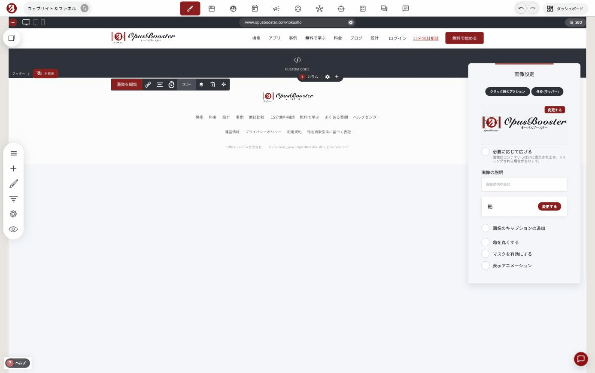
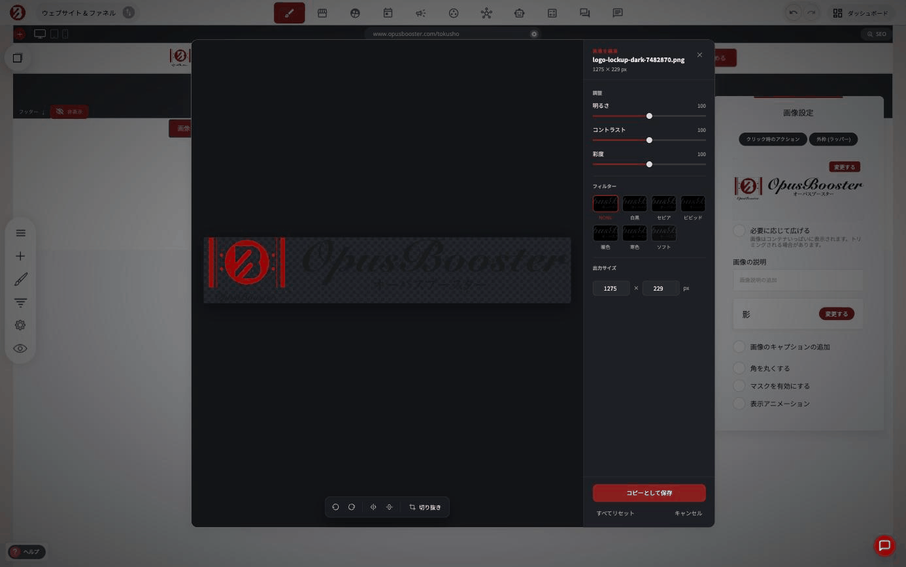
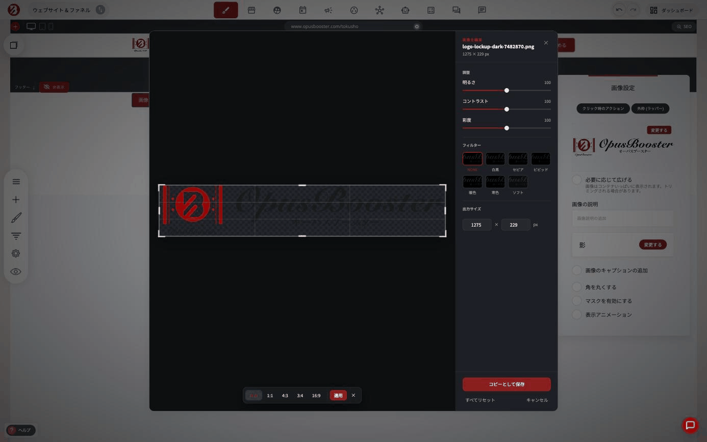

# 画像を編集する

アップロード済みの画像を、外部の画像編集ソフトを使わずにOpusBooster内で直接調整できます。明るさ・コントラスト・彩度の調整、7種類のフィルター、回転・反転、切り抜き、サイズ変更に対応しています。

### 編集画面を開く

1. ページ内の画像をクリックして選択し、ツールバー&#x306E;**「画像を編集」**&#x3092;押す
2. 「画像設定」パネルが開くので、画像サムネイルの上にあ&#x308B;**「変更する」**&#x3092;押す
3. ファイルマネージャーが開く。編集したい画像にカーソルを合わせると、右下に鉛筆アイコンが表示されるのでクリック

<figure><figcaption></figcaption></figure>


ファイルマネージャーは、ページ内の画像だけでなく、サイト全体でアップロード済みのすべての画像から呼び出せます。ロゴやアイコンなど、どのページでも使っている画像もここから編集できます。


### 編集画面でできること

<figure><figcaption></figcaption></figure>

**調整**: 明るさ・コントラスト・彩度をスライダーで調整できます（各0〜200、初期値100）。

**フィルター**: ワンクリックで画像全体の色味を変えられます。

| フィルター | 効果 |
|---|---|
| NONE | フィルターなし（元の色味） |
| 白黒 | モノクロ |
| セピア | 褐色トーン |
| ビビッド | 彩度を強調 |
| 暖色 | オレンジ寄りの色温度 |
| 寒色 | 青寄りの色温度 |
| ソフト | 全体を柔らかいトーンに |

**出力サイズ**: 幅・高さをピクセル単位で直接指定できます。

**回転・反転・切り抜き**: 画面下のツールバーから、左右回転・水平反転・垂直反転ができます。**「切り抜き」**を押すと画像上にハンドルが表示され、ドラッグして範囲を指定できます。縦横比は**自由／1:1／4:3／3:4／16:9**から選べます。

<figure><figcaption></figcaption></figure>


編集を確定するに&#x306F;**「コピーとして保存」**&#x3092;押します。ボタンの名称から、元の画像を上書きするのではなく、編集後の内容を新しいファイルとして追加する動作である可能性が高いです。ロゴなど複数のページで使っている画像を編集する場合は、保存後に該当ページの画像が意図通り更新されているか、実際に確認してから公開することをおすすめします。


### 上手に使うコツ

- ロゴや共通パーツを編集する前に、まず影響範囲（何ページで使われているか）を確認してから作業すると、差し替え漏れを防げます
- 「コピーとして保存」前な&#x3089;**「すべてリセット」**&#x3067;いつでも元の状態に戻せます。色味を迷ったら遠慮なくやり直してOKです
- 大きな加工（トリミングで大きく構図を変える等）は、可能であれば元データを別途保管してから編集すると安心です

---

<!-- cta:opusbooster -->

**自分の場合はどう使えばいいか**

[OpusBoosterの機能全体](https://opusbooster.com/features)を見る。設計から相談したい方は[15分の無料相談](https://opusbooster.com/consultation)、まず触ってみたい方は[14日間の無料トライアル](https://opusbooster.com/register)（クレジットカード不要）から。

