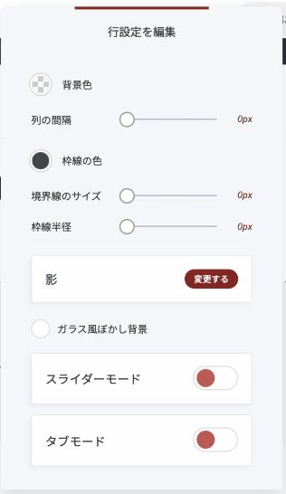
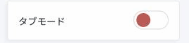
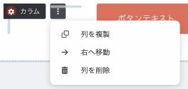

# 並べ方が自由になりました

これまでページ作りは、「上から順に、箱を積む」形でした。きれいに整いますが、**似たようなページになりやすい**という面もありました。

いまは違います。**要素を好きな位置に置けて、重ねられて、1か所で複数の内容を切り替えられます。**

この記事では、レイアウトに関わる5つの機能をご案内します。

## 1. 好きな位置に動かす（自由移動）

ウィジェットを選ぶと、上に小さなツールバーが出ます。**一番右の十字のアイコン**を押してください。

<figure><figcaption>ウィジェットを選ぶと出るツールバー。一番右が自由移動です</figcaption></figure>

押すと、**そのウィジェットを好きな場所へドラッグできる**ようになります。写真の上に文字を重ねる、見出しを少しはみ出させる、といった作り方ができます。

### 重なりの順番を変える

自由移動をオンにすると、**上下の矢印**も使えるようになります。

- **上向き** … 手前に出す
- **下向き** … 奥に送る

写真の上に文字を置いたのに文字が隠れてしまう、というときは、この矢印で手前に出してください。

同じバーには**位置と重なりの数値**が表示され、**元の位置に戻すボタン**もあります。動かしすぎて分からなくなったら、そこから戻せます。

### スマホでの扱いに、ひとつだけ約束があります

| 動かした方向 | スマホ版 |
| :--- | :--- |
| **上下** | **そのまま反映されます** |
| **左右** | **反映されません（元の位置に戻ります）** |

左右のズレをそのままスマホに持っていくと、**画面の外へはみ出してしまう**ためです。意図した設計です。

また、**スマホ表示に切り替えると、十字アイコン自体が消えます。** 位置を整えるのはパソコン表示で行ってください。

## 2. スライダーの作り方が変わりました

**「スライダー」というウィジェットを置く方式ではなくなりました。**

代わりに、**ブロック・行・列そのものをスライダーにできます。**

### やり方

1. 行の左に出る「**⚙**」を押して、「**行設定を編集**」を開きます
2. 「**スライダーモード**」をオンにします
3. 画面の下に、スライドを操作するバーが出ます

<figure><figcaption>行設定を編集。下の方にスライダーモードとタブモードがあります</figcaption></figure>

このバーで、スライドの**追加**、**複製**、**設定**ができます。

<figure><figcaption>スライドを操作するバー</figcaption></figure>

※ スライドが1枚しかないときは、削除のボタンは出ません。

### 何を入れてもかまいません

**これが以前との一番の違いです。** 専用ウィジェットだった頃は、決まった形（画像＋文字など）しか作れませんでした。

いまは**中身が自由**です。写真だけのスライド、お客様の声のスライド、料金表のスライド。1枚目と2枚目で構成が違っていても問題ありません。

## 3. タブで切り替える

スライダーと似ていますが、**上にタブが並び、押して切り替える**形です。

行の設定にある「**タブモード**」をオンにすると使えます。

<figure><figcaption>タブモードのスイッチ</figcaption></figure>

**タブモードは行だけの機能です。** ブロックや列にはありません。

「初級コース／中級コース／上級コース」「よくある質問のカテゴリ別」など、**読者に選ばせたいとき**に向いています。縦に長く並べずに済むので、ページが短くなります。

## 4. 列と列の間隔をあける

「写真を横に3枚並べたけれど、くっついていて窮屈」

これまでは、**間隔を作るために空っぽの列を挟む**必要がありました。

いまは行の設定にある「**列の間隔**」を動かすだけです。

<figure><figcaption>つまみを動かすだけで、列と列の間があきます</figcaption></figure>

**空の列はもう要りません。** スマホでの崩れも起きにくくなります。

## 5. 列をまるごと複製する

「同じ形の列を5つ並べたい」というとき、1つずつ作る必要はありません。

列のメニュー（**⋮**）から「**列を複製**」を選ぶと、**中身ごとそっくり複製されます。**

<figure><figcaption>列のメニュー</figcaption></figure>

同じメニューから、「**右へ移動**」と「**列を削除**」もできます。

※ この2つが出るのは、**列が2つ以上あるとき**です。1つしかないときは「列を複製」だけが表示されます。

このメニューは押し間違えやすい場所にあります。意図せず列が増えてしまったときは、上部の「元に戻す」ボタン（左向きの矢印）で戻してください。

## どれを使えばいいか

| やりたいこと | 使うもの |
| :--- | :--- |
| 写真の上に文字を重ねたい | **自由移動** |
| 実績写真を順番に見せたい | **スライダーモード** |
| 読者に選ばせて切り替えたい | **タブモード** |
| 並べた要素が窮屈 | **列の間隔** |
| 同じ形をいくつも並べたい | **列の複製** |

## まとめ

- **自由移動**は十字アイコンから。重なりの順番も変えられる
- 左右に動かした分は**スマホに反映されない**。スマホでは自由移動そのものが使えない
- スライダーは**行や列そのものをスライダーにする**方式。中身は自由
- **タブモードは行だけ**
- 間隔は「**列の間隔**」で。**空の列を挟む必要はもうない**

## 関連記事

* [スマホ版だけを、パソコン版と別々に整える](mobile-editing.md)
* [色と装飾を、1か所で決める](global-styles.md)
* [新しく増えたウィジェット](../widgets/new-widgets.md)
