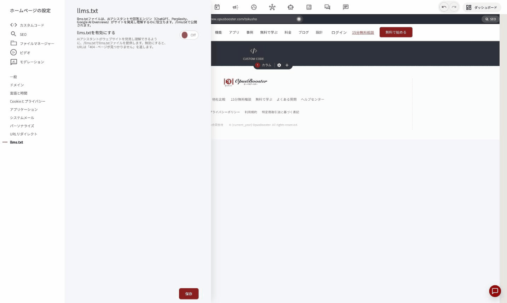
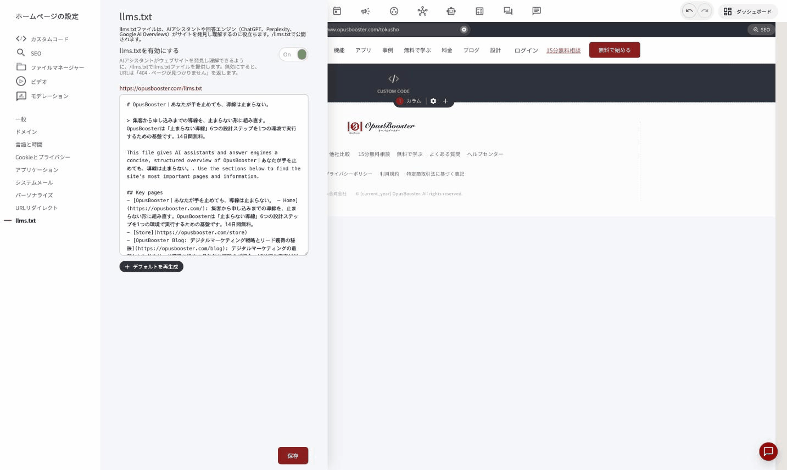

# llms.txtでAIにサイトを理解させる

ページビルダー左のツールバーから**歯車アイコン**（ホームページの設定）を開き、**「llms.txt」**&#x3092;選択すると、ChatGPTやPerplexityなどのAIアシスタント・回答エンジン向けにサイト情報を公開する設定ができます。

<figure><figcaption></figcaption></figure>

### llms.txtとは

`llms.txt`は、AIアシスタントや回答エンジン（ChatGPT、Perplexity、Google AI Overviews等）がサイトを発見・理解しやすくするための、業界で使われ始めているテキストファイルです。検索エンジン向けの`robots.txt`や`sitemap.xml`のAI版とイメージすると分かりやすいです。


これは[ページのSEOスコア](seo-score.md)の「AI対応」カテゴリとも関係する項目です。SEOスコアを上げたい場合は、あわせてこちらも設定することをおすすめします。


### 有効にする

**「llms.txtを有効にする」**&#x3092;Onにすると、サイトの内容をもとにした`llms.txt`ファイルの中身が自動生成されます。生成される内容には次が含まれます。

- サイトのタイトルと要約
- サイトの説明文
- **Key pages**: トップページや主要なランディングページとその説明
- **Blog**: ブログ記事一覧へのリンク
- **Store**: 商品・料金ページへのリンク
- **Contact**: 会社名・所在地・メールアドレス・電話番号
- **Optional**: サイトマップ（sitemap.xml）へのリンク

内容はテキストエリアで自由に編集できます。手直ししたい場合はそのまま書き換えて構いません。元の自動生成内容に戻したい場合&#x306F;**「デフォルトを再生成」**&#x3092;押します。

<figure><figcaption></figcaption></figure>

編集が終わった&#x3089;**「保存」**&#x3092;押して公開します。公開後は `https://[あなたのドメイン]/llms.txt` でファイルの中身を確認できます。


**「llms.txtを有効にする」をOffにすると、URLは「404・ページが見つかりません」を返します。** 一度公開したあとに一時的に取り下げたい場合もOffで対応できます。


### 上手に使うコツ

- 会社情報（住所・連絡先）は自動でサイト設定から反映されます。内容が古い場合は、まずサイト全体の会社情報設定を見直すと、こちらにも正しく反映されます
- ブログ記事やページが増えたら、**「デフォルトを再生成」**&#x3067;最新の一覧に更新しておくと、AIが把握できる情報も最新に保てます
- まだ新しい取り組みのため、対応するAIサービス側は今後も増えていく見込みです。今のうちに公開しておいて損はありません

---

<!-- cta:opusbooster -->

**自分の場合はどう使えばいいか**

[OpusBoosterの機能全体](https://opusbooster.com/features)を見る。設計から相談したい方は[15分の無料相談](https://opusbooster.com/consultation)、まず触ってみたい方は[14日間の無料トライアル](https://opusbooster.com/register)（クレジットカード不要）から。

