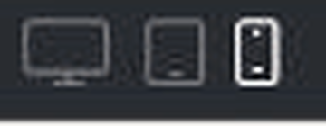
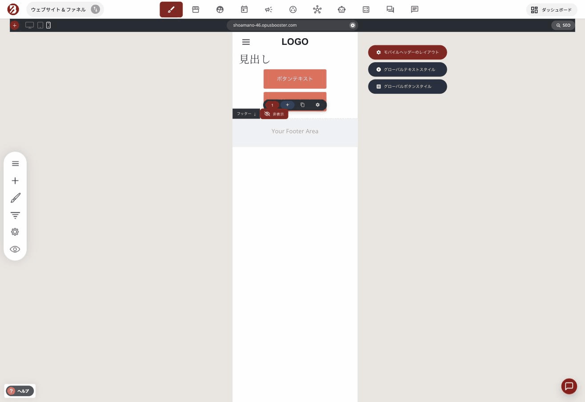
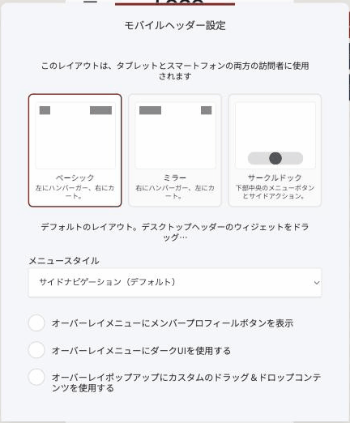
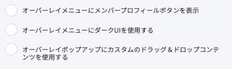
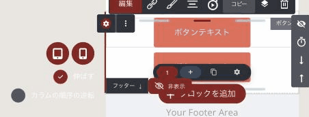

# スマホ版だけを、パソコン版と別々に整える

「パソコンで見るときれいなのに、スマホだと文字が大きすぎる」

「スマホだと余白が詰まって、読みにくい」

これまでは、こうしたときに**スマホ専用のブロックをもう一つ作る**しかありませんでした。同じ内容を二重に持つことになり、片方を直したらもう片方も直す、という手間が続きます。

**それが不要になりました。** パソコン版はそのままに、スマホ版だけを調整できます。

## 表示を切り替える

編集画面の左上に、3つのアイコンが並んでいます。

| アイコン | 表示 |
| :--- | :--- |
| モニター | パソコン |
| タブレット | タブレット |
| スマートフォン | スマホ |

**スマホのアイコンを押すと、スマホ幅の表示に切り替わります。** ここで調整したことは、パソコン版には反映されません。

<figure><figcaption>左上の3つのアイコンで表示を切り替えます</figcaption></figure>

### 切り替えるときに出るダイアログ

表示を切り替えようとすると、こんな画面が出ることがあります。

> **変更を保存しました**
> 終了する前に変更を保存しますか？
> 〔破棄して終了〕〔保存して続行〕

見出しと本文が食い違っていて戸惑いますが、**聞かれているのは「保存しますか？」の方**です。編集を続けるなら「**保存して続行**」を押してください。

## スマホ表示でだけできること

スマホ表示に切り替えると、画面の右側に3つのボタンが現れます。

| ボタン | 何ができるか |
| :--- | :--- |
| **モバイルヘッダーのレイアウト** | スマホでのメニューの出し方を選ぶ |
| **グローバルテキストスタイル** | 文字の共通設定を開く |
| **グローバルボタンスタイル** | ボタンの共通設定を開く |

<figure><figcaption>スマホ表示でだけ現れる3つのボタン</figcaption></figure>

**まず「グローバル」の方を見てください。** 一つずつ個別に直すより、共通設定で一度に決めた方があとが楽です。ページが増えても崩れません。

## スマホのメニューを選ぶ

「モバイルヘッダーのレイアウト」を押すと、3つの形から選べます。

| レイアウト | 見た目 |
| :--- | :--- |
| **ベーシック** | 左にハンバーガー、右にカート |
| **ミラー** | 右にハンバーガー、左にカート |
| **サークルドック** | **画面の下中央に丸いメニューボタン**＋左右にアクション |

<figure><figcaption>モバイルヘッダーは3つの形から選べます</figcaption></figure>

**サークルドックは、スマホアプリのような見た目になります。** 指が届きやすい下の方にメニューが来るので、スマホで長く読ませたいサイトと相性のいい形です。

### メニューの中身を自由に作る

同じ画面の下にある「**オーバーレイポップアップにカスタムのドラッグ＆ドロップコンテンツを使用する**」をオンにすると、**メニューを開いたときに出る画面を、自分で組み立てられます。**

パソコン版のメニュー項目をそのまま出す必要はありません。画像でも、動画でも、ボタンでも、置きたいものを置けます。

<figure><figcaption>ここをオンにすると、メニューの中身を自分で組み立てられます</figcaption></figure>

## 列の並びを、スマホだけ入れ替える

パソコンで「左に写真、右に文章」と並べたものは、スマホでは縦に積まれます。このとき**写真が先、文章が後**になります。

「スマホでは文章を先に読ませたい」というとき、列の設定にある「**カラムの順序の逆転**」をオンにしてください。スマホのときだけ順番が入れ替わります。

同じ場所に「**伸ばす**」もあります。列を画面幅いっぱいに広げるかどうかの設定です。

<figure><figcaption>スマホ表示で列を選ぶと出る設定</figcaption></figure>

## 覚えておくと迷わないこと

### スマホ表示では「自由移動」は使えません

ウィジェットを選んだときに出るツールバーの右端に、**十字のアイコン**があります。要素を好きな位置へ動かす機能です。

**スマホ表示に切り替えると、このアイコンは消えます。**

不具合ではありません。スマホは画面が狭いので、左右に動かすと**画面の外へはみ出してしまう**ためです。位置を整えたいときは、パソコン表示で調整してください。

### 上下に動かした分は、スマホにも反映されます

自由移動でウィジェットを**上下**に動かしたときは、その位置がスマホ版にも引き継がれます。**左右**に動かした分は引き継がれません。

重ねて配置したデザインが、スマホでも成立するように、という考え方です。

## まとめ

- 左上の**スマホのアイコン**で表示を切り替える
- そこで直したことは、**パソコン版に影響しない**
- **スマホ専用のブロックを作る必要はもうない**
- 個別に直す前に、**グローバルの共通設定**を先に見る
- スマホでは**自由移動が使えない**（左右のはみ出しを防ぐため）

## 関連記事

* [並べ方が自由になりました](layout-freedom.md)
* [色と装飾を、1か所で決める](global-styles.md)
