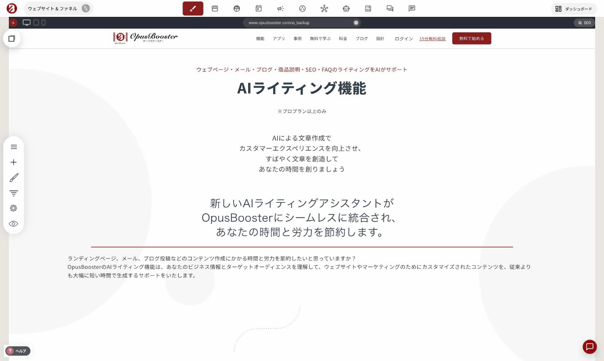
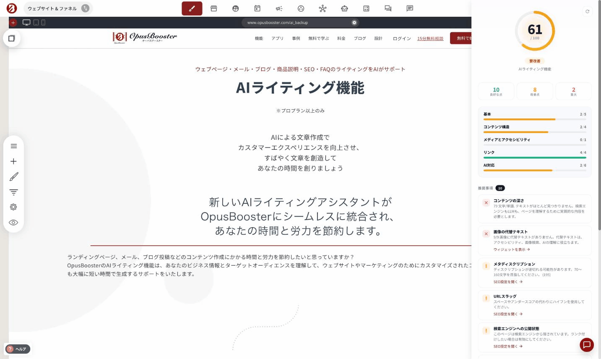
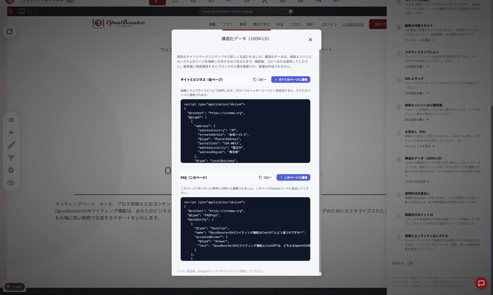

# ページのSEOスコアを確認する

ページビルダーの右上にあ&#x308B;**「SEO」ボタン**&#x3092;押すと、そのページの検索エンジン・AI検索への対応状況を、100点満点のスコアとチェックリストで確認できます。

<figure><figcaption></figcaption></figure>

### この機能でできること

- ページごとのSEOスコアを0〜100点で表示
- 「良好な点」「改善点」「重大」に分けたチェック項目一覧
- 一部の項目は、その場で直接直せるボタン付き（SEO設定を開く／該当ウィジェットを表示／構造化データを自動生成）

<figure><figcaption></figcaption></figure>

### スコアの見方

パネル上部に円形のスコアが表示されます。点数に応じてラベルと色が変わります（低い順に「不十分」（赤）→「要改善」（オレンジ）→「良い」（緑））。

スコアの下に、以下の3つの数字が並びます。

- **良好な点**: すでにクリアできている項目数
- **改善点**: 直すと良い項目数（警告扱い）
- **重大**: 優先して直すべき項目数（エラー扱い）

さらにその下に、5つのカテゴリ別の達成率がバーで表示されます。

| カテゴリ | 内容の目安 |
|---|---|
| 基本 | ページの基本設定（公開状態・URLスラッグ等） |
| コンテンツ構造 | 見出し（H1等）・本文の充実度など |
| メディアとアクセシビリティ | 画像の代替テキストなど |
| リンク | 内部リンク・リンクテキストの分かりやすさ |
| AI対応 | 構造化データ（JSON-LD）・FAQ形式のコンテンツなど、AI検索（ChatGPT・Perplexity・Google AI Overviews）向けの対応 |

各カテゴリの分母（例: `2/5`）は、ページの内容によって変わります。すべてのページが同じ満点になるわけではないので、他のページと数字だけを比べて一喜一憂する必要はありません。


このスコアは「ページ内」の施策だけを見ています。被リンク（バックリンク）・表示速度・ドメインの評価など、ページの外側の要因は含まれません。ページ内でできることを底上げするための指標として使ってください。


### 推奨事項の見方

「推奨事項」の一覧には、直すと良い項目が優先度順に並びます。

- **✕（赤）**: 重大。優先して対応してください
- **！（オレンジ）**: 改善点。余裕があれば対応してください

各項目には、何が足りないか・なぜ必要かが一言で説明されています。項目によっては、下にその場で対応できるリンクが付いています。

| リンク名 | 押すと起きること |
|---|---|
| SEO設定を開く | ページタイトル・メタディスクリプションを編集する、既存の「ページの編集」モーダルが開きます |
| ウィジェットを表示 | 問題のある該当ウィジェット（例: 見出しウィジェット）がハイライト表示され、該当箇所がすぐ分かります |
| JSON-LDを生成 | 後述の「構造化データの自動生成」が開きます |

### 良好な点の確認

「良好な点」の見出しをクリックすると、すでにクリアできている項目が展開表示されます。何ができているかも合わせて確認できるので、次に何を直せば良いかの判断材料になります。

### 構造化データ（JSON-LD）を自動生成する

推奨事項の中に「構造化データ（JSON-LD）」という項目があり、**「JSON-LDを生成」**&#x30DC;タンを押すと、今のサイト・ページの内容をもとにAIが構造化データ（schema.orgの記法）を自動生成します。

構造化データとは、検索エンジンやAI（ChatGPT等）に「このページが何についてのページか」を正確に伝えるための、目に見えないマークアップです。

ページの内容に応じて、複数のブロックが生成されることがあります。例えば:

- **サイトとビジネス（全ページ）**: 会社・サイト全体についての情報（住所・事業種別等）。「すべてのページに適用」でグローバルヘッダーコードに追加し、サイト全体に反映されます
- **FAQ（このページ）**: そのページ内にあるQ&A形式のコンテンツから自動生成。「このページに適用」でそのページだけに反映されます

どちらのブロックにも共通して、生成結果の上にコピーボタンがあり、内容を確認してから自分で好きな場所に貼り付けることもできます。

<figure><figcaption></figcaption></figure>


「すべてのページに適用」を押すと、サイト全体のヘッダーコードが変更されます。「このページに適用」は該当ページのみへの反映です。どちらも内容を確認してから適用してください。再度生成して適用し直すと、前回分は上書きされます（重複は作られません）。


適用後は、Googleの[リッチリザルトテスト](https://search.google.com/test/rich-results)で正しく認識されているか確認することをおすすめします。

### 上手に使うコツ

- 新しいページを作ったら、公開前に一度SEOボタンを開いて「重大」項目だけでも解消しておく
- 「AI対応」カテゴリは新しい観点です。ChatGPTやPerplexityなど、AI検索経由の流入も増えている今、後回しにしないことをおすすめします
- スコアを100点にすることが目的ではありません。「重大」がゼロになれば、まず十分です

---

<!-- cta:opusbooster -->

**自分の場合はどう使えばいいか**

[OpusBoosterの機能全体](https://opusbooster.com/features)を見る。設計から相談したい方は[15分の無料相談](https://opusbooster.com/consultation)、まず触ってみたい方は[14日間の無料トライアル](https://opusbooster.com/register)（クレジットカード不要）から。

