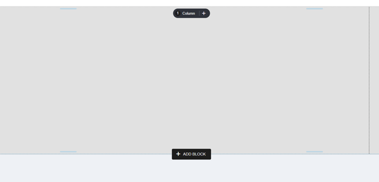
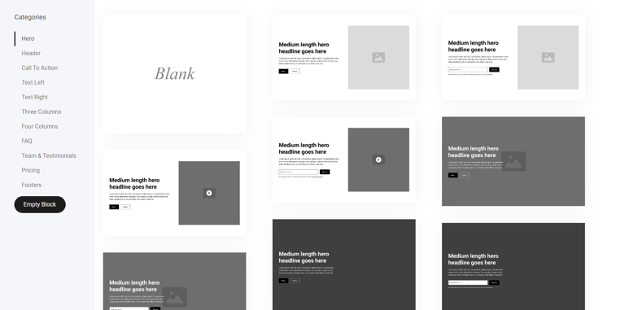
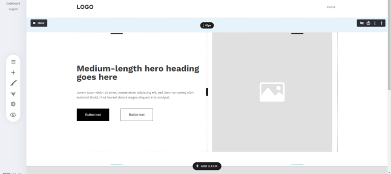
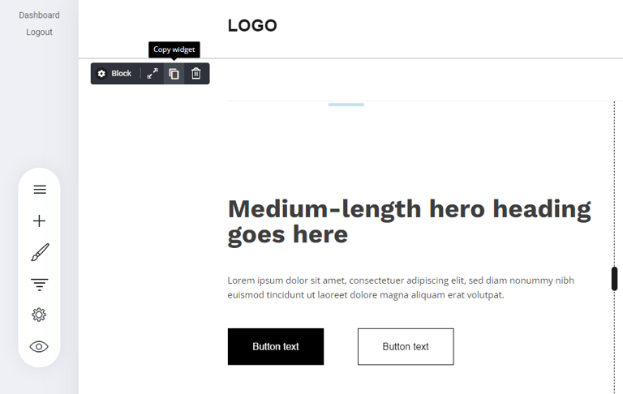
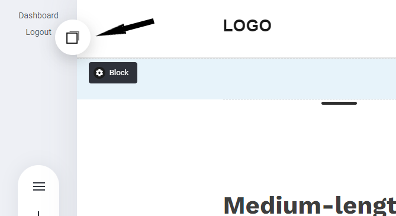
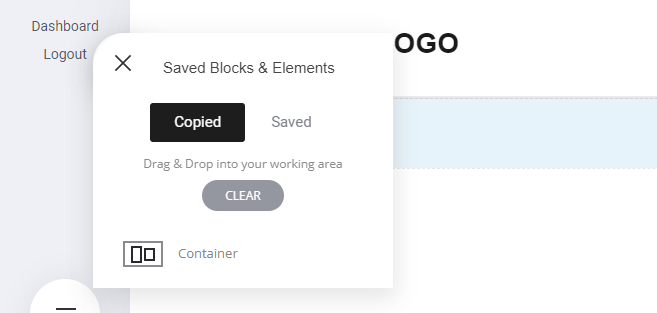

# 新規ブロックの追加

### 新規ブロックの追加 

ブロックは、最小限のデザインスキルでページをまとめるのに最適な方法です。何百ものブロックからお選びいただけます。

新しいブロックをページに追加するには、以下のようにコンテナの上部または下部に移動してください。

<figure><figcaption></figcaption></figure>

ブロックタブを選択すると、あらかじめデザインされたブロックの巨大なギャラリーが表示されます。追加したいブロックを選択するだけで、ページデザインに表示されます。

<figure><figcaption></figcaption></figure>

これでブロックがページに追加され、編集できるようになりました。

<figure><figcaption></figcaption></figure>

ここから、ブロックのデザインを保存して、後で使ったり、別のプロジェクトで使ったりすることができます。

実際のブロックの上部に移動し、ウィジェットのコピーを選択するだけです：

<figure><figcaption></figcaption></figure>

ウィジェットをコピー」をクリックすると、「保存されたブロックアイコン」内にコピーされたブロックが表示されます。

<figure><figcaption></figcaption></figure>

コピーしたブロック／コンテナが表示されます。後でまた使えるように保存するには、コンテナの横にある歯車のアイコンを選択し、名前を付けて保存。これで、実際に「保存済み」タブから見ることができるようになります。

<figure><figcaption></figcaption></figure>
