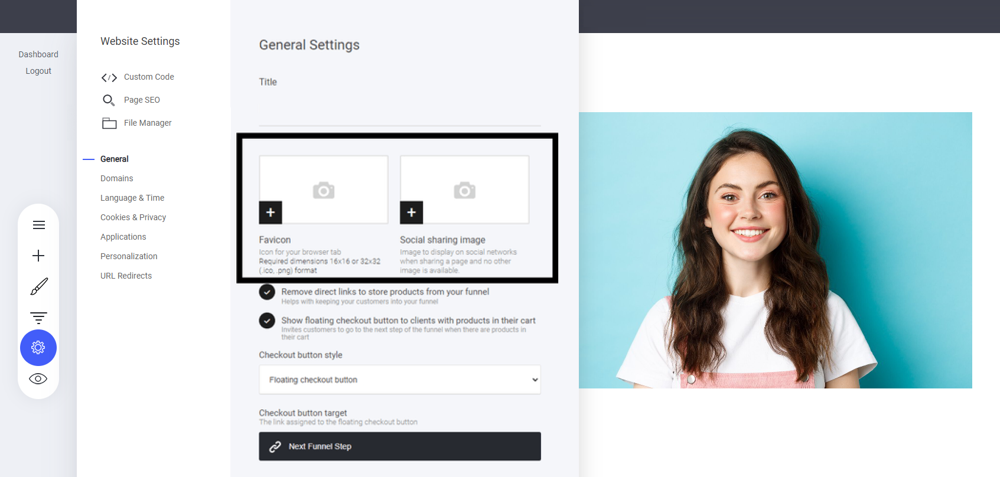

# ファビコンとソーシャルシェア画像

ファビコンとソーシャルシェア画像を追加するには、\[設定]から\[一般]タブを選択します。

ファビコンは、ウェブサイトの検索バーに表示される画像です。これは、ユーザーのコンピュータ画面上であなたのページを識別するのに役立ちます。

### ソーシャルシェア画像とは？

ソーシャルシェアは、ソーシャルメディア上であなたのウェブサイトやウェブサイトのページが共有されたときに表示されます。


ソーシャルシェア画像は、ウェブサイト上の各ページとファネルステップ毎に用意する必要があります。



ページごとに個別の画像を作成すると、そのページの内容をすぐに識別できるようになります。


<figure><figcaption></figcaption></figure>
