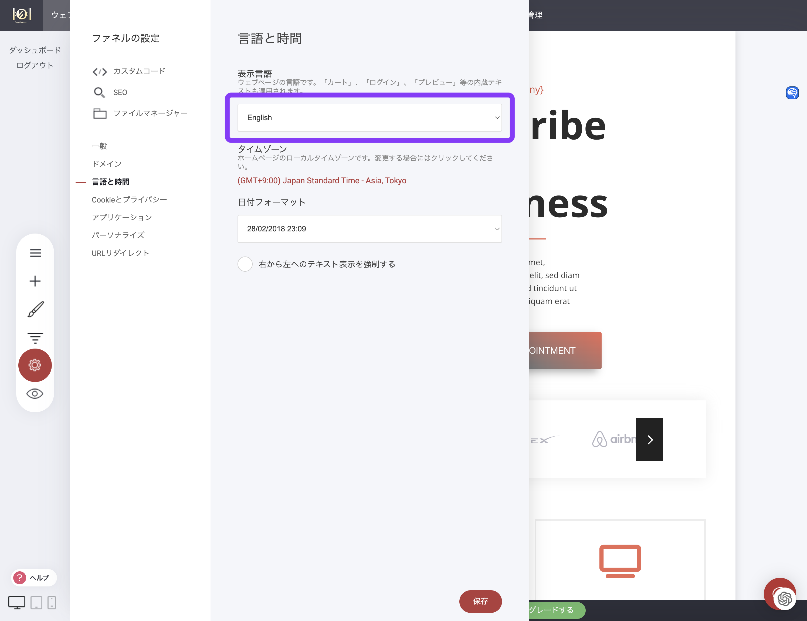

# 言語とタイムゾーンの設定

ウェブサイトの言語（ストア/ブログなどの言語翻訳）とタイムゾーンを変更するには

「設定」→「言語と時間」

<figure><figcaption></figcaption></figure>

使用したい言語とタイムゾーンを選択して保存をクリック

<figure><figcaption></figcaption></figure>

変更が反映されない場合はページの再読み込みや再ログインをしてください。
