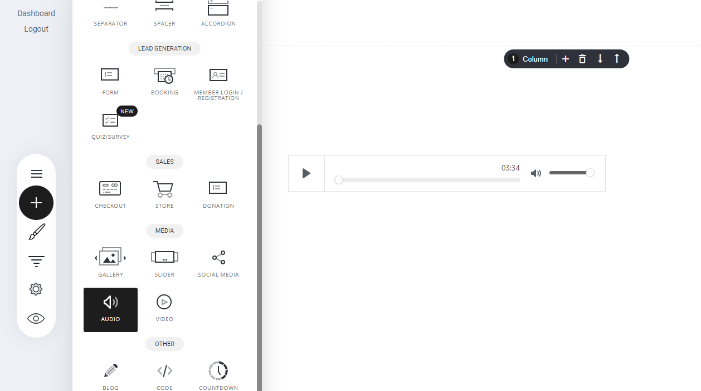

# 音声ウィジェット

音声ウィジェットは、ウェブサイトページに音楽/サウンドを追加することができます。ポッドキャストや、訪問者がウェブサイトを閲覧しているときに音楽を流すのに最適です。

例えば、お客様が購入された際に、「ありがとうございました」と音声でお知らせするのも良い方法です。

オーディオファイルをページに追加するには、音声ウィジェットに移動して、ビルダーにドロップするだけです。

<figure><figcaption></figcaption></figure>

### 設定

音声ウィジェットの設定はとても簡単です。まず、設定タブを選択し、ファイルや曲の名前とアーティスト名を付け、テーマをライトモードかダークモードに設定し、自動再生のオン/オフを設定し、最後に[ファイルマネージャー](../website-funnel-builder/file-manager.md)からオーディオファイルを選択します。

<figure><figcaption></figcaption></figure>

---

<!-- cta:opusbooster -->

**自分の場合はどう使えばいいか**

[OpusBoosterの機能全体](https://opusbooster.com/features)を見る。設計から相談したい方は[15分の無料相談](https://opusbooster.com/consultation)、まず触ってみたい方は[14日間の無料トライアル](https://opusbooster.com/register)（クレジットカード不要）から。

