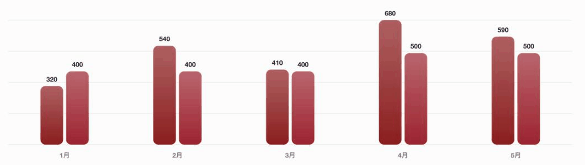
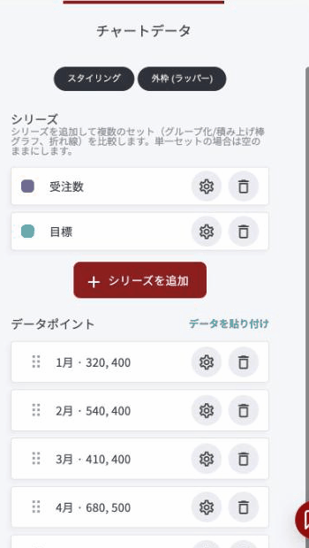
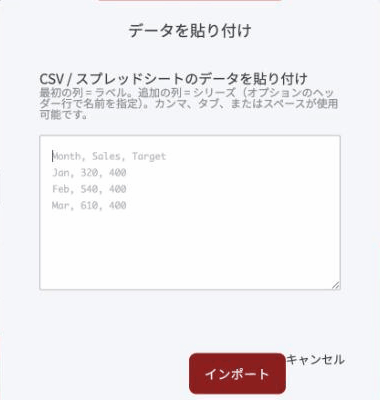
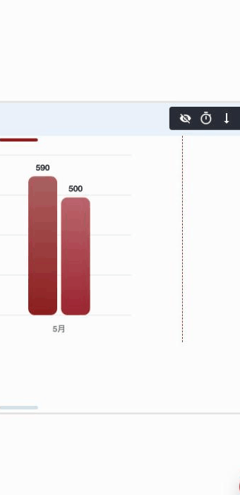

# チャートウィジェット

数字をグラフにして見せるウィジェットです。売上の推移、成長の記録、実績の比較など、データで語りたいときに使います。**表計算ソフトからコピーした内容をそのまま貼り付ければ、グラフが組み上がります。**

### このウィジェットが向いている場面

**数字が頭に入ります。** 表や数字の羅列では伝わらない「増えている」「差がある」が、グラフなら一瞬で伝わります。

**作るのが速いです。** ExcelやGoogleスプレッドシートからコピーして貼るだけです。1つずつ数値を入力する必要はありません。

**用途の幅が広いです。** 1つの数字を見せるだけ（ドーナツ・ゲージ）から、推移の分析（折れ線・エリア）、並べての比較（棒・コンボ）まで対応します。

**動きがあります。** 数字のカウントアップと、スクロールに合わせた表示アニメーションが最初から入っています。

<figure><figcaption><p>「棒」で、受注数と目標を並べて表示したところ</p></figcaption></figure>

### グラフの種類は6つ

「スタイリング」の**チャートタイプ**から選びます。

| 種類 | 向いている用途 |
|---|---|
| 棒 | 項目ごとの値を比べる |
| 折れ線 | 時間に沿った推移を見せる |
| 面 | 折れ線の下を塗る。量の大きさを強調したいとき |
| コンボ（棒＋折れ線） | 関係する2つの指標を重ねる（実績と目標など） |
| ドーナツ | 割合を見せる。中央にラベル（合計など）を置けます |
| ゲージ | 目標に対する進み具合を、速度計のような形で見せる |

### データを貼り付ける

グラフの元になる数字は、貼り付けで一度に入ります。「チャートデータ」の右上&#x306B;**「データを貼り付け」**&#x304C;あります。

<figure><figcaption></figcaption></figure>

<figure><figcaption></figcaption></figure>

- **1列目がラベル**になります（月、商品名など）
- **2列目以降がデータ**になります。複数列あれば、複数の系列として扱われます
- **1行目にヘッダー**を置くと、系列の名前になります
- 区切りは**カンマ・タブ・スペース**のいずれでも動きます

つまり、ExcelやGoogleスプレッドシート、CSVファイルから範囲をコピーして、そのまま貼れます。

```
月,受注数,目標
1月,320,400
2月,540,400
3月,410,400
4月,680,500
5月,590,500
```

これを貼って「インポート」を押すと、**「受注数」と「目標」の2系列**が自動で作られ、グラフが組み上がります。系列を1つだけにしたい場合は、2列目までのデータを貼ってください。

### 主な設定

<figure><figcaption></figcaption></figure>

| 項目 | 内容 |
|---|---|
| テーマ | ライト／ダーク |
| 棒グラフのスタイル | 角丸の棒グラフなど、棒の形 |
| 向き | 垂直（縦棒）／水平（横棒） |
| 枠線の角丸 | グラフ全体の四隅 |
| 積み上げ棒グラフ | 複数の系列を積み上げて1本にします |
| 目標値・目標ラベル | 比較用の基準線を引きます |
| テキストのフォント・テキストの色 | 文字まわりの設定 |
| 値の接頭辞 / 値の接尾辞 | 数字の前後に付ける記号（例:「¥」「%」） |
| 値を表示 | グラフ上に数字を出します |
| コンパクトな数値（1.2k） | 1200を1.2kのように略します |
| グリッドを表示 / グリッドスタイル | 目盛りの線 |
| 凡例を表示 | 系列名の一覧を出します |
| ホバーツールチップ | カーソルを乗せたときに詳細を出します |
| 値をカウントアップ / スクロール時にアニメーション | 訪問者が到達したときに動かします |
| アニメーションの長さ | 動きの速さ |


系列が2つ以上あるときは、**「凡例を表示」をオンに**してください。どの色がどの系列かが分からないと、グラフの意味が伝わりません。



グラフは**元の数字が正しいことが前提**です。実績として外部に出す数字は、出典と集計期間を自分で説明できる状態にしてから載せてください。


---

<!-- cta:opusbooster -->

**自分の場合はどう使えばいいか**

[OpusBoosterの機能全体](https://opusbooster.com/features)を見る。設計から相談したい方は[15分の無料相談](https://opusbooster.com/consultation)、まず触ってみたい方は[14日間の無料トライアル](https://opusbooster.com/register)（クレジットカード不要）から。

