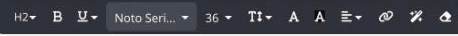
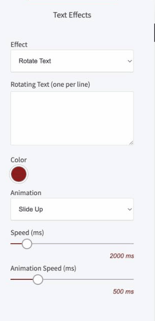

# 見出しウィジェット

ページに見出しを置くための、いちばん基本のウィジェットです。H1〜H6の見出しタグに対応していて、書式の変更や、特定の言葉を目立たせるテキストエフェクトも使えます。

### このウィジェットが向いている場面

**検索エンジンに構造が伝わります。** 「大きい文字」ではなく、本物のH1〜H6タグとして出力されます。検索エンジンにも、読み上げソフトにも、ページの構造が正しく伝わります。

**その場で書式を変えられます。** 太字、下線、色、サイズ、行間、配置。エディタを離れずに整えられます。

**言葉を目立たせられます。** テキストエフェクトを使うと、一部の言葉だけを動かしたり、色を引いたりできます。

### 文字を編集する

テキストをダブルクリックすると、上に編集パネルが出ます。

<figure><figcaption></figcaption></figure>

| 項目 | 内容 |
|---|---|
| 見出しの階層 | H1〜H6 |
| 太字・下線・斜体・打ち消し線・上付き・下付き | 文字の装飾 |
| 書体・文字サイズ | フォントとpx指定のサイズ |
| 行の高さ | 行と行の間隔 |
| 文字色・背景色 | 色の設定 |
| 配置 | 左・中央・右 |
| リンク | クリックしたときの移動先 |
| エフェクト | 下記のテキストエフェクト |
| 書式のクリア | 設定した装飾をまとめて解除します |

### AIに文案を作らせる

編集パネルの上段に、AIの機能が4つ並んでいます。

<figure><figcaption></figcaption></figure>

| 機能 | 内容 |
|---|---|
| AI自動生成 | ゼロから見出しの文案を作ります |
| リライト | いま入っている文章を書き換えます |
| 拡張 | 短い文章をふくらませます |
| 要約 | 長い文章を短くまとめます |


見出しは短いほうが読まれます。長くなってしまったときは**要約**にかけると、言いたいことを残したまま削れます。



**H1は1ページに1つ**にしてください。ページの主題を示すタグなので、いくつもあると検索エンジンが主題を判断できなくなります。2番目以降の見出しは H2、その下は H3、と順番に下げていきます。見た目の大きさで選ばず、意味の階層で選ぶのがコツです。


### テキストエフェクト

見出しの中の、特定の言葉だけに適用できます。ツールバーの魔法の杖アイコンから開きます。

<figure><figcaption></figcaption></figure>


このパネルは、現在**英語のまま表示されます**（Text Effects / Highlight / Rotate Text など）。順次日本語化される予定です。


**Highlight（ハイライト）**

言葉に色を引いて目立たせます。色（Color）・線のスタイル（Highlight Style。下線など）・位置（Placement。文字の下など）を選べます。

**Rotate Text（テキストの回転）**

同じ位置で複数の言葉が入れ替わります。「AIで、〇〇を自動化」の〇〇の部分を、ブログ・SNS・メールと切り替えるような使い方ができます。

| 項目 | 内容 |
|---|---|
| Rotating Text | 表示する言葉。1行に1つずつ入力します |
| Color | 入れ替わる文字の色 |
| Animation | 動き方。Fade / Slide Up / Flip / Zoom In / Bounce Up / Blur In / Typewriter の7種類 |
| Speed (ms) | 1つの言葉が表示されている時間 |
| Animation Speed (ms) | 入れ替わる動きの速さ |


エフェクトは**1ページに1箇所**が目安です。見出しのたびに文字が動くと、肝心の内容が読まれません。


---

<!-- cta:opusbooster -->

**自分の場合はどう使えばいいか**

[OpusBoosterの機能全体](https://opusbooster.com/features)を見る。設計から相談したい方は[15分の無料相談](https://opusbooster.com/consultation)、まず触ってみたい方は[14日間の無料トライアル](https://opusbooster.com/register)（クレジットカード不要）から。

