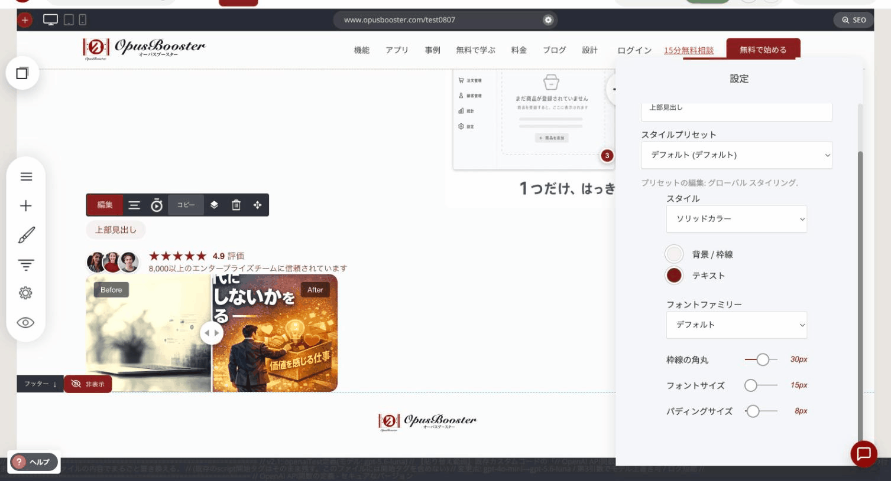

# ビル型見出しウィジェット

見出しの上に置く、小さくて角の丸いラベルです。「新着」「事例」「STEP 1」のような短い言葉を見出しの手前に添えて、そのセクションが何の話かを先に伝えます。

### このウィジェットが向いている場面

**ページが単調になりません。** 見出しばかりが縦に積み上がるページに、小さなアクセントが入ります。

**読む順番ができます。** 「これは分類のラベルです」と先に示すことで、小さい文字から大きい文字へ、視線が自然に流れます。

**ブランドの色を出せます。** 背景色や形を設定できるので、サイト全体のデザインに合わせられます。

**セクションに名札を付けられます。** 「サービス紹介」「導入事例」のような区分けを、見出しをもう1段増やさずに表現できます。

### 設定項目

編集を押すと設定が開きます。

<figure><figcaption>
左が実際の表示。「上部見出し」がビル型見出しです
</figcaption></figure>

| 項目 | 内容 |
|---|---|
| ラベルテキスト | 表示する短い言葉 |
| スタイルプリセット | グローバルスタイリングで決めた見た目を適用します |
| スタイル | 「ソリッドカラー」（塗りつぶし）か「境界」（枠線だけ） |
| 背景 / 枠線 | 塗りつぶしの色、または枠線の色 |
| テキスト | 文字の色 |
| フォントファミリー | 文字の書体 |
| 枠線の角丸 | 角の丸みの強さ |
| フォントサイズ | 文字の大きさ |
| パディングサイズ | 文字の周りの余白。大きくすると横長のピルになります |


**スタイルプリセット**を使うと、サイト全体で同じ見た目に揃えられます。プリセットの中身は「グローバルスタイリング」で編集します。ページごとに色を変えていくと、あとで統一するのが大変になります。



言葉は短いほど効きます。2〜6文字を目安にしてください。文章になってしまうと、下の見出しと役割がぶつかります。


---

<!-- cta:opusbooster -->

**自分の場合はどう使えばいいか**

[OpusBoosterの機能全体](https://opusbooster.com/features)を見る。設計から相談したい方は[15分の無料相談](https://opusbooster.com/consultation)、まず触ってみたい方は[14日間の無料トライアル](https://opusbooster.com/register)（クレジットカード不要）から。

