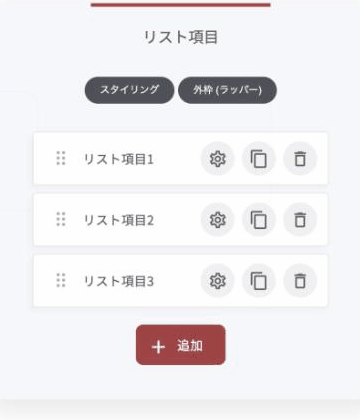
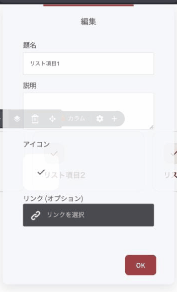
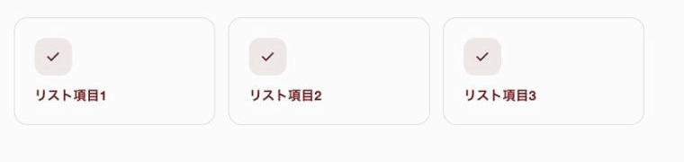
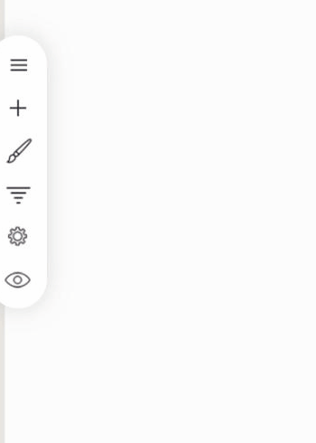

# アイコンリストウィジェット

箇条書きに、アイコンと説明文を添えて見せるウィジェットです。「・」を並べただけのリストより目に留まり、項目ごとの中身も伝わります。

### このウィジェットが向いている場面

**読み飛ばされにくくなります。** アイコンが付くと、文字の塊ではなく「項目の集まり」として認識されます。

**項目ごとに説明を足せます。** 見出しだけのリストと違い、1行の補足を添えられるので、意味が伝わります。

**リンクを張れます。** 項目ごとにリンクを設定できるので、サービス一覧や機能一覧から個別ページへ誘導できます。

### 項目を追加・編集する

編集を押すと、項目の一覧が開きます。「+ 追加」で増やし、ドラッグで並び順を変えられます。真ん中のアイコンで項目を複製できます。

<figure><figcaption></figcaption></figure>

歯車アイコンを押すと、その項目の中身を編集できます。

<figure><figcaption></figcaption></figure>

| 項目 | 内容 |
|---|---|
| 題名 | 項目の見出し |
| 説明 | 補足の文章 |
| アイコン | 項目の左に置くアイコン |
| リンク（オプション） | クリックしたときの移動先 |

### レイアウトは3種類

「スタイリング」の**レイアウト**から選びます。

**標準**

アイコン付きの項目が、上から下へ縦に並ぶ、シンプルな形です。

**テーブル**

標準と同じ縦並びですが、項目のあいだに横線が入ります。項目数が多いときに、区切りがはっきりします。

**カード**

1項目ずつが枠で囲まれ、横に並びます。サービス紹介や特徴の一覧など、それぞれを独立して見せたいときに向いています。

<figure><figcaption>
「カード」で表示したところ
</figcaption></figure>

### 全体の見た目の設定

<figure><figcaption></figcaption></figure>

| 項目 | 内容 |
|---|---|
| テキストのフォント | 文字の書体 |
| フォントサイズ | 文字の大きさ |
| アイコンのサイズ | アイコンの大きさ |
| ロード時にアイテムをアニメーション化 | ページを開いたときに、項目が順に現れます |
| テキストの色 / アイコンの色 | それぞれ別に指定できます |


アイコンは、項目ごとに意味の違うものを選んでください。全部同じチェックマークにすると、装飾にはなっても情報にはなりません。


---

<!-- cta:opusbooster -->

**自分の場合はどう使えばいいか**

[OpusBoosterの機能全体](https://opusbooster.com/features)を見る。設計から相談したい方は[15分の無料相談](https://opusbooster.com/consultation)、まず触ってみたい方は[14日間の無料トライアル](https://opusbooster.com/register)（クレジットカード不要）から。

