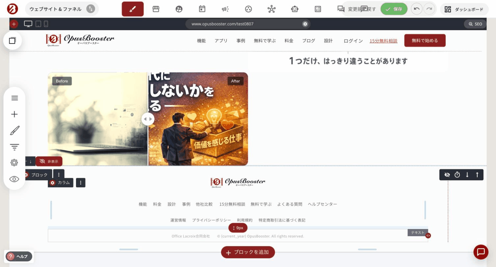

# 画像比較ウィジェット

2枚の画像を1つの枠に重ねて表示し、中央のバーを左右に動かすことで「before」と「after」を見比べられるウィジェットです。施術前後、リフォーム前後、デザインの改訂前後など、変化そのものを見せたいときに使います。

<figure><figcaption></figcaption></figure>

### このウィジェットが向いている場面

**変化が一目で伝わります。** 2枚の画像を別々に並べるより、1枚がもう1枚に切り替わる動きを見せた方が、変わった量が直感的に伝わります。

**訪問者が自分で操作します。** バーを動かすという行為が生まれるぶん、ただスクロールして通り過ぎるより記憶に残ります。

**使い道は幅広いです。** リフォーム、商品のリニューアル、写真の加工、ボディメイクの経過など、「前」と「後」がある題材ならそのまま使えます。

### 表示方法は2種類

**ドラッグで動かす**

訪問者が自分でバーをつかんで左右に動かします。好きな位置で止めて、じっくり見比べられます。

**スクロールで自動的に動く**

訪問者がその位置までスクロールすると、バーが自動で動いて変化を見せます。操作は不要です。

### 設定方法

1. **左の画像**と**右の画像**をアップロードします
2. それぞれの画像で**焦点をドラッグして指定**します。画面サイズによって画像が切り取られても、指定した部分が中央に残ります
3. **左のラベル**と**右のラベル**を入力します（例:「施術前」「施術後」）


**「スクロールで自動的に動く」を選んだ場合の追加設定**

- **どこまで動かすか**: 既定でバーが止まる位置を決められます（例: 50%）
- **動く速さ**: アニメーションの速度を調整できます



2枚の画像は**同じ構図・同じ距離で撮る**と、変化がはっきり伝わります。カメラの位置がずれていると、変化ではなく「別の写真」に見えてしまいます。


---

<!-- cta:opusbooster -->

**自分の場合はどう使えばいいか**

[OpusBoosterの機能全体](https://opusbooster.com/features)を見る。設計から相談したい方は[15分の無料相談](https://opusbooster.com/consultation)、まず触ってみたい方は[14日間の無料トライアル](https://opusbooster.com/register)（クレジットカード不要）から。

