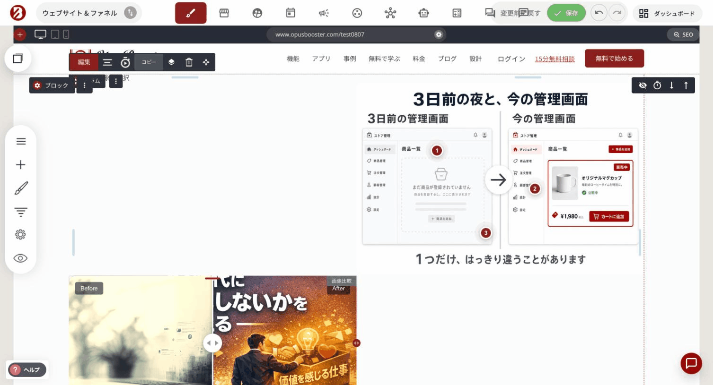
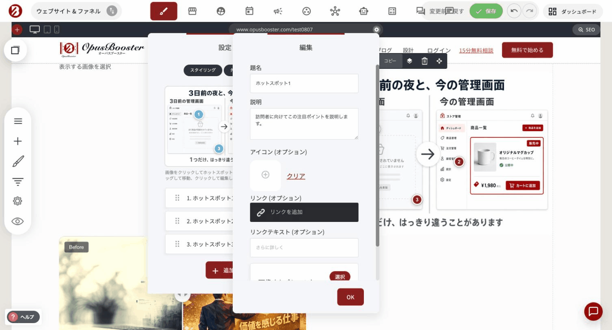

# ホットスポット画像ウィジェット

1枚の画像の上に、好きな位置でピンを置けるウィジェットです。訪問者がピンをクリックすると、その場所の説明が吹き出しで開きます。写真に文字を詰め込まずに、必要な情報だけを必要なときに見せられます。

<figure><figcaption></figcaption></figure>

### このウィジェットが向いている場面

**画像を散らかさずに説明できます。** 写真の中の複数の要素を説明したいとき、キャプションを並べると読みにくくなります。ピンなら、興味のある部分だけを訪問者が選んで開けます。

**商品の紹介に向いています。** 使用シーンの写真に、写っている商品それぞれのピンを立てて、個別の販売ページへリンクできます。

**図解の説明に使えます。** 間取り図、機材のセッティング、工程図など、部分ごとに補足が必要な図に向いています。

**そのまま行動につなげられます。** ピンごとにリンクとボタンを設定できるので、画像そのものが申し込み導線になります。

### 設定方法

1. まず**元になる画像**を選びます
2. 画像を**直接クリック**すると、その位置にピンが立ちます
3. ピンは**ドラッグで移動**できます。クリックすると内容を編集できます
4. **「+ 追加」**&#x3067;ピンを増やせます。一覧で並び順も変えられます

### ピンごとの設定項目

ピンの一覧から歯車アイコンを押すと、そのピンの編集画面が開きます。

<figure><figcaption></figcaption></figure>

| 項目 | 内容 |
|---|---|
| タイトル・説明文 | 吹き出しに表示される見出しと本文 |
| アイコン（任意） | ピン自体に表示するアイコン |
| リンク・リンクテキスト（任意） | 吹き出しにボタンを付けられます（例:「詳しく見る」） |
| 画像（任意） | 吹き出しの中にもう1枚画像を入れられます。商品のアップなどに |
| 画像の代替テキスト | 読み上げソフトや検索エンジン向けの説明文 |


ピンの数に決まりはありませんが、**1枚に5〜6個までが読みやすい**と思います。多すぎると、どこを見ればいいのか分からなくなります。


---

<!-- cta:opusbooster -->

**自分の場合はどう使えばいいか**

[OpusBoosterの機能全体](https://opusbooster.com/features)を見る。設計から相談したい方は[15分の無料相談](https://opusbooster.com/consultation)、まず触ってみたい方は[14日間の無料トライアル](https://opusbooster.com/register)（クレジットカード不要）から。

