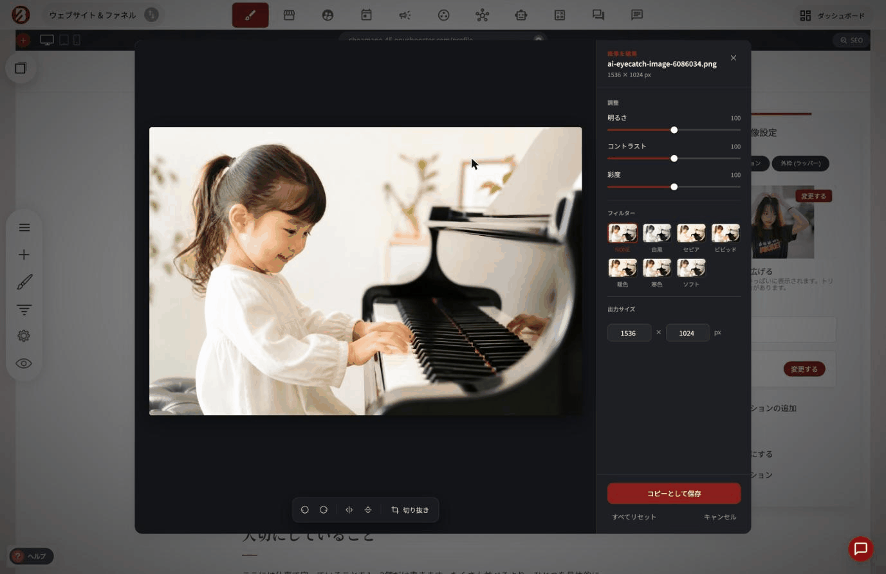

# 画像ウィジェット

ウェブサイトに**画像**を追加して設定します。画像ウィジェットを見つけるには、ウィジェットで、**画像**を選択します。

ファイルマネージャに画像を追加する方法については、以下のリンクをタップしてください。


[fairumanjnoi.md](../website-funnel-builder/file-manager.md)


画像を選択し、ページに配置したら、画像設定タブに移動します。ここでは、画像の説明文「SEOに最適」、影、画像のキャプション、コールトゥアクションを追加できます。

### 画像エディタ

画像設定タブの中に、簡易的な**画像エディタ**が用意されています。ファイルマネージャーで元の画像を編集し直さなくても、その場で画像を調整できます。

* **角丸**：4つの角をまとめて、または個別に丸めることができます
* **マスク**：円形や星形など、複数の形に画像を切り抜けます
* **調整**：明るさ・コントラスト・彩度を調整できます
* **フィルター**：白黒・セピア・ビビッド・暖色・寒色・ソフトの6種類から、あらかじめ用意されたフィルターをワンクリックで適用できます
* **出力サイズ**：書き出すサイズを指定できます
* **回転・反転・トリミング**：画像の向きや切り抜き範囲を変更できます

<figure><figcaption></figcaption></figure>

編集内容は「コピーとして保存」でき、元の画像を残したまま調整後の画像を別ファイルとして書き出せます。すべての調整を一括でリセットするボタンもあります。

キャプションを付けると、テキストボックスを表示したり、CTAリンクを追加したりと、さまざまなことができるようになります。

画像やサービスについてより詳しく説明したい場合に最適です。

キャプションの編集は、ブランディングを強化したい場合や、キャプションバーをより好みの位置に移動させたい場合など、さまざまな用途に対応できます。

画像にリンクやポップアップライトボックスを追加することができます。画像にリンクを追加することで、ウェブサイト訪問者を別のページ、ネットショップ製品、ファネルのステップなど、好きな場所に誘導することができます。

ライトボックスオプションは視覚効果です。訪問者が画像にカーソルを合わせたり、クリックしたりすると、画像が飛び出します。

---

<!-- cta:opusbooster -->

**自分の場合はどう使えばいいか**

[OpusBoosterの機能全体](https://opusbooster.com/features)を見る。設計から相談したい方は[15分の無料相談](https://opusbooster.com/consultation)、まず触ってみたい方は[14日間の無料トライアル](https://opusbooster.com/register)（クレジットカード不要）から。

