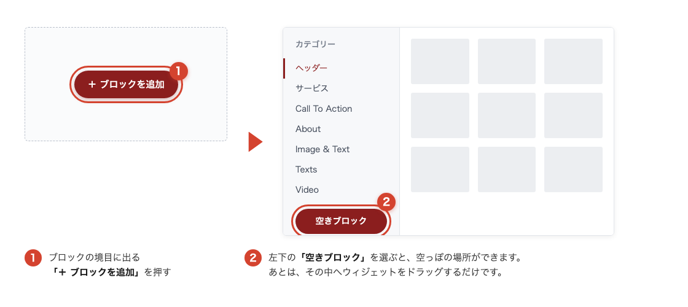
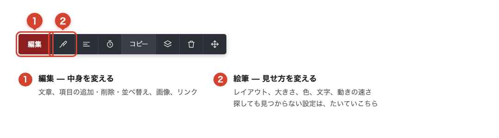
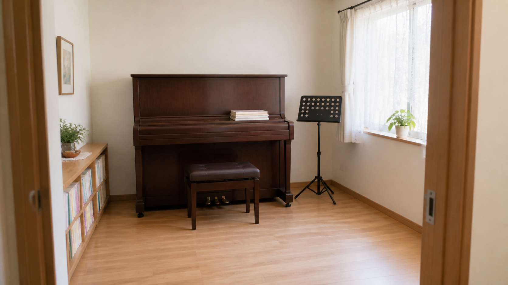

# 新しいウィジェットの使い方

ページビルダーに、新しいウィジェットが15種類追加されました。

お客様の声、料金表、実績の数字、ビフォーアフター写真。これまで「画像を作って貼る」か「あきらめる」しかなかったものが、置くだけで作れるようになっています。

この記事では、まず操作の基本を説明したあと、目的別に「どれを使えばいいか」をご案内します。

### まず、置き方を覚えてください 

ここだけ覚えれば、あとは全部同じです。

1. 左のツールバーの「**＋**」を押します
2. 一覧から使いたいウィジェットを、ページの上へ**ドラッグ＆ドロップ**します
3. 置いた瞬間、右側に設定パネルが開きます。ここで中身を編集します
4. 最後に上部の「**保存**」を押します

#### うまく置けないときは

よくあるのが「ドラッグしたのに、何も増えない」という状態です。これは、すでに何か置いてある場所の上に落とすと、新しく置くのではなく「そこにあるものを選んだ」動きになるためです。

確実なのは、何もない余白に落とすこと。それでもうまくいかないときは、次の方法が確実です。

<figure><figcaption></figcaption></figure>


ページの一番下（フッター）に落とさないよう気をつけてください。フッターは全ページ共通のため、うっかり置くとサイト全部のフッターが変わってしまいます。

また、一覧をクリックしただけでは置けません。必ずドラッグしてください。


#### 「編集」と「絵筆」は役割が違います

置いたウィジェットをクリックすると、左上に小さなツールバーが出ます。ここが2つに分かれているのが、一番のポイントです。

<figure><figcaption></figcaption></figure>

探しているのに見つからない設定は、たいてい絵筆の中にあります。たとえば次のようなものです。

* グラフを棒から折れ線に変えたい → **絵筆**の「Chart Type」
* 年表を縦に並べたい → **絵筆**の「レイアウト」
* 料金表を最初から年額表示にしたい → **絵筆**の「Default billing」

どれも「編集」の中をいくら探しても見つかりません。**中身を直すなら編集、見せ方を変えるなら絵筆**と覚えてください。

なお、絵筆が出ないウィジェットもあります。その場合は設定が「編集」にまとまっているので、そちらをご覧ください。

#### ブログ記事の中でも使えます

ここまでの手順は、ページだけでなく[ブログ記事の本文](../../blog/getting-started/article-content.md)でもそのまま使えます。記事の編集画面にも同じウィジェット一覧が出るので、置き方も同じです。

文章だけで説明していたところに表や年表を入れる、施術やリフォームの記事にビフォーアフターを入れる。記事の説得力を上げたいときに効きます。

***

### 信頼をつくる4つ 

実績やお客様の声を持っているのに、サイトに載せていない。これが一番もったいない状態です。この4つはそこを埋めるためのものです。

#### Testimonials（お客様の声）

顔写真・お名前・星の評価・コメントが入ったカードが3枚並びます。設定パネルで人数を増やしたり、順番を入れ替えたりできます。

まず1つ選ぶなら、これをおすすめします。顔写真つきの声が並んでいるだけで、ページの印象は変わります。

#### Video Testimonials（動画のお客様の声）

動画版です。サムネイル・再生ボタン・再生時間・お名前・星・コメントが入ったカードが並びます。

インタビュー動画を1本でも撮ってあるなら、文章の声よりずっと強く働きます。絵筆から、自動で流れる速さ（初期値40秒）、マウスを乗せたら止めるかどうか、動画の縦横比を変えられます。

#### Social Review Proof（評価バー）

顔写真・星5つ・点数・ひとことが、横一列に並ぶ細い帯です。

Googleの口コミの点数や、これまでの受講者数を持っている方は、ページの上のほうに一行入れてみてください。ここは説明ではなく、安心してもらうための場所です。

#### Stat Counter（実績の数字）

「10,000+ / 受講者数」のような大きな数字が並びます。画面に入ると数字が0から増えていく動きがつきます。

絵筆から、数字の大きさ、3桁ごとのカンマ、増えていく速さ（初期値2秒）を変えられます。数字を持っている方には、置くだけで効く1つです。

***

### 説明をわかりやすくする4つ 

#### Table（表）

3列3行の表が入ります。列と行は好きなだけ増やせます。

料金の比較、コースの内容一覧、時間割。これまで画像を作って貼っていたものが、そのまま表として作れます。あとから1行足すのも簡単です。

#### Icon List（チェック付きリスト）

チェックマークつきの箇条書きです。「含まれるもの」「お持ちいただくもの」を並べるときに使います。項目ごとに複製ボタンがあるので、似た項目を増やすのが楽です。

#### Timeline（流れ・沿革）

見出しと日付が並ぶ年表です。会社の沿革、受講の流れ、レッスンの進み方などに使えます。

初期状態では横並びですが、項目が4つ以上になると窮屈になります。そのときは絵筆の「レイアウト」を「垂直」に変えると、縦に並んで読みやすくなります。

#### Hotspot Image（説明つきの写真）

写真を1枚置いて、その上をクリックするとピンが立ちます。ピンごとに説明を書けます。

教室の設備紹介、商品の各部の説明、館内のご案内。1枚の写真に説明を埋め込めるので、ページが短くなります。

***

### 売るための2つ 

#### Pricing（料金プラン）

プランのカードが3枚並びます。アイコン、プラン名、価格、説明、含まれるもの、申し込みボタン、「最も人気」バッジまで最初から入っています。

月額と年額を切り替えるスイッチと、割引バッジが標準でついています。絵筆の「Default billing」で、最初にどちらを表示するか選べます。年額を先に見せたい場合はここを変えてください。

#### Pricing Comparison（プラン比較表）

プランと機能を掛け合わせた比較表です。「この機能はProから」を一覧で見せられます。機能を「基本機能」「上級機能」のようにカテゴリで区切れます。

プランが3つ以上あって違いが複雑なときは、Pricingで選ばせて、この表で納得してもらう。2つ並べて使うのが効果的です。

***

### 見せ方を上げる3つ 

#### Image Comparison（ビフォーアフター）

2枚の写真を重ねて、真ん中のつまみを左右に動かすと切り替わります。

<figure><figcaption>
ビフォー（左に置く写真）
</figcaption></figure>

<figure><figcaption>
アフター（右に置く写真）
</figcaption></figure>

**コツは、2枚を同じ場所・同じ角度で撮ること**です。カメラの位置がずれていると、つまみを動かしたときに「別の写真に切り替わった」ように見えてしまい、変化が伝わりません。

施術の前後、リフォームの前後、お部屋の片づけ前後、演奏フォームの矯正前後。ビフォーアフターが伝わる仕事をされている方には、これが一番強い見せ方です。

#### Image Autorotator（流れるロゴ）

画像が自動で横に流れていきます。導入企業のロゴ、掲載されたメディア、受賞歴、生徒さんの作品などに使えます。

マウスを乗せたときだけ色がつく設定や、クリックで拡大する設定もあります。

#### Team Members（メンバー紹介）

顔写真・お名前・肩書・紹介文・SNSアイコンが入ったカードです。

一人で運営されている方でも、「講師プロフィール」として1枚だけ使うのは効果的です。

***

### 動きを足す2つ 

#### Chart（グラフ）

棒グラフが入ります。「Paste data」を使うと、表からコピーした数字をまとめて貼り付けられます。

新しいウィジェットの中で一番設定が多く、絵筆から次のようなことができます。

* グラフの種類を変える（Chart Type）
* 縦棒か横棒か（Orientation）
* 目標ラインを引く（Target Value）
* 単位をつける（$ や %）
* 大きな数字を「1.2k」と短く表示する
* 画面に入ったときに伸びるアニメーション

#### Scrolling Text（流れる文字）

見出しの後ろを大きな文字が流れていく演出です。


かなり目を引く動きなので、1ページに1か所までにしてください。複数入れると、どこを見ればいいかわからないページになります。


***

### 色が思ったものにならないときは 

新しいウィジェットは、サイト全体で設定した色（グローバルカラー）を自動で使います。

「置いたら変な色になった」という場合は、ウィジェット側ではなくサイト全体の色設定を見直すと、まとめて解決することがあります。

***

### まとめ 

* 置き方はドラッグ＆ドロップ。うまくいかないときは「空きブロック」を作ってから
* 中身は「編集」、見せ方は「絵筆」
* ページだけでなく、ブログ記事の本文でも同じように使えます
* 何から使うか迷ったら、Testimonials（お客様の声）から

***

<!-- cta:opusbooster -->

**自分の場合はどう使えばいいか**

[OpusBoosterの機能全体](https://opusbooster.com/features)を見る。設計から相談したい方は[15分の無料相談](https://opusbooster.com/consultation)、まず触ってみたい方は[14日間の無料トライアル](https://opusbooster.com/register)（クレジットカード不要）から。

