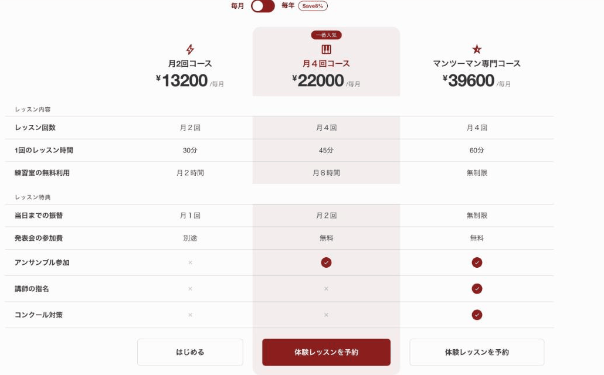
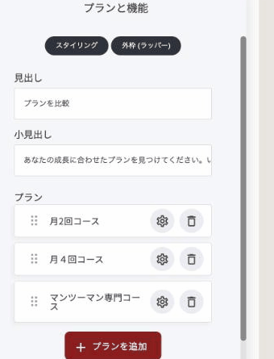
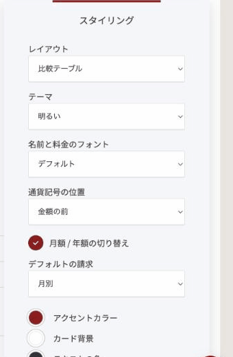
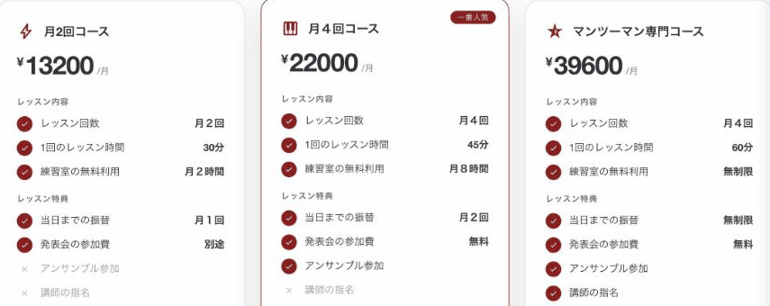

# 料金比較ウィジェット

料金プランを、共通の項目で横並びに比較できるウィジェットです。料金ウィジェットとの違いは、**機能を「行」として先に決め、プランごとにその行の値を入れる**ところです。全プランで同じ項目を揃えて見せたいときに向いています。

<figure><figcaption>
「比較テーブル」で3プランを並べたところ
</figcaption></figure>

### このウィジェットが向いている場面

**横に並べて見比べられます。** どのプランに何が含まれるかを、行ごとに一目で確認できます。「発表会の参加費」のように、プランによって値が変わる項目も並べやすい形です。

**チェックマークと文字を混ぜられます。** ○×で表す項目（対応・非対応）と、テキストで表す項目（月2回・30分など）を同じ表の中で扱えます。

**見出しで区切れます。** 機能を「レッスン内容」「レッスン特典」のようにグループ分けできるので、項目数が多くても読みやすくなります。

### 料金ウィジェットとの違い

| | 料金ウィジェット | 料金比較ウィジェット |
|---|---|---|
| 機能の書き方 | プランごとに自由なテキストで列挙 | 全プラン共通の「行」を先に作る |
| 向いている場面 | プランごとに特典の内容が大きく異なるとき | 同じ項目で横に比べたいとき |

似た用途ですが、「行を揃えて比較させたいか」で使い分けます。

### プランを追加する

「編集」を押すと、「プラン」と「機能」が別々のリストで並びます。まず**プラン**を作ります。「+ プランを追加」で増やし、ドラッグで並び順を変え、歯車で編集します。

<figure><figcaption></figcaption></figure>

プランごとの設定項目は、料金ウィジェットとほぼ同じです（プラン名・アイコン・通貨・月額/年額料金・ボタンテキスト・ボタンリンク・ラベル・おすすめプランのハイライト）。

### 機能の行を追加する

次に**機能**の行を作ります。「機能を追加」で増やし、歯車で編集します。

| 項目 | 内容 |
|---|---|
| 機能ラベル | 行の見出し（左端に出る項目名） |
| セクション見出し（以下の機能をグループ化） | オンにすると、この行は入力欄ではなく**グループの見出し**になります（例:「レッスン内容」） |
| プランごとの値 | 各プランの欄に入れる値。「Yes」「No」、または任意のテキストを入力できます |

「Yes」「No」と入力すると、自動的にチェックマーク（✓）とバツ（✗）で表示されます。「月2回」「30分」のように自由な文章を入れれば、そのまま文字として表示されます。同じ表の中で、行ごとにどちらを使うかを自由に選べます。


「アンサンブル参加」のように○×で十分な項目は Yes/No にし、「1回のレッスン時間」のように具体的な違いを見せたい項目はテキストにする、という使い分けが読みやすさにつながります。


### レイアウトは2種類

「スタイリング」の**レイアウト**から選びます。

<figure><figcaption></figcaption></figure>

**比較テーブル**

すべてのプランを横に並べ、行ごとに値を比較する表形式です。項目数が多いときや、プラン間の違いを一覧させたいときに向いています。

**プランカード**

プランごとに独立したカードになり、各項目の前にチェックマークが付きます。

<figure><figcaption>
「プランカード」で表示したところ
</figcaption></figure>

### 全体の見た目

| 項目 | 内容 |
|---|---|
| テーマ | 明るい／暗い |
| 名前と料金のフォント | 文字の書体 |
| 通貨記号の位置 | 金額の前か後ろか |
| プランの角丸 | カード・プランの四隅 |
| 月額 / 年額の切り替え | 訪問者が自分で切り替えられるスイッチを出すかどうか |
| デフォルトの請求 | 最初にどちらを表示するか |
| アクセントカラー・カード背景・テキストの色・切り替えテキストの色 | 配色の設定 |


年払いに切り替えたときの割引表示（例:「Save ¥13200/yr」）は、現在英語表記です。順次日本語化される見込みです。


---

<!-- cta:opusbooster -->

**自分の場合はどう使えばいいか**

[OpusBoosterの機能全体](https://opusbooster.com/features)を見る。設計から相談したい方は[15分の無料相談](https://opusbooster.com/consultation)、まず触ってみたい方は[14日間の無料トライアル](https://opusbooster.com/register)（クレジットカード不要）から。

