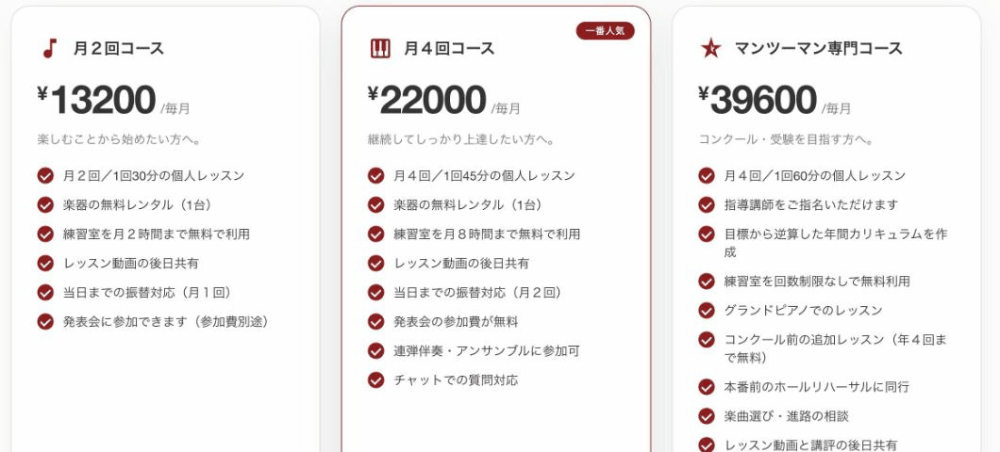
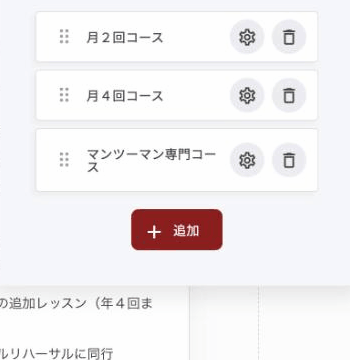
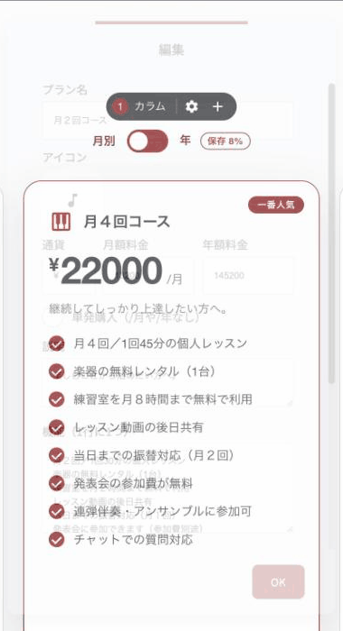
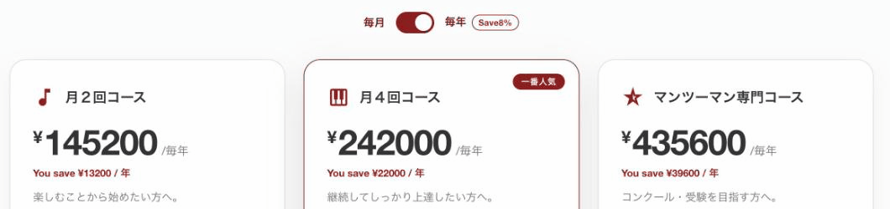
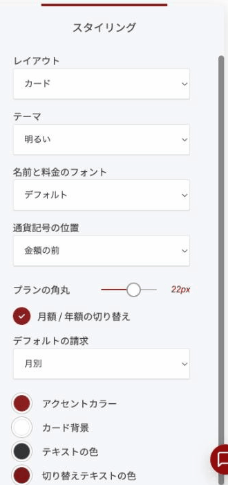

# 料金ウィジェット

料金プランを並べて見せるウィジェットです。プランごとに、名前・価格・説明・特典を自由に書けます。月額と年額を切り替えるスイッチも付けられます。

<figure><figcaption>
3つのプランを「カード」で並べたところ
</figcaption></figure>

### このウィジェットが向いている場面

**用意が早いです。** プランごとに特典を自由な文章で書けます。全プランで揃った比較表を作る必要はありません。

**見せ方を選べます。** 3つのレイアウトがあるので、ページの雰囲気に合わせられます。

**年払いを勧められます。** 月額と年額の切り替えスイッチが付き、**年払いにするといくら得か**が自動で表示されます。

**プランごとに導線を変えられます。** ボタンの文言とリンク先をプランごとに設定できるので、「体験レッスンを予約」と「まずは相談する」を出し分けられます。

### レイアウトは3種類

「スタイリング」の**レイアウト**から選びます。

| レイアウト | 特徴 |
|---|---|
| カード | 枠で囲んだカードを横に並べます。おすすめのプランが強調される、いちばん一般的な形 |
| 列（最小） | 枠のない、すっきりした列で並べます。落ち着いた見た目にしたいとき |
| テーブル（1行に1つ） | 1プランを横幅いっぱいの1行で表示します。縦のスペースが限られるとき |

### プランを追加する

編集を押すと、プランの一覧が開きます。「+ 追加」で増やし、ドラッグで並び順を変えられます。

<figure><figcaption></figcaption></figure>

### プランごとの設定

歯車アイコンを押すと、そのプランの中身を編集できます。

<figure><figcaption></figcaption></figure>

| 項目 | 内容 |
|---|---|
| プラン名 | プランの名前 |
| アイコン | 名前の左に置くアイコン。検索して選べます |
| 通貨 | 「¥」など、価格に添える記号 |
| 月額料金 / 年額料金 | それぞれの価格 |
| 単発購入（/月や/年なし） | 買い切りのプランのとき。「/月」の表示が消えます |
| 説明 | 価格の下に置く一言（例:「楽しむことから始めたい方へ」） |
| 機能（1行に1つ） | プランに含まれる内容。1行が1項目になります |
| ボタンテキスト / ボタンリンク | 申し込みボタンの文言と移動先 |
| ラベル | プランの右上に出すバッジ（例:「一番人気」） |
| おすすめプラン（ハイライト） | オンにすると、そのプランが強調表示されます |

### 月額と年額を切り替える

「月額 / 年額の切り替え」をオンにすると、訪問者が自分で切り替えられるスイッチが出ます。

<figure><figcaption>
年額に切り替えると、割引額が自動で表示されます
</figcaption></figure>

**割引額は自動で計算されます。** 月額と年額の両方を入力しておけば、年払いにした場合の差額が出ます。自分で計算して書く必要はありません。

「デフォルトの請求」で、最初にどちらを表示するかを決められます。

### 全体の見た目

<figure><figcaption></figcaption></figure>

| 項目 | 内容 |
|---|---|
| テーマ | 明るい／暗い |
| 名前と料金のフォント | 文字の書体 |
| 通貨記号の位置 | 金額の前か後ろか |
| プランの角丸 | カードの四隅 |
| アクセントカラー・カード背景・テキストの色・切り替えテキストの色 | 配色の設定 |


プランは**3つまで**が選びやすいと言われています。4つ以上あると、比べること自体が負担になって離脱しやすくなります。増やしたくなったら、いちばん見せたいプランを「おすすめプラン」に指定して、視線の置き場所を作ってください。


---

<!-- cta:opusbooster -->

**自分の場合はどう使えばいいか**

[OpusBoosterの機能全体](https://opusbooster.com/features)を見る。設計から相談したい方は[15分の無料相談](https://opusbooster.com/consultation)、まず触ってみたい方は[14日間の無料トライアル](https://opusbooster.com/register)（クレジットカード不要）から。

