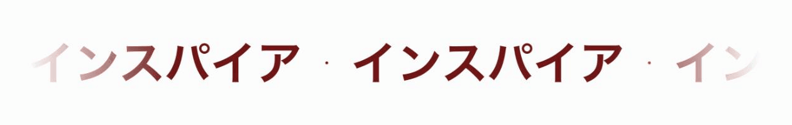
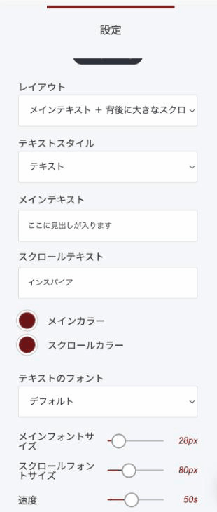

# スクロールテキストウィジェット

文字を横に流して見せるウィジェットです。太い見出しの後ろに、大きく薄い文字を流す2層構成にもできますし、流れる文字だけを帯のように置くこともできます。

### このウィジェットが向いている場面

**目に留まります。** 止まっている文字より、動いている文字のほうが視線を集めます。ページ上部やバナーに向いています。

**画像なしで雰囲気が出ます。** 太い前景の文字と、大きく薄い背景の文字が重なると、雑誌のような見た目になります。デザイン素材を用意しなくても成立します。

**言いたいことを繰り返せます。** 流れる側にキーワードを置いて、静止している見出しで本題を伝える、という役割分担ができます。

### レイアウトは2種類

編集ボタンを押すと設定が開きます。ここで**レイアウト**を選びます。

**メインテキスト ＋ 背後に大きなスクロールテキスト**

前景の文字は動かさず、後ろで大きな文字が流れます。重なりのある、奥行きのある見出しになります。

<figure><figcaption>
静止した見出しの後ろを、大きな文字が流れます
</figcaption></figure>

**スクロールテキストのみ**

帯のように、流れる文字だけを1行で見せます。ページの区切りや、お知らせの帯として使えます。

<figure><figcaption>
流れる文字だけを帯状に見せます
</figcaption></figure>

### 設定項目

<figure><figcaption></figcaption></figure>

| 項目 | 内容 |
|---|---|
| テキストスタイル | 見出しの階層。「テキスト」または H1〜H5 |
| メインテキスト | 静止して表示する文章 |
| スクロールテキスト | 流れる側の文章 |
| メインカラー／スクロールカラー | それぞれの文字色 |
| テキストのフォント | 文字の書体 |
| メインフォントサイズ | 静止している文字の大きさ |
| スクロールフォントサイズ | 流れる文字の大きさ |
| 速度 | 端から端まで流れきるのにかかる秒数。数字が大きいほどゆっくりになります |


**テキストスタイル**は見た目だけでなく、検索エンジンから見た見出しの階層にも関わります。ページの主見出しとして使うなら H1 や H2 を選んでください。飾りとして置くだけなら「テキスト」のままで構いません。



動きは目を引きますが、ページ内で何箇所も使うと落ち着きがなくなります。1ページに1箇所を目安にしてください。


---

<!-- cta:opusbooster -->

**自分の場合はどう使えばいいか**

[OpusBoosterの機能全体](https://opusbooster.com/features)を見る。設計から相談したい方は[15分の無料相談](https://opusbooster.com/consultation)、まず触ってみたい方は[14日間の無料トライアル](https://opusbooster.com/register)（クレジットカード不要）から。

