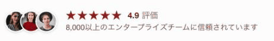
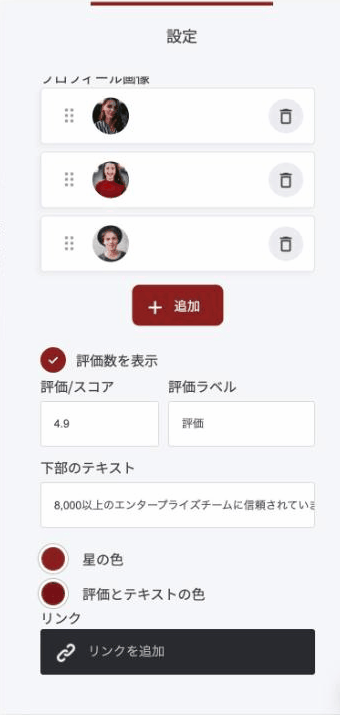

# ソーシャルプルーフウィジェット

顔写真・星評価・ひとことの信頼メッセージを、ひとまとまりで小さく表示するウィジェットです。見出しの下や申し込みボタンのそばなど、訪問者が「ここを信じていいか」を判断している場所に置きます。

### このウィジェットが向いている場面

**すぐに安心してもらえます。** 顔写真と高い評価が並ぶと、「すでに使っている人がいる」という事実が一瞬で伝わります。

**迷いを減らします。** 申し込みフォームやボタンのすぐ近くに置くと、行動する直前のためらいに効きます。

**軽く済みます。** まとまったお客様の声や事例を用意しなくても、数人の顔と数字だけで信頼を伝えられます。

**言葉を自由に決められます。** 「下部のテキスト」の欄で、「延べ200名の講師にご利用いただいています」のように、伝えたい実績を書けます。

<figure><figcaption>
顔写真・星評価・数字・ひとことが、ひとまとまりで表示されます
</figcaption></figure>

### 設定項目

<figure><figcaption></figcaption></figure>

| 項目 | 内容 |
|---|---|
| プロフィール画像を表示 | 顔写真を並べるかどうか。オンにすると下に一覧が出て、追加・削除・並び替えができます |
| 評価数を表示 | 数字と星を出すかどうか |
| 評価/スコア | 表示する数字（例: 4.9） |
| 評価ラベル | 数字の横に添える言葉（例:「評価」） |
| 下部のテキスト | 数字の下に置く、補足の信頼メッセージ |
| 星の色 | 星の色 |
| 評価とテキストの色 | 数字と文章の色 |
| リンク | ウィジェット全体をクリックできるようにします（例: レビュー一覧ページへ） |


顔写真は、実際のお客様の許可を取ったものを使ってください。素材写真を「利用者の顔」として並べると、信頼を得るための仕掛けが逆に信頼を損ないます。写真が用意できない場合は、画像を非表示にして数字と文章だけでも成立します。


---

<!-- cta:opusbooster -->

**自分の場合はどう使えばいいか**

[OpusBoosterの機能全体](https://opusbooster.com/features)を見る。設計から相談したい方は[15分の無料相談](https://opusbooster.com/consultation)、まず触ってみたい方は[14日間の無料トライアル](https://opusbooster.com/register)（クレジットカード不要）から。

