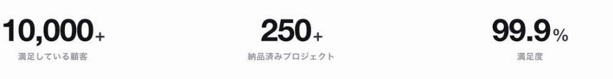
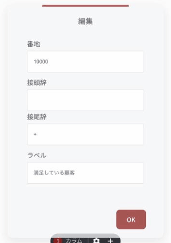
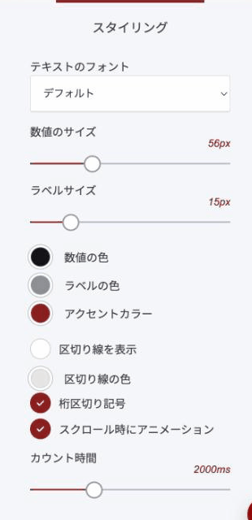

# 統計カウンターウィジェット

「導入10,000社」「満足度98%」のような数字を、大きく目立つ形で見せるウィジェットです。訪問者が画面をスクロールして到達すると、0からカウントアップします。

### このウィジェットが向いている場面

**実績がひと目で伝わります。** 「たくさんの方にご利用いただいています」と書くより、「10,000名」と数字で出したほうが、規模も信頼も速く伝わります。

**準備が要りません。** 数字とラベルを入れるだけです。グラフや表のようにデータを組み立てる必要はありません。

**動きが目を引きます。** 数字が動くことで、静止したページの中で自然に視線を集めます。

**置き場所を選びません。** ページ上部、申し込みボタンの手前、「数字で見る〇〇」という独立したセクションなど、実績を示したい場所ならどこでも使えます。

<figure><figcaption>
スクロールして到達すると、0からカウントアップします
</figcaption></figure>

### 数字を追加する

数字は一覧で管理します。「+ 追加」で増やし、ドラッグで並び順を変え、歯車で編集、ゴミ箱で削除します。

### 数字ごとの設定

<figure><figcaption></figcaption></figure>

| 項目 | 内容 |
|---|---|
| 番地 | 表示する数字そのもの（例: 10000） |
| 接頭辞 / 接尾辞 | 数字の前後に付ける記号（例:「¥」「+」「%」） |
| ラベル | 数字の下に置く説明（例:「ご利用者数」） |


いちばん上の欄&#x306F;**「番地」**&#x3068;表示されますが、住所のことではありません。**表示する数字を入れる欄**です。英語の Number を訳したときの誤りで、修正を依頼済みです。次回のアップデートで表示が変わります。


### 全体の見た目

レイアウトは6種類あります。余白・配置・強さが変わるので、置く場所の雰囲気に合うものを選んでください。

- ミニマル
- ラジアルリング
- スポットライト
- 編集インデックス
- ネオングロー
- グラデーション番号

<figure><figcaption></figcaption></figure>

| 項目 | 内容 |
|---|---|
| テキストのフォント | 文字の書体 |
| 数値のサイズ / ラベルサイズ | それぞれ別に指定できます |
| 数値の色 / ラベルの色 / アクセントカラー | 配色の設定 |
| 区切り線を表示 / 区切り線の色 | 数字と数字のあいだに縦線を入れます |
| 桁区切り記号 | オンにすると 10,000、オフだと 10000 と表示されます |
| スクロール時にアニメーション | オフにすると、カウントアップせず最初から数字が出ます |
| カウント時間 | 数え上がりきるまでの時間（既定は2000ミリ秒＝2秒） |


数字は**事実だけ**を載せてください。盛った数字は、後から問い合わせや取材で必ず確認されます。出せる数字が小さいうちは、「創業3年」「継続率92%」のように、**自信のある切り口**を選ぶほうが効果的です。


---

<!-- cta:opusbooster -->

**自分の場合はどう使えばいいか**

[OpusBoosterの機能全体](https://opusbooster.com/features)を見る。設計から相談したい方は[15分の無料相談](https://opusbooster.com/consultation)、まず触ってみたい方は[14日間の無料トライアル](https://opusbooster.com/register)（クレジットカード不要）から。

