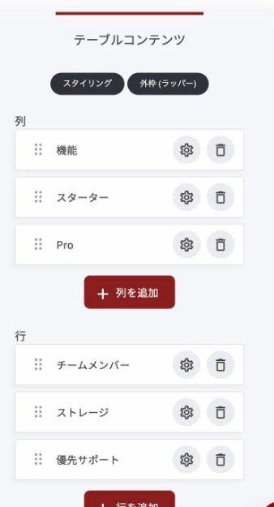
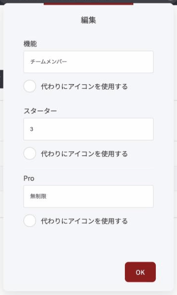
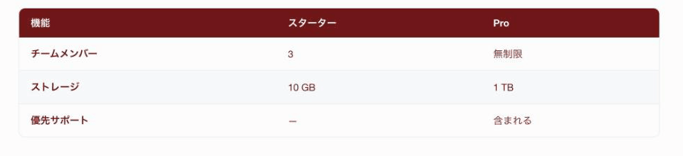
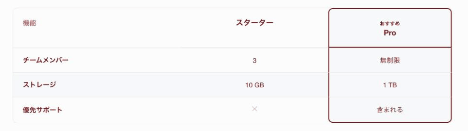
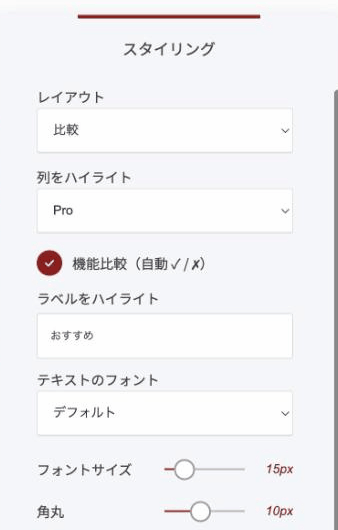

# テーブルウィジェット

料金プラン、機能一覧、仕様表など、整理して見せたい情報を表の形で掲載するウィジェットです。見せ方は2種類あり、目的に応じて選べます。

### このウィジェットが向いている場面

**比べるのが早くなります。** 文章で説明を並べるより、表のほうがひと目で違いが分かります。

**そのままで見栄えがします。** 行の色分け・枠線・角の丸みが最初から用意されているので、CSSを書かなくても整った表になります。

**使いどころが広いです。** 料金ページ、機能の比較、仕様表、ちょっとしたデータの一覧まで対応できます。

### 列と行を編集する

編集を押すと「テーブルコンテンツ」が開きます。ここで表の中身を作ります。

<figure><figcaption></figcaption></figure>

上が**列**、下が**行**です。どちらも「+ 列を追加」「+ 行を追加」で増やせて、左のハンドルをドラッグすると並び順を変えられます。

- **列**の歯車を押すと「列タイトル」を編集できます
- **行**の歯車を押すと、その行の各セルの値をまとめて入力できます

<figure><figcaption>
行の編集。列ごとに値を入れていきます
</figcaption></figure>

セルごとに「代わりにアイコンを使用する」をオンにすると、文字ではなくアイコンで表示できます。「対応」「非対応」を記号で見せたいときに使います。

### レイアウトは2種類

「スタイリング」の**レイアウト**から選びます。

**標準**

見出し行と、その下にデータ行が並ぶ、ふつうの表です。仕様表や機能一覧など、素直に情報を並べたいときに向いています。

<figure><figcaption>
「標準」で表示したところ
</figcaption></figure>

**比較**

料金プランの比較に特化した形です。1つの列を目立たせて、見てほしいプランへ視線を誘導できます。

<figure><figcaption>
「比較」で Pro 列を強調し、「おすすめ」のラベルを付けたところ
</figcaption></figure>

### 設定項目

**両方のレイアウトで使えるもの**

| 項目 | 内容 |
|---|---|
| テキストのフォント | 文字の書体 |
| フォントサイズ | 文字の大きさ |
| 角丸 | 表の四隅の丸み |
| ヘッダーの背景／ヘッダーテキスト | 見出し行の背景色と文字色 |
| 本文テキスト | データ行の文字色 |
| 枠線 / 区切り線 | 線の色 |
| ストライプ行 | 1行おきに背景色を変えて読みやすくします |
| 外側の枠線 | 表の外側に枠線を付けるかどうか |

**比較レイアウトだけの設定**

<figure><figcaption>
「比較」を選んだときのスタイリング
</figcaption></figure>

| 項目 | 内容 |
|---|---|
| 列をハイライト | どのプラン（列）を目立たせるか。「NONE」で強調なし |
| 機能比較（自動 ✓ / ✗） | 入力した値を自動的に ✓ / ✗ に変換します |
| ラベルをハイライト | 強調した列の上に出すバッジの文字（例:「おすすめ」「いちばん人気」） |


「ラベルをハイライト」は、**「機能比較（自動 ✓ / ✗）」をオンにすると出てきます。** オフのままだと項目自体が表示されないので、バッジの文字を変えたいときはまずこのスイッチを入れてください。



料金表では、いちばん売りたいプランを「列をハイライト」に指定します。並べただけの表よりも、選んでほしい方向がはっきり伝わります。


---

<!-- cta:opusbooster -->

**自分の場合はどう使えばいいか**

[OpusBoosterの機能全体](https://opusbooster.com/features)を見る。設計から相談したい方は[15分の無料相談](https://opusbooster.com/consultation)、まず触ってみたい方は[14日間の無料トライアル](https://opusbooster.com/register)（クレジットカード不要）から。

