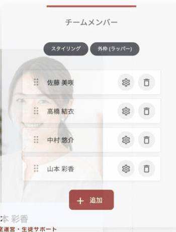
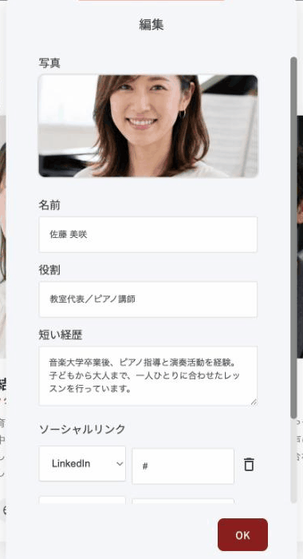
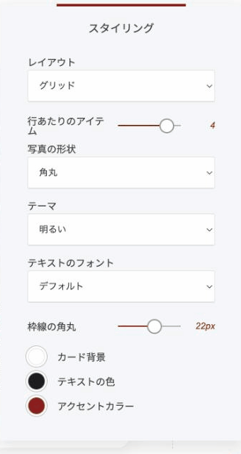

# チームメンバーウィジェット

顔写真・お名前・役割・経歴・SNSリンクをまとめたプロフィールカードを並べるウィジェットです。「チーム紹介」向けに作られていますが、人を並べて見せたい場面ならどこでも使えます。

<figure><figcaption>
「グリッド」で4人並べたところ
</figcaption></figure>

### このウィジェットが向いている場面

**顔が見えると安心されます。** 実在する人の名前と写真が出ているだけで、問い合わせのハードルが下がります。

**チーム紹介以外にも使えます。** 講師陣、登壇者、コーチ、役員、協力者、アンバサダー。「人 ＋ 写真 ＋ 肩書き ＋ 紹介文」の形が要る場面はすべて対応できます。

**その人に直接つながります。** SNSリンクを設定できるので、興味を持った訪問者がそのままフォローや連絡に進めます。

**規模に合わせられます。** 会社概要の一角に置く小さなスライダーから、専用ページの全員一覧まで対応します。

### レイアウトは3種類

**スライダー**

1人ずつ（または数人ずつ）順に切り替わります。「スライダータイプ」でシングルスライド・複数スライド・自動回転（コントロールなし）を選べます。「ホバーで一時停止」もあります。

**リスト**

縦に積み上げます。写真の横に名前・肩書き・紹介文・SNSが並ぶので、1人あたりの情報量が多いときに向いています。

**グリッド**

横に並べます。「行あたりのアイテム」で列数を決められます。全員を一望させたいときに向いています。

### プロフィールを追加する

一覧で管理します。「+ 追加」で増やし、ドラッグで並び順を変え、歯車で編集、ゴミ箱で削除します。

<figure><figcaption></figcaption></figure>

### 1人ごとの設定

<figure><figcaption></figcaption></figure>

| 項目 | 内容 |
|---|---|
| 写真 | 顔写真 |
| 名前 | お名前 |
| 役割 | 役職や担当 |
| 短い経歴 | プロフィール文 |
| ソーシャルリンク | LinkedIn、X（Twitter）、GitHub、Dribbble、Instagram など。プルダウンで種類を選び、URLを入れます。複数登録できます |

### 全体の見た目

<figure><figcaption></figcaption></figure>

| 項目 | 内容 |
|---|---|
| 行あたりのアイテム | グリッドのときの列数 |
| 写真の形状 | 「角丸」または「サークル」（丸型） |
| テーマ | 明るい／暗い |
| テキストのフォント | 文字の書体 |
| 枠線の角丸 | カードの四隅 |
| カード背景・テキストの色・アクセントカラー | 配色の設定 |


紹介文は**役職の説明ではなく、その人に頼みたくなる理由**を書いてください。「マーケティング担当」より「広告費をかけずに集客する設計が得意」のほうが、問い合わせにつながります。


---

<!-- cta:opusbooster -->

**自分の場合はどう使えばいいか**

[OpusBoosterの機能全体](https://opusbooster.com/features)を見る。設計から相談したい方は[15分の無料相談](https://opusbooster.com/consultation)、まず触ってみたい方は[14日間の無料トライアル](https://opusbooster.com/register)（クレジットカード不要）から。

