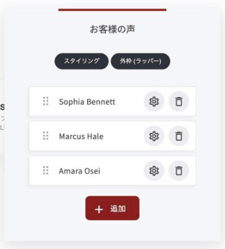
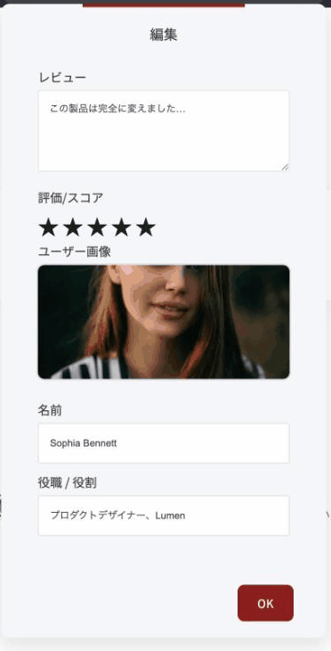
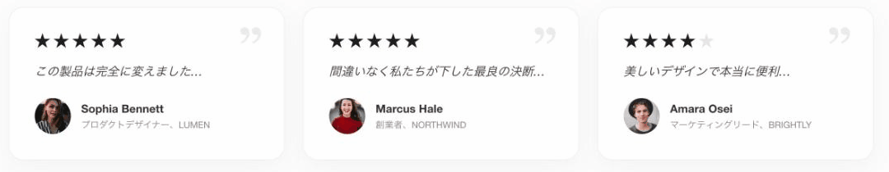
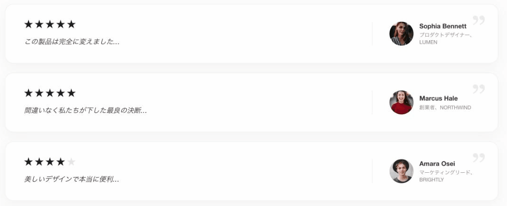
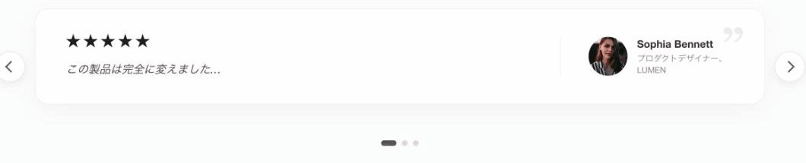
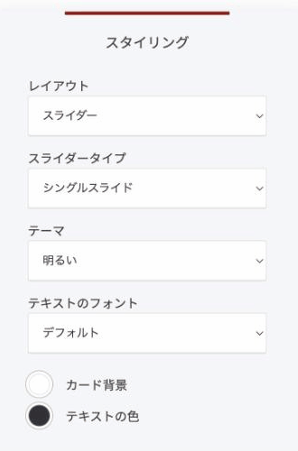

# お客様の声ウィジェット

お客様からいただいた声を、写真・お名前・肩書き・星評価とあわせて掲載するウィジェットです。3つの表示方法があるので、置く場所と目的に合わせて選べます。

### このウィジェットが向いている場面

**具体的だと信じてもらえます。** お名前と肩書き（例:「山田花子さま／ピアノ教室主宰」）が入るだけで、当たり障りのない褒め言葉ではなく、実在する人の言葉として読まれます。

**星評価はひと目で伝わります。** 本文を読む前に、どう受け止められているかが分かります。

**置き場所に合わせて形を選べます。** 省スペースのスライダー、じっくり読ませる縦並び、数の多さを見せるグリッド。

### 声を追加・編集する

編集を押すと、掲載する声の一覧が開きます。「+ 追加」で増やし、左のハンドルをドラッグして並び順を変えられます。

<figure><figcaption></figcaption></figure>

歯車アイコンを押すと、その声の中身を編集できます。

<figure><figcaption></figcaption></figure>

| 項目 | 内容 |
|---|---|
| レビュー | いただいた声の本文 |
| 評価/スコア | 星の数。クリックして選びます |
| ユーザー画像 | 顔写真 |
| 名前 | お名前 |
| 役職 / 役割 | 肩書き（例:「ピアノ教室主宰、〇〇音楽院」） |

### レイアウトは3種類

「スタイリング」の**レイアウト**から選びます。

**グリッド**

横に並べて、複数件を一度に見せます。件数の多さそのものを伝えたいときに向いています。「行あたりのアイテム」で、何件ずつ並べるかを決められます。

<figure><figcaption>
「グリッド」で3件並べたところ
</figcaption></figure>

**リスト**

上から下へ、横幅いっぱいで縦に並べます。お客様の声だけを集めたページなど、順番に読んでほしいときに向いています。

<figure><figcaption>
「リスト」で表示したところ
</figcaption></figure>

**スライダー**

1件ずつ順に表示し、矢印とドットで切り替えます。限られた場所に置きたいときに向いています。「スライダータイプ」で動き方を選べます。

<figure><figcaption>
「スライダー」で表示したところ
</figcaption></figure>

| スライダータイプ | 動き |
|---|---|
| シングルスライド | 1件表示して手動で切り替え |
| 複数スライド | 複数件を並べて切り替え |
| 自動回転（コントロールなし） | 矢印もドットも出さず、自動的に流れます |

<figure><figcaption>
「スライダー」を選ぶと「スライダータイプ」が出てきます
</figcaption></figure>

### そのほかの設定

| 項目 | 内容 |
|---|---|
| テーマ | 「明るい」「暗い」から選びます |
| テキストのフォント | 文字の書体 |
| カード背景・テキストの色 | ブランドに合わせて調整できます |


お名前を出すことに抵抗がある場合は、「M.Yさま（40代・ピアノ講師）」のように、本人と分かる範囲を狭めた表記でも構いません。ただし、まったくの匿名より、属性が分かる方が読み手に届きます。


---

<!-- cta:opusbooster -->

**自分の場合はどう使えばいいか**

[OpusBoosterの機能全体](https://opusbooster.com/features)を見る。設計から相談したい方は[15分の無料相談](https://opusbooster.com/consultation)、まず触ってみたい方は[14日間の無料トライアル](https://opusbooster.com/register)（クレジットカード不要）から。

