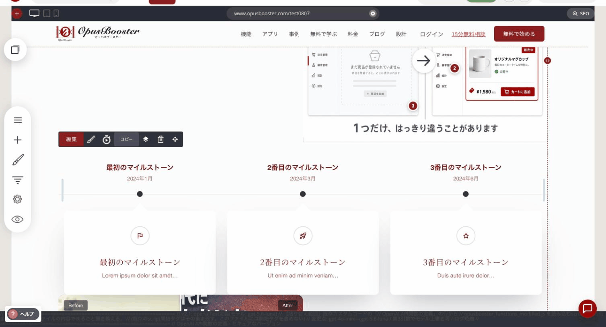
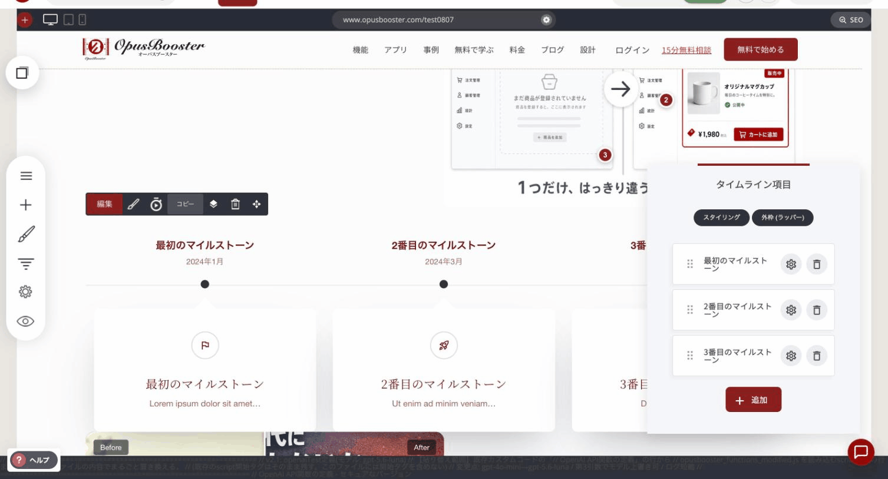
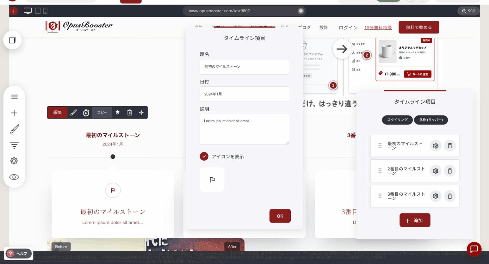

# タイムラインウィジェット

出来事や工程を、時系列で並べて見せるウィジェットです。沿革、これまでの実績、講座の進み方、申し込みから開始までの流れなど、「順番があるもの」を伝えるときに使います。

### このウィジェットが向いている場面

**流れが目で追えます。** 箇条書きで並べるより、日付と線でつながっている方が、進んできた道のりとして伝わります。

**信頼につながります。** 日付の入った実績（開催回数、受賞、リリース）が並ぶと、続けてきたことそのものが証明になります。

**手順の説明に向いています。** 申し込みから受講開始まで、制作の工程など、複数のステップに分かれるものを、視覚的に区切って見せられます。

### レイアウトは3種類

「スタイリング」の**レイアウト**から選びます。

**水平**

日付とタイトルだけを、横一列に並べます。線の上に節目が並ぶ、すっきりした形です。日付を並べるだけで十分なときに向いています。

**水平 – 詳細は下**

上と同じ横並びですが、それぞれの節目の下に、アイコン・タイトル・説明の入ったカードが付きます。節目ごとに説明が要るときに向いています。

<figure><figcaption>
「水平 – 詳細は下」で表示したところ
</figcaption></figure>

**垂直**

縦の線に沿って、節目が並びます。それぞれに詳細カードが付きます。項目数が多いときや、物語として読ませたいときに向いています。

### 項目の追加と編集

項目は一覧で管理します。**「+ 追加」**&#x3067;新しい項目を作り、左のハンドルをドラッグして並び順を変えられます。

<figure><figcaption></figcaption></figure>

歯車アイコンを押すと、その項目の中身を編集できます。

<figure><figcaption></figcaption></figure>

| 項目 | 内容 |
|---|---|
| 題名 | 節目の見出し |
| 日付 | 表示する日付 |
| 説明 | 補足の文章 |
| アイコンを表示 | オンにすると、アイコンを選んで表示できます |

### 全体の見た目の設定

「スタイリング」で、タイムライン全体の見た目を調整します。

| 項目 | 内容 |
|---|---|
| 行あたりのアイテム | 折り返すまでに何項目並べるか |
| テキストのフォント | 文字の書体 |
| 見出しフォントサイズ | 見出しの文字の大きさ |
| タイトル色 | 見出しと日付の色 |
| ボックススタイリング | カードの背景色と文字色 |

---

<!-- cta:opusbooster -->

**自分の場合はどう使えばいいか**

[OpusBoosterの機能全体](https://opusbooster.com/features)を見る。設計から相談したい方は[15分の無料相談](https://opusbooster.com/consultation)、まず触ってみたい方は[14日間の無料トライアル](https://opusbooster.com/register)（クレジットカード不要）から。

