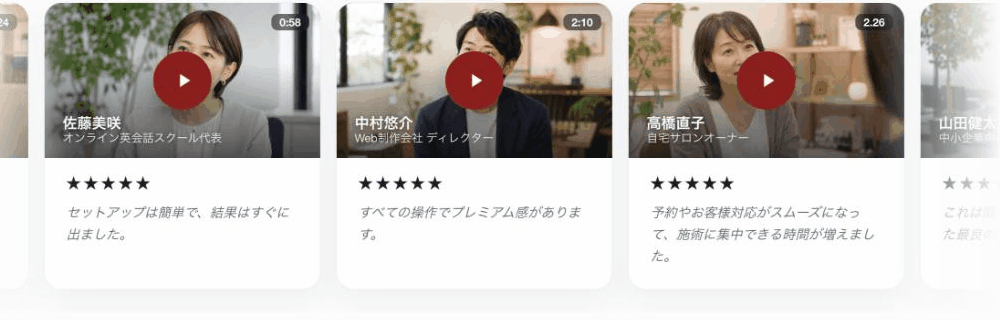
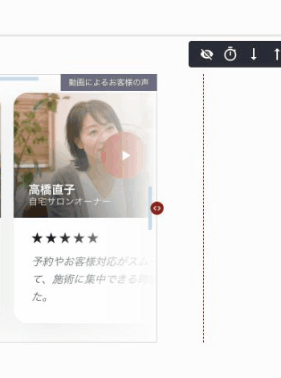
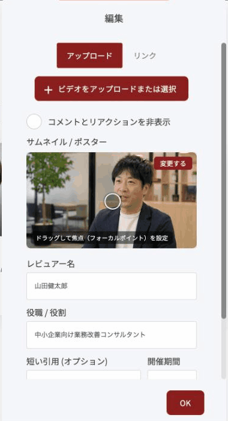
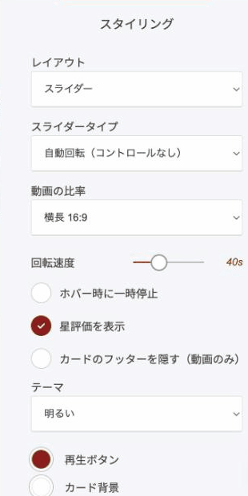

# 動画によるお客様の声ウィジェット

お客様の声を、再生できる動画カードとして並べるウィジェットです。サムネイル・お名前・肩書き・星評価・ひとことが1枚のカードにまとまります。文字だけの「お客様の声」より一段踏み込んだ見せ方です。

<figure><figcaption></figcaption></figure>

### このウィジェットが向いている場面

**文字より強く伝わります。** 本人の声と表情が入ると、書かれた文章では出せない実感が伝わります。

**クリックされます。** 再生ボタンとサムネイルは、それだけで押したくなる形です。ページに留まる時間も伸びます。

**置き場所に合わせられます。** 省スペースのスライダーから、実績を並べるグリッドまで選べます。

**会話が生まれます。** OpusBooster内にアップした動画は、コメント欄付きで開きます。一方的な宣伝ではなく、やり取りの場になります。

### レイアウトは3種類

**スライダー**

1件ずつ順に切り替わります。「スライダータイプ」で、自動回転（コントロールなし）・シングルスライド・複数スライドから選べます。

**リスト**

縦に積み上げます。お客様の声を集めた専用ページに向いています。

**グリッド**

横に並べて一覧します。件数の多さを見せたいときに向いています。

### 1件ごとの設定

一覧の歯車アイコンから、その1件を編集します。

<figure><figcaption></figcaption></figure>

<figure><figcaption></figcaption></figure>

| 項目 | 内容 |
|---|---|
| アップロード / リンク | 動画をアップするか、外部動画（YouTubeなど）のURLを指定するかを選びます |
| コメントとリアクションを非表示 | オンにすると、再生画面のコメント欄を出しません |
| サムネイル / ポスター | 再生前に表示する画像。ドラッグで焦点（フォーカルポイント）を指定できます |
| レビュアー名 | 話している方のお名前 |
| 役職 / 役割 | 肩書き |
| 短い引用（オプション） | 動画の下に添える言葉 |
| 所要時間 | サムネイルの右上に出す再生時間（例: 1:24） |
| 評価/スコア | 星の数 |


お使いの画面では、この欄&#x304C;**「開催期間」**&#x3068;表示されているかもしれません。イベントの期間ではなく、**動画の再生時間**を入れる欄です。訳を「所要時間」に修正済みで、次回のアップデートで表示が変わります。


### 動画の開き方が2通りあります

**外部リンクの動画**（YouTubeなど）は、そのままページ内で再生されます。

**OpusBoosterにアップした動画**は、ライトボックス（画面いっぱいの再生画面）で開き、**コメント欄が付きます。**


コメント欄を活かすなら、OpusBoosterにアップする方を選んでください。YouTubeに置くと再生は軽くなりますが、関連動画から他社のページへ流れる可能性があります。


### 見た目の設定

<figure><figcaption></figcaption></figure>

| 項目 | 内容 |
|---|---|
| 動画の比率 | 横長 16:9 ／ 正方形 1:1 ／ 縦長 9:16 ／ クラシック 4:3 |
| 回転速度 | スライダーのときの切り替え間隔 |
| ホバー時に一時停止 | カーソルを乗せているあいだ、切り替えを止めます |
| 星評価を表示 | 星を出すかどうか |
| カードのフッターを隠す（動画のみ） | 名前・肩書き・引用を隠して、動画だけを見せます |
| テーマ | 明るい／暗い |
| 再生ボタン・カード背景 | 配色の設定 |


縦長 9:16 は、スマートフォンで撮った動画をそのまま載せるときに使います。お客様に「スマホで自撮りしてください」とお願いする場合は、この比率にしておくと上下が切れません。


---

<!-- cta:opusbooster -->

**自分の場合はどう使えばいいか**

[OpusBoosterの機能全体](https://opusbooster.com/features)を見る。設計から相談したい方は[15分の無料相談](https://opusbooster.com/consultation)、まず触ってみたい方は[14日間の無料トライアル](https://opusbooster.com/register)（クレジットカード不要）から。

