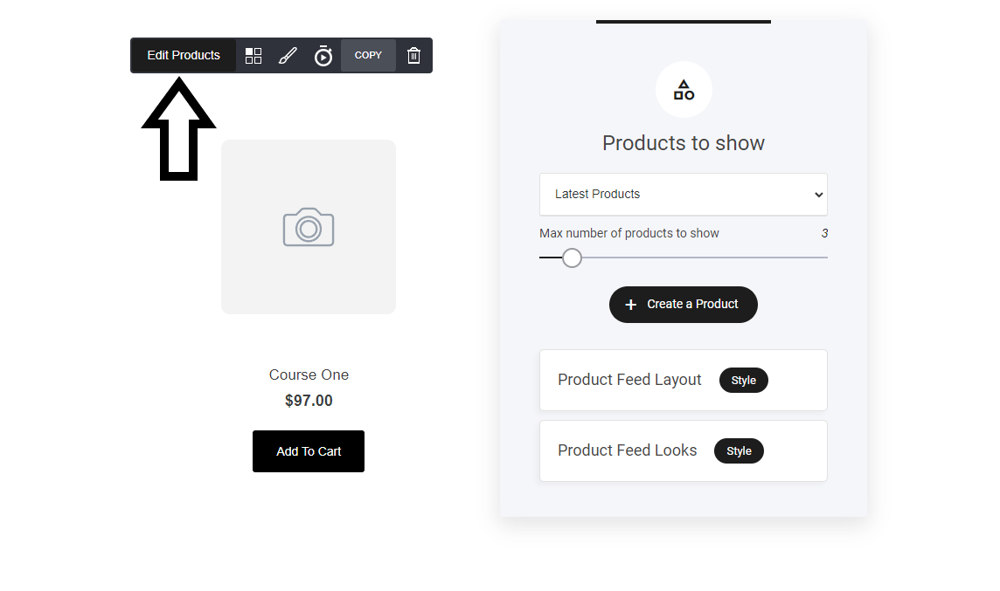
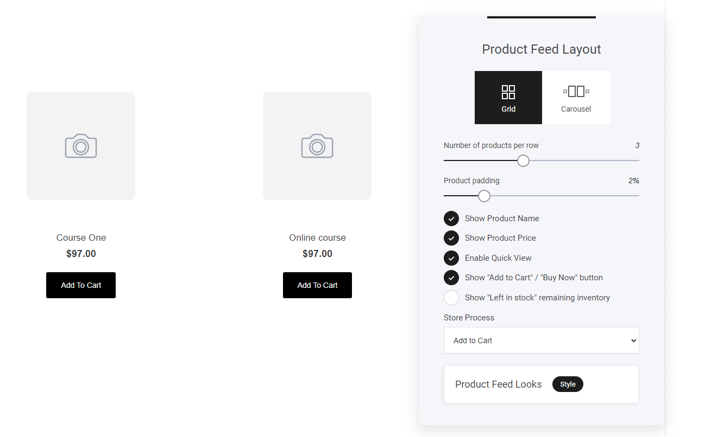

# ストアウィジェット

ストアウィジェットは、どのページにも、あるいはブログの記事内にも、ショップの商品を表示するための素晴らしいウィジェットです。

ストアウィジェットを追加するには、ウィジェット一覧からページ内の任意の位置にドロップするだけです：

<figure><figcaption></figcaption></figure>

まず最初に、表示したい商品を追加します。下図のように、「商品の編集」タブを選択します。すると、新しいウィンドウが開き、商品を追加することができます。

* 最新商品
* 選択したカテゴリの全商品
* 選択した商品
* 表示する商品の数

<figure><figcaption></figcaption></figure>

### 商品レイアウト

この設定のオプションの多くは、より視覚的な設定です。それでは、重要な設定をより詳しく見ていきましょう。

* ストアのプロセス

ストアプロセスタブでは、 「カートに追加」「今すぐ購入」の2つの選択肢があります。

**カートに追加**： ショッピングカートに複数のアイテムを追加したい場合、このオプションが便利です。カートに入れるをクリックすると、そのアイテムは自動的にカートに保存され、次のアクションを待つことができます。

**今すぐ購入**： 今すぐ購入ボタンを選択することで、訪問者が今すぐ購入ボタンをクリックすると、自動的に決済用の「チェックアウト」ページが表示され、購入の準備ができます。

<figure><figcaption></figcaption></figure>

### 商品フィードの外観

商品フィードの外観は、ストア商品ウィジェットのスタイルとデザインを選択することによって、ユーザーが選択することができます。それでは、詳しく見ていきましょう

<figure><figcaption></figcaption></figure>

商品をページ上に表示する際のレイアウトは、上の画像のように3種類あります。また、コンテンツの配置は、テキストを左揃え、中央揃え、または右揃えに設定します。

割引商品バッジのタイプ： 特定の製品に割引が割り当てられている場合、アイテム自体に直接視覚的に表示することができます。4つのオプションから選ぶことができます。

* なし：情報を表示しません。
* セール品： セール品である場合に表示されます
* 割引額： アイテムが値段で割引されている場合
* 割引率：アイテムが一定の値（%）で割引されている場合
