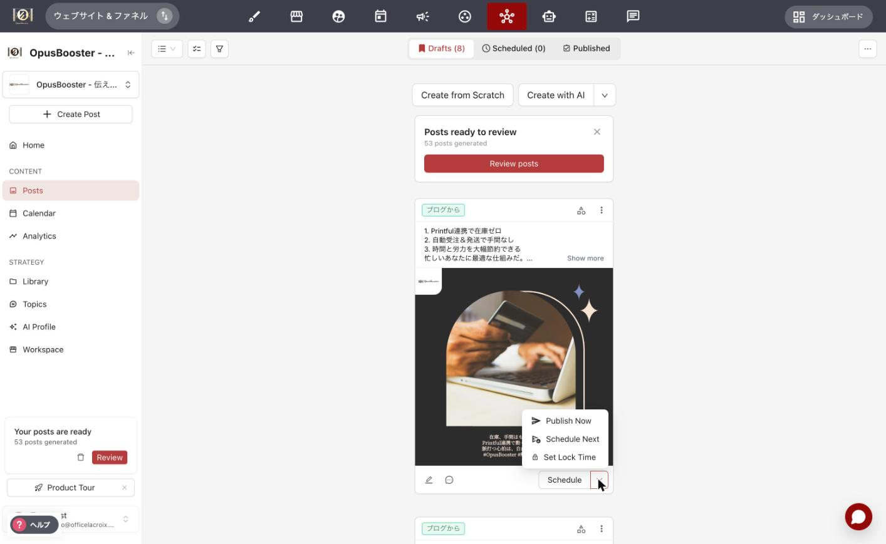
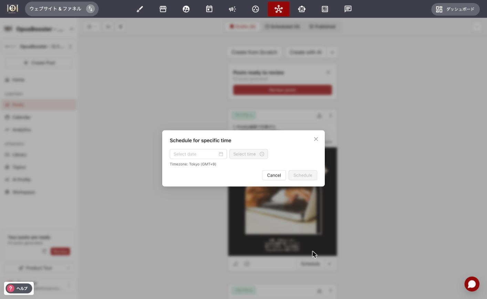

# 予約投稿とコンテンツカレンダーの使い方

## 概要

コンテンツカレンダーでは、予約済みの投稿を並び替えたり、整理したり、いつ何を投稿するかを戦略的に計画したりできます。

## キューとロック投稿

SNS運用AIの予約投稿には、大きく分けて2つの考え方があります。

* **キュー**: 設定した曜日・時間に沿って、順番に配信される投稿
* **ロック投稿**: 特定の日時に固定して配信される投稿(鍵アイコンが表示されます)

キューの配信曜日・時間は、投稿画面の「スケジュール」設定から編集できます。ストーリーズや祝日関連の投稿など、決まった日時に必ず出したい投稿は、ロック投稿にしておくと安心です。

## カレンダーでの並び替え

カレンダーはドラッグ&ドロップに対応しています。

* キューに入っている投稿をドラッグして別の投稿の間にドロップすると、その位置に挿入されます。
* キューの最後までドラッグすると、最後の枠に挿入されます。
* ロック投稿を別の日にドラッグすると、その日時に予約し直すかどうかの確認が表示されます。

## 投稿を特定の日時にロックする

<figure><figcaption></figcaption></figure> <figure><figcaption></figcaption></figure>

投稿のメニューから「ロック時間を設定」を選び、日時を指定すると、その投稿は指定した日時に固定されて配信されます。ロックを解除すると、通常のキューに戻すこともできます。

## 特定の時間帯をスキップする

特定の曜日・時間帯に投稿したくない場合は、「時間帯をスキップ」を設定できます。スキップされた枠には投稿が配信されず、次の予定はそのまま次の枠に繰り越されます。スキップ設定は、あとから解除することも可能です。

## 週表示

カレンダーは「週表示」でも確認できます。週表示ではサムネイルが大きく表示され、投稿内容が見やすくなります。また、SNSごとの表示切り替えができるため、プラットフォームごとに異なるスケジュールを組んでいる場合にも便利です。

## 祝日の表示

カレンダー上に、その日の祝日が自動で表示されます。ワークスペースの設定から、表示する地域の祝日を選択したり、この表示自体をオフにしたりできます。

## タイムゾーン

デフォルトでは、SNS運用AIは現在のタイムゾーンに合わせてすべての時刻を表示します。海外拠点など、別のタイムゾーンで投稿を管理したい場合は、特定のタイムゾーンを指定して管理することもできます。

## キューのシャッフル

生成された投稿には、トピック設定に基づいて自動的にカテゴリー(またはテーマ)が割り当てられます。「キューをシャッフル」機能を使うと、これらを踏まえて投稿の並び順を整理できます。

* **ランダムにシャッフル**: キュー全体をランダムに並び替えます。
* **カテゴリー順にシャッフル**: 1週間の中でカテゴリーが均等にローテーションするように並び替えます。
* **テーマ順にシャッフル**: 使用しているデザインテーマが偏らないよう、ローテーションするように並び替えます。

複数のトピックやデザインテーマを使い分けている場合、この機能を使うことで、投稿内容やデザインのバランスを保ちながら、まとめて予約した投稿を効率よく整理できます。

## 投稿頻度とアカウント評価

各SNSのアルゴリズムは、投稿1本ごとの反応率だけでなく、アカウント単位でも「この発信者の投稿はどれくらい反応されているか」を学習していると考えられています。反応の薄い投稿を毎日大量に積み重ねると、新しい投稿の初期配信が伸びにくくなる傾向があります。逆に、反応される投稿を続けられているアカウントは、1本あたりの初速も伸びやすくなります。

目指したいのは「毎日たくさん」ではなく「反応される投稿を、無理のない頻度で」です。キューの配信曜日・時間は自由に調整できるので、毎日の枠を埋めることが負担になっている場合は、週2〜3本まで絞って1本の質を上げるのも有効な戦略です。空いた枠は「時間帯をスキップ」で調整できます。

質を上げるコツは、生成された投稿をそのまま流さないことです。配信前にカレンダーからプレビューし、自分の言葉や実際のエピソードをひと言足すだけで、反応率は変わってきます。SNS運用AIが土台を用意し、最後のひと味を加えるのがあなたの役目、という分担が、いちばん少ない手間で質を保てます。

さらに、リールやショート動画のような「発見型」のコンテンツと、キューによる自動投稿を併用すると役割分担ができます。発見型は新規リーチを広げる役、自動投稿はすでにつながっている人との接点を切らさない役です。両輪で組み立てると、アカウント全体の評価が安定しやすくなります。

## 最初の30日間に見るべきもの

数字が出なくても、失敗ではありません。開設したばかりのアカウントは、どのプラットフォームでも最初の2〜4週間は配信が絞られます。これは通常の仕様であって、ツールの不具合でも、設定の間違いでもありません。

この時期に見るべきなのは、再生数やフォロワー数ではなく「積み上げ」です。投稿が何本たまったか、プロフィールが埋まっているか、コメントや保存が1件でもついたか。この3つが動いていれば順調に進んでいます。

初速の出方はプラットフォームによっても違います。TikTokやYouTubeショートは新規アカウントでも発見面に乗りやすく、InstagramやFacebookはフォロワーの土台ができてから伸びる傾向があります。これから始めるなら、前の節でふれた発見型のショート動画を併用するのが近道です。

そして、この30日間の蓄積が、そのまま2ヶ月目以降の配信の土台になります。アルゴリズムは1本ごとの反応だけでなく、アカウントが継続して発信しているかどうかも見ているためです。

---

<!-- cta:opusbooster -->

**自分の場合はどう使えばいいか**

[SNS運用AIの全体像](https://opusbooster.com/sns-ai)を見る。設計から相談したい方は[15分の無料相談](https://opusbooster.com/consultation)、まず触ってみたい方は[14日間の無料トライアル](https://opusbooster.com/register)（クレジットカード不要）から。

