# プレイリスト

### ビデオプレイリストとは

**ビデオプレイリスト**は、動画の整理を簡単にするための機能です。学習用のモジュール、シリーズもののコンテンツ、テーマ別のコレクションなど、関連する動画をグループ化することで、視聴者にシームレスな視聴体験を提供できます。

### プレイリストを使うメリット

* **コンテンツを構造化できる** – 動画をカテゴリごとに整理し、目的の動画にたどり着きやすくなります。
* **連続再生ができる** – 動画から動画へスムーズに切り替わります。
* **エンゲージメントが高まる** – 視聴者のニーズに合わせたキュレーション体験を作れます。

プレイリストを使うことで、動画は**探しやすく、直感的で、楽しく**視聴できるようになります。

### ビデオプレイリストの設置方法

1. **左のタスクバー**から**「ビデオプレイリスト」ウィジェット**を選択します
2. 配置したいセクションへ**ドラッグ＆ドロップ**します。ページ、ブログ、ファネル、コミュニティスペースのどこにでも設置できます

<figure>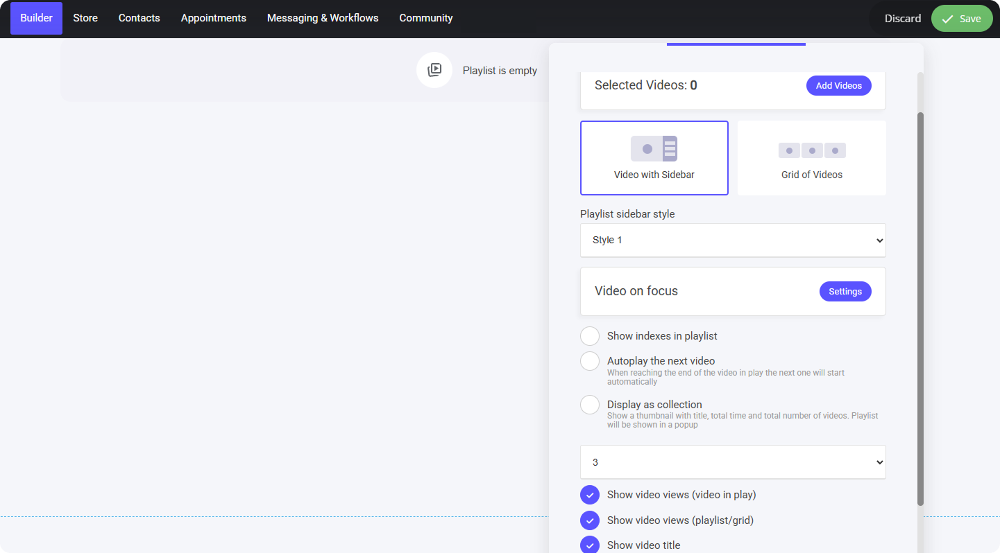<figcaption></figcaption></figure>

### プレイリストに動画を追加する

プレイリストに動画を追加する手順は以下のとおりです。

1. プレイリスト編集画面の上部にある**「ビデオを追加」ボタン**をクリックします
2. **ビデオマネージャー**が開き、次の操作ができます
   * **新しい動画をアップロードする**
   * **既存の動画を編集して**詳細を調整する
   * **複数の動画を選択して**プレイリストに組み込む

<figure>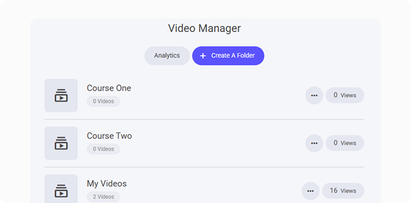<figcaption></figcaption></figure>

**効率よく動画を追加するコツ**

* **フォルダごと選択する** – フォルダにカーソルを合わせて**「選択」ボタン**をクリックすると、フォルダ内のすべての動画を一度に追加できます。
* **個別に選ぶ** – **フォルダのタイトル**をクリックして開き、追加したい動画だけを手動で選択します。

**選択時に個別設定も変更できる**

プレイリスト用に動画を選択する際、選択ウィンドウから直接、以下のような個別設定を更新できます。

* **コメント管理** – 表示・非表示ややり取りの設定を調整します。
* **チャプター** – 重要な場面へのナビゲーションを追加・変更します。
* **サムネイル** – 現在のサムネイルを任意の画像に差し替えます。

<figure>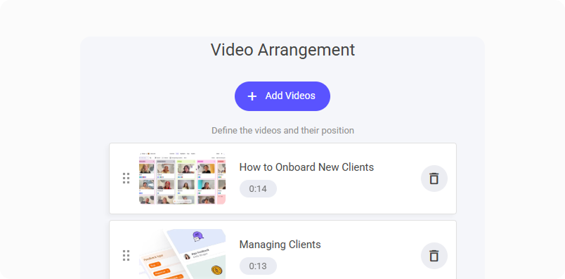<figcaption></figcaption></figure>

**動画の並べ替え**

動画を選択すると**並べ替え用のリスト**に入り、次の操作ができます。

* **順序を入れ替える** – ドラッグで好みの順番に並べ替えます。
* **流れを整える** – 視聴者にとって自然な視聴順になるよう調整します。

***

### プレイリストの表示形式

プレイリストは主に2つの形式で表示できます。

1. **サイドバー付きビデオ** – **メインの動画**を大きく表示し、サイドバーに残りの動画一覧を表示するレイアウトです。視聴者がコンテンツを追いやすくなります。
2. **ビデオグリッド** – すべての動画を整然としたグリッドで表示する形式です。一覧性が高く、見たい動画をすぐ選べます。

<figure>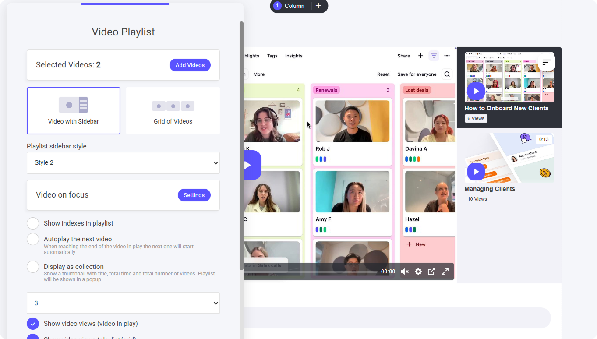<figcaption></figcaption></figure>

### サイドバー付きビデオ

**サイドバー付きビデオ**では、**3つのスタイル**から選択できます。

1. **コンパクトサムネイル** – 各動画に**小さめのサムネイル**を表示し、内容を視覚的に判別しやすくします。
2. **拡大サムネイル** – やや大きめの**サムネイルプレビュー**を表示します。
3. **詳細表示** – メインプレイヤーの横に**シンプルなリスト**で動画を並べ、レイアウトをすっきり保ちます。

<figure>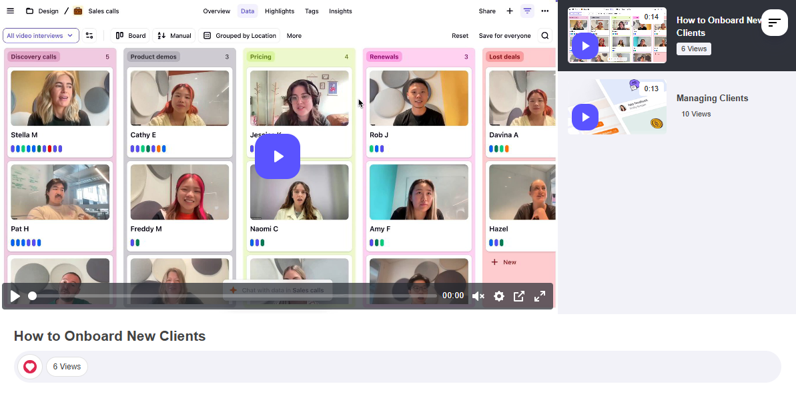<figcaption></figcaption></figure>

<figure>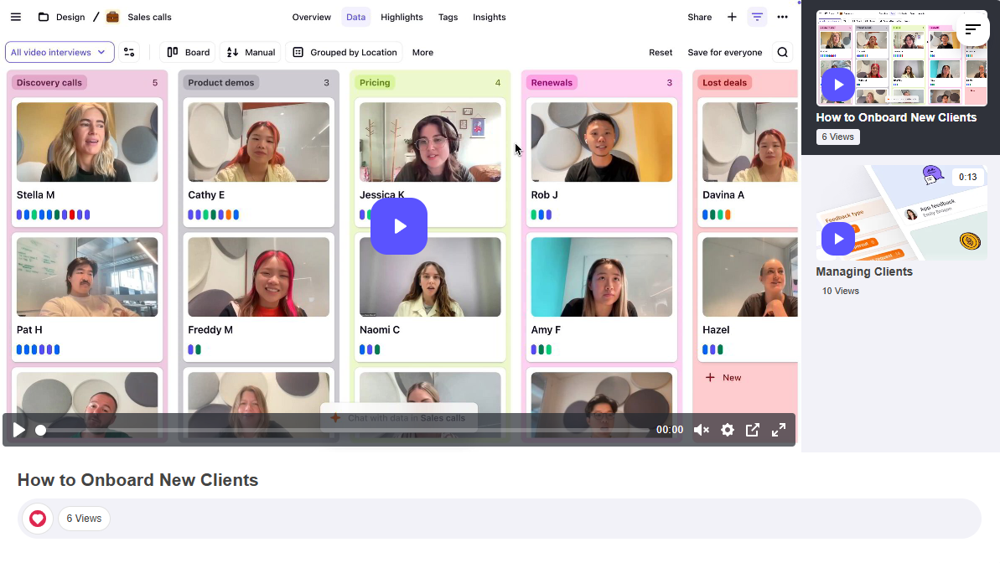<figcaption></figcaption></figure>

<figure>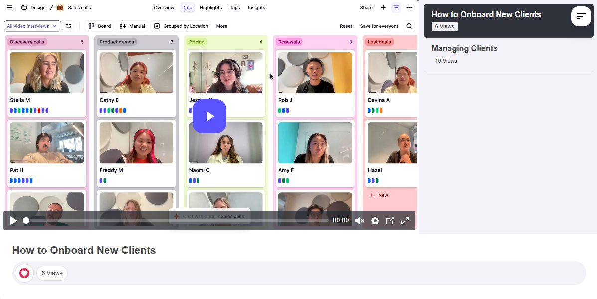<figcaption></figcaption></figure>

**サイドバーの最小化**

サイドバーが表示されている間、動画は**標準サイズ**で再生され、プレイリスト内の移動がしやすい状態になります。

動画を大きく表示したい場合は、

* サイドバー**右上のメニューアイコン**をクリックします。
* サイドバーが**最小化**され、動画が拡大表示されて**集中して視聴できる**状態になります。

<figure>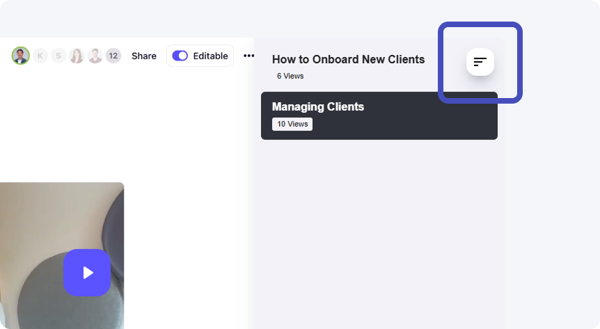<figcaption></figcaption></figure>

**再生中の動画の扱い**

プレイリスト内で動画を選択すると、その動画が**メインの表示**になります。サイドバーからのナビゲーションはそのまま使えます。さらに以下のオプションがあります。

* **コントロールを非表示** – 動画から再生バーのコントロールを取り除きます。
* **自動再生** – 動画を開くと自動的に再生を開始します。
* **フォーカスが外れたら一時停止** – 別の画面に切り替えると動画が自動的に一時停止します。

<figure>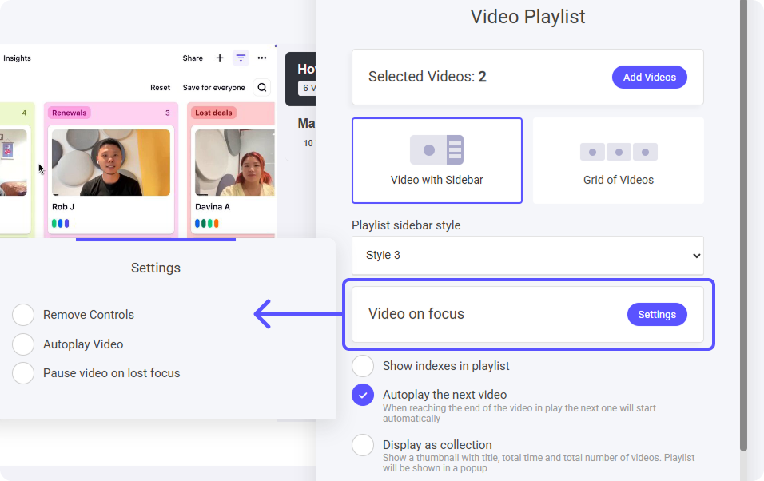<figcaption></figcaption></figure>

**プレイリストにインデックスを表示**

インデックスを有効にすると、各動画に**連番**が付き、視聴者が進行状況を把握しやすくなります。

* プレイリストに**4本の動画**がある場合、**1〜4**の番号が順に表示されます。
* 番号によって**視聴の順序が明確**になり、構成されたシリーズやレッスンを順番にたどりやすくなります。
* **教育コンテンツ、エピソード形式の動画、体系立てたプレゼンテーション**に最適です。

<figure>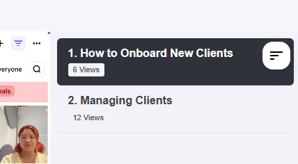<figcaption></figcaption></figure>

**次の動画を自動再生**

自動再生を有効にすると、現在の動画が終わったタイミングで**次の動画が自動的に**始まります。

* **シームレスな視聴** – 手動で選択する手間がなくなり、体験がスムーズになります。
* **連続再生** – 一気見、コース、ガイド付き学習などに最適です。

**コレクションとして表示**

**コレクションビュー**では、プレイリスト全体が**1つのメイン動画**の下にまとまって表示されます。複数のサムネイルを並べる代わりに、プレイリストが**1つのエントリー**として表示されます。

* **メイン動画の表示** – プレイリスト全体が1つの代表動画として表示されます。
* **クリックで展開** – メイン動画を選択すると、動画の全リストが展開表示されます。
* **すっきりしたナビゲーション** – レイアウトを簡潔に保ちながら、プレイリスト内のすべてのコンテンツにアクセスできます。

<figure>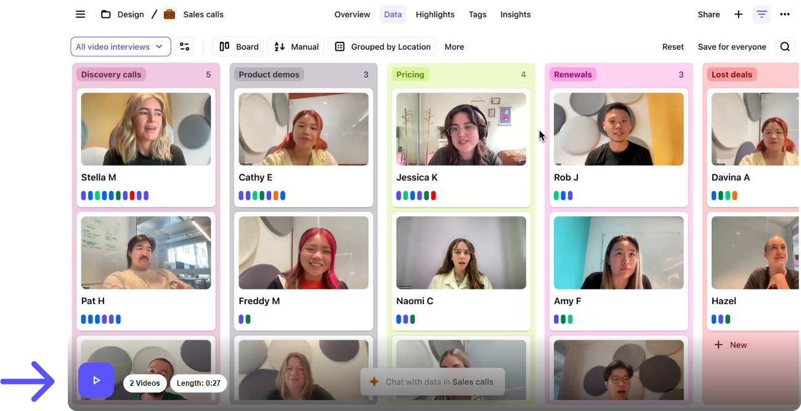<figcaption></figcaption></figure>

**その他の表示設定**

視聴体験を高めるために、以下の表示オプションをカスタマイズできます。

1. 再生中の動画の視聴回数を表示
2. プレイリスト／グリッド内の動画の視聴回数を表示
3. 動画タイトルを表示
4. 動画へのリアクションを表示
5. 動画のコメントを表示

<figure>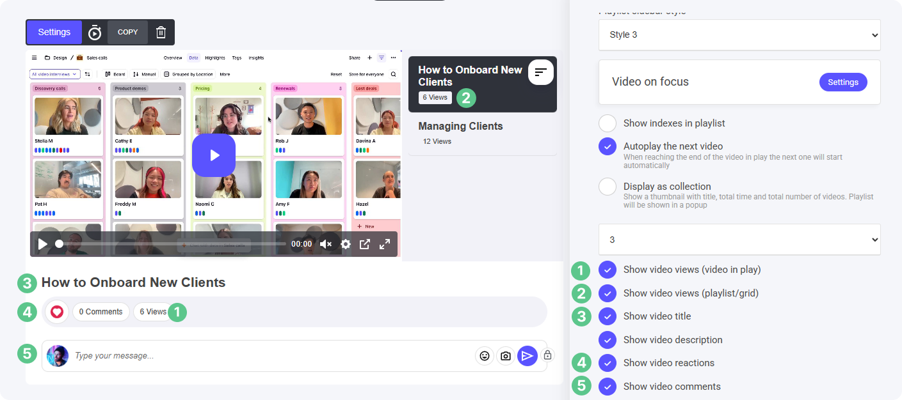<figcaption></figcaption></figure>

**視聴済みとしてマーク**

視聴者が動画を**手動で「視聴済み」にできる**機能です。視聴体験を自分でコントロールできるようになります。

* **緑のチェックアイコン** – 視聴済みにすると、動画の横に**緑のチェック**が表示され、完了したことが分かります。
* **オートメーションのトリガーになる** – ワークフローに自動化アクションを設定している場合、視聴済みにしたタイミングで**その自動化が作動**します。
* **進捗を追いやすい** – 視聴者が**見終わったコンテンツを把握**でき、プレイリストやコースが使いやすくなります。

<figure>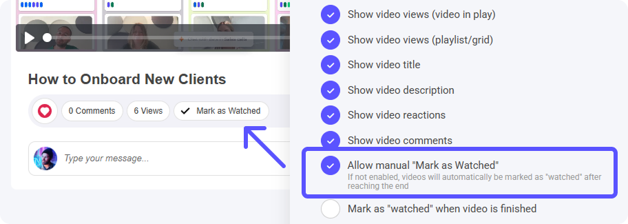<figcaption></figcaption></figure>

**自動で視聴済みにする**

手動の「視聴済みにする」オプションを**有効にしていない**場合は、再生が最後まで終わった時点で**自動的に視聴済みとしてマークされます**。

* **手動操作は不要** – システムが視聴完了を検出し、**緑のチェックマーク**を付けます。
* **オートメーションのトリガーになる** – 動画の視聴完了に紐づけた**ワークフローの自動化**が、再生終了時に作動します。
* **進捗の追跡** – 視聴者が自分で操作しなくても、視聴済みコンテンツを簡単に把握できます。

### ビデオグリッド

**グリッド表示**は、動画を**ギャラリー形式**で整理し、**視覚的に一覧できる閲覧体験**を作ります。

* **整理されたレイアウト** – 動画が行・列で整然と並びます。
* **すばやい選択** – 一目で全体を見渡して、見たい動画をすぐ選べます。
* **なじみのある体験** – 現代の動画配信サービスに近い、親しみやすいデザインです。

**コース、エンターテインメント系コンテンツ、動画数の多いコレクション**に最適で、動画を見つけやすくなります。

<figure>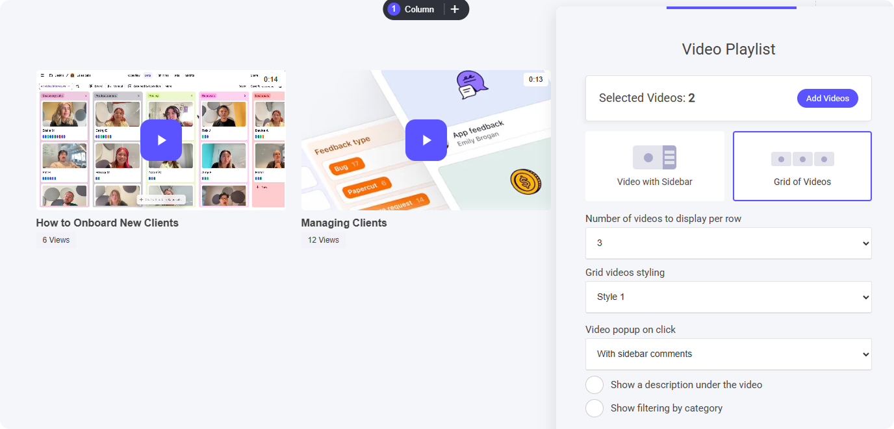<figcaption></figcaption></figure>

**1行あたりの動画数**

1行に表示する動画の数は自由にコントロールできます。

* **1行あたり2〜6本**の間で選択できます。
* デザインに合わせて**見やすさ**と**余白**を最適化できます。
* 動画配信サービスのような**構造化された閲覧体験**を作れます。

**グリッドのスタイル**

グリッド形式では、2つのスタイルから選べます。

1. **シンプル** – クリーンでミニマルなレイアウトにより、**洗練された、視聴の邪魔にならない**閲覧体験を実現します。
2. **枠あり（タイル風）** – 各動画の周囲に枠線を追加し、**タイルのように区切られた**見た目を作ります。

<figure>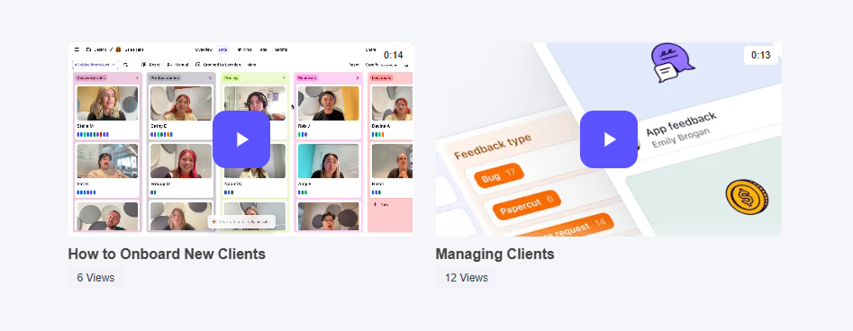<figcaption></figcaption></figure>

<figure>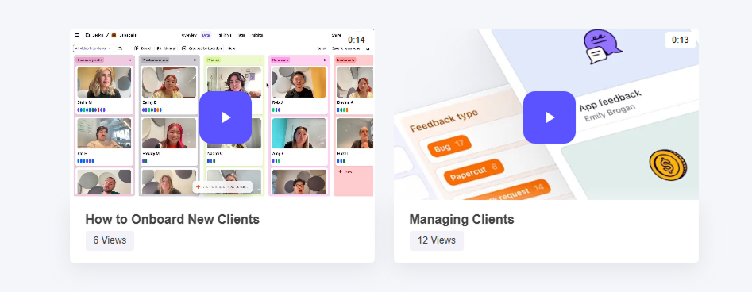<figcaption></figcaption></figure>

**クリックで動画をポップアップ表示**

グリッド表示で視聴者が動画を選択すると、**フルスクリーンのポップアップ**で動画が開き、没入感のある視聴体験になります。

* **コメントの表示位置** – コメントを**動画の横または下**のどちらに表示するか選択できます。
* **議論が混ざらない** – コメントがその動画に直接ひも付くため、動画間でコメントが混在しません。
* **スムーズなナビゲーション** – フルスクリーン再生を楽しみながら、関連するコメントにもアクセスできます。

<figure>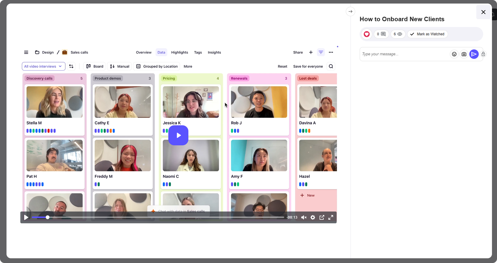<figcaption></figcaption></figure>

**カテゴリで絞り込む**

**カテゴリフィルタ**を使うと、グリッドの上部に表示される**カテゴリボタン**で、動画を簡単に絞り込めます。

* **カテゴリボタン** – グリッド上部に整理されて表示され、すばやく切り替えられます。
* **手間のない絞り込み** – カテゴリを選択すると、表示される動画が即座に絞り込まれます。
* **大規模なプレイリストに最適** – カテゴリが多いコレクションでも、目的の動画を見つけやすくなります。

<figure>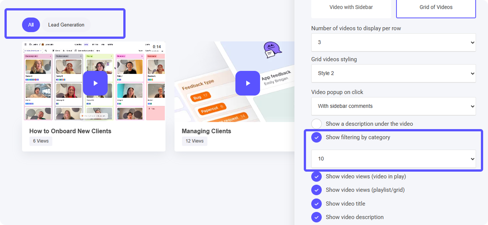<figcaption></figcaption></figure>
