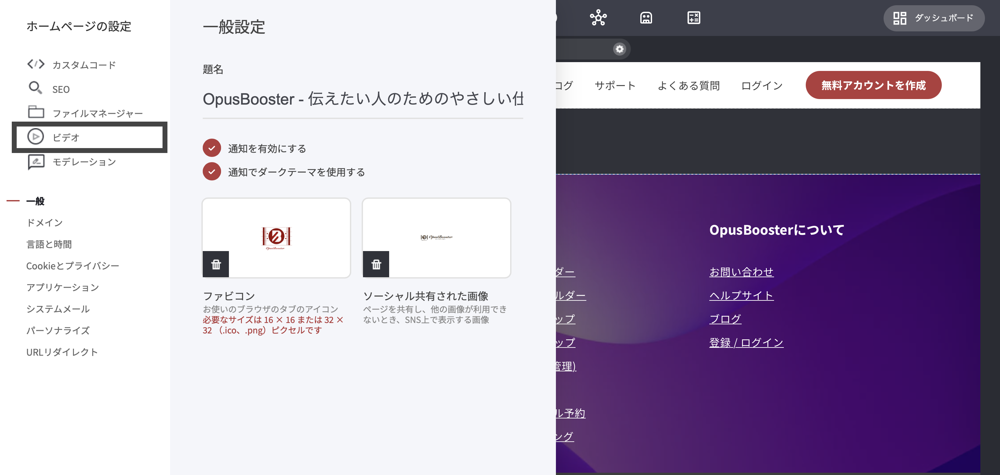
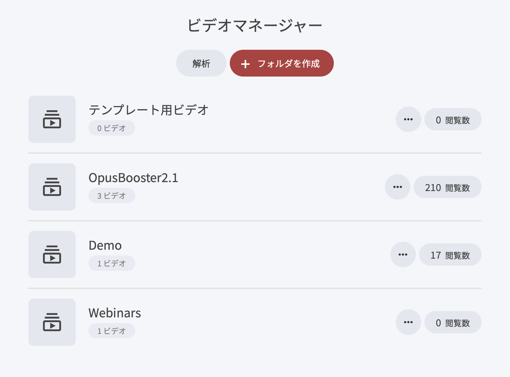

# ビデオマネージャー

### ネイティブ動画ホスティングとは

外部の動画サービスに頼らず、プラットフォーム内で動画をアップロード・管理・設定できる機能です。ブランド体験を保ちながら、動画配信をスムーズに行えます。

### アップロード後にできること

* 設定を細かくコントロール：再生オプション、公開範囲、エンゲージメント機能などを調整できます。
* 表示方法を柔軟に選択：埋め込み、レイアウト調整、見え方の指定が可能です。
* パフォーマンス最適化：外部プラットフォームの制限に左右されにくく、意図した形で提供できます。
* 他機能と連携：コミュニティ投稿、ディスカッション、学習モジュールなどに自然に紐づけられます。

### 動画のアップロード手順

1. 左側のタスクバーから、サイト設定の「歯車」をクリック
2. 上部にある「ビデオ」を選択
3. ポップアップが開いたら、目的に応じて操作します

ポップアップが表示されると、ビデオの整理と管理に関していくつかのオプションが利用できます：

* **新しいビデオを追加** – 新しいコンテンツをプラットフォームに直接アップロードします。
* **フォルダを作成** – カスタムフォルダにグループ化してビデオを整理します。
* **既存ビデオを編集** – 以前アップロードしたコンテンツの設定や表示設定を変更します。


**便利な整理のコツ（コースやプレイリストを作る場合）**\
コースや連続コンテンツ（プレイリスト）を作る予定があるなら、最初にフォルダを分けておくのがおすすめです。

**フォルダ分けのメリット**\
・管理が楽：目的のレッスン動画をすぐ見つけて更新できます\
・探しやすい：視聴者側も内容を追いやすくなります\
・拡張しやすい：コンテンツが増えても構造が崩れにくいです


例：作成した「My Videos」フォルダを開き、表示される「+Upload A Video」からアップロードを開始します。

>)

ボタンを押すとPC内のファイル選択画面が開くので、動画を選ぶと「Video settings」画面に進みます。

>)

***

### **ビデオタイトル**

分かりやすいタイトルを付けると、プラットフォーム全体で扱いやすくなります。たとえば以下の場面で表示・参照されます。\
&#xNAN;**・プレイリストに追加するとき**（識別しやすい）\
&#xNAN;**・コースのカリキュラムに組み込むとき**（受講者が迷いにくい）\
&#xNAN;**・メディアライブラリで管理するとき**（後から探しやすい）

### **ビデオ説明**

内容の補足や前提、見どころ、重要ポイントなどを書けます。プレイリストやコース等に追加したときにも表示されます。

説明文を入れるメリット

* 動画の目的が伝わる
* 補足情報や目印（タイムスタンプ等）を書ける
* プラットフォーム内検索で見つけやすくなる可能性がある


**表示をスッキリさせたい場合**\
ページへ埋め込む際に、タイトルや説明文の表示をオフにできる場合があります。余計なテキストを減らし、デザインに馴染ませたいときに便利です。


### **サムネイル**

再生前に表示されるプレビュー画像です。任意の画像をアップロードして、見栄えや識別性を高められます。

サムネイルの効果

* **クリックされやすい**（内容が一目で伝わる）
* **見分けやすい**（似た動画が多いほど有効）
* **デザイン統一**（ブランド感を保ちやすい）

サムネイル追加時は、内蔵のファイルマネージャーが開いて画像を選択できます。


[fairumanjnoi.md](../platform/webusaitofanerubirud/fairumanjnoi.md)


### **カテゴリ**

動画をカテゴリ分けしておくと、Video Playlist Widget でフィルタ（絞り込みタブ）を使う際に探しやすくなります。

カテゴリ化のメリット

* 必要な動画に到達しやすい
* 種類ごとに整理できる
* 視聴体験が分かりやすくなる

>)

### **ビデオチャプター**

長めの動画を「区切り（章）」に分けて、見たい場所へすぐ飛べるようにする機能です。

主な特徴

* 複数チャプターを作成可能：コンテンツを構造化されたセグメントに分割して整理を向上させる
* ツールチップ表示：チャプターにカーソルを合わせると内容をプレビューできる
* 目的の箇所へジャンプ：探す手間を減らして視聴しやすくなる

ビデオチャプターにより、ユーザーは重要な瞬間を素早く見つけることができ、長尺コンテンツをより魅力的でアクセスしやすく、インタラクティブにします。

>)

### チャプターの追加手順

1. 「動画チャプター」タブを開い&#x3066;**、** チャプター管理ウィンドウにアクセスします
2. 「動画チャプターを追加」をクリックして、新しいチャプターの作成を開始します
3. タイムスタンプを指定（動画のどの位置か）：チャプターをビデオ内の参照したい正確な位置に配置します
4. チャプター名を入力（視聴者が内容を判断しやすい名称）：これは視聴者にとって分かりやすい参照となり、関連するセクションに瞬時にジャンプするのに役立ちます

>)

チャプター追加後は一覧で管理できます

* チャプターを編集 – 名称や位置を修正
* チャプターを削除 – 不要なチャプターを削除

この設定により、 **明確でカスタマイズ可能な体験が保証され、**&#x8996;聴者がコンテンツとどのように関わるかを簡単に微調整できます。

>)

***

### **コメント**

動画にコメント欄を付けられます。


補足：ページに埋め込むとき／プレイリストに追加するときに、コメントのオン・オフを切り替えられる場合があります。運用方針に合わせて使い分けると管理しやすいです。


コメント管理の詳細は以下をお読みください。


[komentoeria.md](../community/komyunitiwijetto/komentoeria.md)



[komyunitimodershon.md](../community/komyunitino/komyunitimodershon.md)


>)

### **キャプション**

字幕を付けることで、内容が伝わりやすくなり、アクセシビリティも向上します。

字幕の設定手順

1. 動画設定で「キャプション」を開く
2. VTT形式の字幕ファイルをアップロード
3. 言語を選択
4. 自動表示をオンにすると、再生時に字幕が表示されます（後から切り替え可能）。視聴者はプレイヤーの「CC」アイコンから字幕をオフにできます。

この機能はアクセシビリティを向上させ、視聴者が体験を制御できるようにします。

>)

***

**埋め込みと共有**

外部サイト、メールなど、埋め込みに対応している場所へ動画を設置できます。

埋め込みの流れ

1. 「シェア」をクリック
2. 再生コントロールの表示設定、自動再生、表示設定などを調整
3. 埋め込み用スクリプトをコピーして、外部の設置先に貼り付け

埋め込み時のポイント\
チャプターや字幕など、動画側で設定している追加オプションも一緒に反映される場合があります。プラットフォーム外で視聴される場合でも、ナビゲーション性やアクセシビリティ、再生設定などを保ったまま提供できます。

>)
